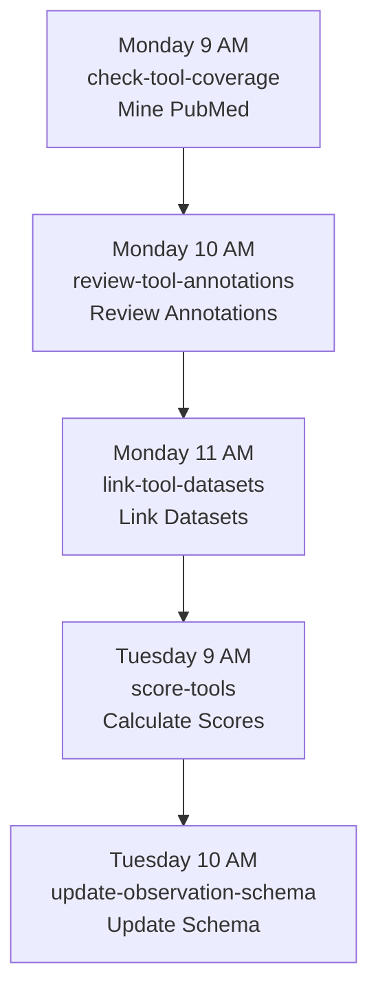

# Workflow Coordination - nf-research-tools-schema

## Overview

Based on [Issue #97](https://github.com/nf-osi/nf-research-tools-schema/issues/97), the workflows in this repository have been coordinated to run in a specific sequence that respects data dependencies and prevents race conditions.

## Problem Statement

Previously, multiple workflows ran simultaneously (Monday 9 AM UTC):
- `check-tool-coverage.yml`
- `score-tools.yml`
- `update-observation-schema.yml`

This caused:
- ⚠️ Race conditions on shared data
- ⚠️ Incomplete data for scoring calculations
- ⚠️ Duplicated processing
- ⚠️ Missed data linkages

## Solution: Coordinated Schedule

### Monday - Data Collection Day

| Time | Workflow | Duration | Purpose |
|------|----------|----------|---------|
| **9:00 AM** | `check-tool-coverage` | ~30-60 min | Mine PubMed for NF tools, validate with AI |
| **10:00 AM** | `review-tool-annotations` | ~10-15 min | Review Synapse annotations for tool fields |
| **11:00 AM** | `link-tool-datasets` | ~15-30 min | Link datasets to tools, cross-reference pubs |

### Tuesday - Analysis Day

| Time | Workflow | Duration | Purpose |
|------|----------|----------|---------|
| **9:00 AM** | `score-tools` | ~10-20 min | Calculate tool completeness scores |
| **10:00 AM** | `update-observation-schema` | ~5-10 min | Update schema with latest tool data |

## Dependency Chain



**Text Version:**
```
Step 1: check-tool-coverage (Mon 9 AM)
   ↓ Provides: Novel tool data, validation results
Step 2: review-tool-annotations (Mon 10 AM)
   ↓ Provides: Annotation suggestions, schema updates
Step 3: link-tool-datasets (Mon 11 AM)
   ↓ Provides: Tool-dataset relationships
Step 4: score-tools (Tue 9 AM)
   ↓ Provides: Completeness scores
Step 5: update-observation-schema (Tue 10 AM)
   ↓ Provides: Updated schema definitions
```

## Changes Made

### 1. link-tool-datasets.yml
**Before:** Tuesday 9:00 AM UTC
**After:** Monday 11:00 AM UTC
**Reason:** Must run after annotation review completes

### 2. score-tools.yml
**Before:** Monday 9:00 AM UTC
**After:** Tuesday 9:00 AM UTC
**Reason:** Needs complete data from all Monday workflows

### 3. update-observation-schema.yml
**Before:** Monday 9:00 AM UTC
**After:** Tuesday 10:00 AM UTC
**Reason:** Depends on completeness scores from score-tools

### 4. check-tool-coverage.yml
**Status:** No change (already at Monday 9:00 AM)
**Role:** Runs FIRST, other workflows depend on this

### 5. review-tool-annotations.yml
**Status:** No change (already at Monday 10:00 AM)
**Role:** Step 2 in sequence, added as part of annotation review separation

## Design Decisions

### Why 1-Hour Buffers?
- Allows adequate time for workflow completion
- Handles variable execution times (API calls, data volume)
- Prevents race conditions on shared resources
- Provides buffer for Synapse API rate limits
- Easier debugging if failures occur

### Why Split Monday/Tuesday?
- **Logical separation**: Data collection vs. analysis
- **Complete datasets**: Scoring runs on fully updated data
- **Load distribution**: Spreads computational load
- **Clear milestones**: Monday data ready, Tuesday results ready

### Why This Order?
1. **Mine PubMed first**: Source of truth for publications
2. **Review annotations**: Ensures schema is current
3. **Link datasets**: Requires both tool data and annotations
4. **Score completeness**: Requires all data linkages complete
5. **Update schema**: Final step reflects all changes

## Manual Execution

All workflows support manual triggering via `workflow_dispatch`. If you need to run them manually:

### Via GitHub UI
1. Go to **Actions** tab
2. Select the workflow
3. Click **Run workflow**
4. Select branch and run

### Via GitHub CLI
```bash
# Step 1
gh workflow run check-tool-coverage.yml

# Step 2 (wait for Step 1 to complete)
gh workflow run review-tool-annotations.yml

# Step 3 (wait for Step 2 to complete)
gh workflow run link-tool-datasets.yml

# Step 4 (wait for Step 3 to complete)
gh workflow run score-tools.yml

# Step 5 (wait for Step 4 to complete)
gh workflow run update-observation-schema.yml
```

**Important:** When running manually, respect the dependency order and wait for each workflow to complete before starting the next.

## Monitoring

### Expected Behavior
- **Monday 9-12 PM UTC**: Data collection workflows run
- **Tuesday 9-11 AM UTC**: Analysis workflows run
- Each workflow creates PRs or artifacts as appropriate

### Warning Signs
- Multiple workflows running simultaneously
- Workflows failing with "data not found" errors
- PRs missing expected data
- Scores calculated before data links complete

### What to Check
```bash
# Check recent workflow runs
gh run list --workflow=check-tool-coverage.yml --limit 5
gh run list --workflow=review-tool-annotations.yml --limit 5
gh run list --workflow=link-tool-datasets.yml --limit 5
gh run list --workflow=score-tools.yml --limit 5
gh run list --workflow=update-observation-schema.yml --limit 5

# Check for failures
gh run list --status failure --limit 10
```

## Troubleshooting

### Workflow Runs at Wrong Time
**Issue:** Workflow triggered at old schedule
**Solution:** Changes may take 1 week to apply; manually trigger if needed

### Dependency Not Met
**Issue:** Workflow runs but missing expected data
**Solution:** Check if previous workflow in sequence completed successfully

### Multiple PRs Created
**Issue:** Workflows creating conflicting PRs
**Solution:** May indicate workflows ran out of order; check timestamps

### Rate Limit Errors
**Issue:** Synapse API rate limits exceeded
**Solution:** 1-hour buffers should prevent this; may need to increase if hitting limits

## Rollback Procedure

If coordination causes issues:

1. **Disable problematic workflow:**
   ```yaml
   # Comment out the schedule section
   # on:
   #   schedule:
   #     - cron: '0 11 * * 1'
   ```

2. **Manual trigger as needed:**
   - Use `workflow_dispatch` to run manually
   - Control exact timing

3. **Revert schedule changes:**
   - Can revert to previous times if needed
   - Each workflow independent

4. **Monitor and adjust:**
   - May need to adjust time buffers
   - Can shift to different days if needed

## Future Enhancements

Potential improvements:

1. **Workflow Dependencies:**
   - Use GitHub Actions `workflow_call` for explicit dependencies
   - Trigger workflows only after dependencies complete

2. **Status Checks:**
   - Add inter-workflow status checks
   - Skip if previous workflow failed

3. **Consolidated Workflow:**
   - Combine all steps into single workflow
   - Better control over sequence

4. **Notifications:**
   - Slack/email notifications on completion
   - Alert on failures or missing data

5. **Data Validation:**
   - Check data quality between steps
   - Fail fast if dependencies not met

## Testing Plan

### Week 1 (Data Collection)
- ✅ Monitor Monday 9 AM: check-tool-coverage
- ✅ Monitor Monday 10 AM: review-tool-annotations
- ✅ Monitor Monday 11 AM: link-tool-datasets
- Check: All PRs created successfully
- Check: Data linkages complete

### Week 2 (Analysis)
- ✅ Monitor Tuesday 9 AM: score-tools
- ✅ Monitor Tuesday 10 AM: update-observation-schema
- Check: Scores calculated correctly
- Check: Schema updated with complete data

### Week 3 (Validation)
- Verify full sequence runs smoothly
- Confirm no race conditions
- Check PR quality and completeness

### Week 4 (Documentation)
- Document any issues encountered
- Adjust timing if needed
- Update troubleshooting guide

## Related Documentation

- [Issue #97](https://github.com/nf-osi/nf-research-tools-schema/issues/97) - Original coordination issue
- [Workflows README](../.github/workflows/README.md) - Individual workflow docs
- [Tool Annotation Review](TOOL_ANNOTATION_REVIEW.md) - Annotation review workflow
- [Tool Coverage README](../tool_coverage/README.md) - Coverage mining details

---

*Last Updated: 2026-02-05*
*Status: Implemented and Testing*
*Issue: #97*
