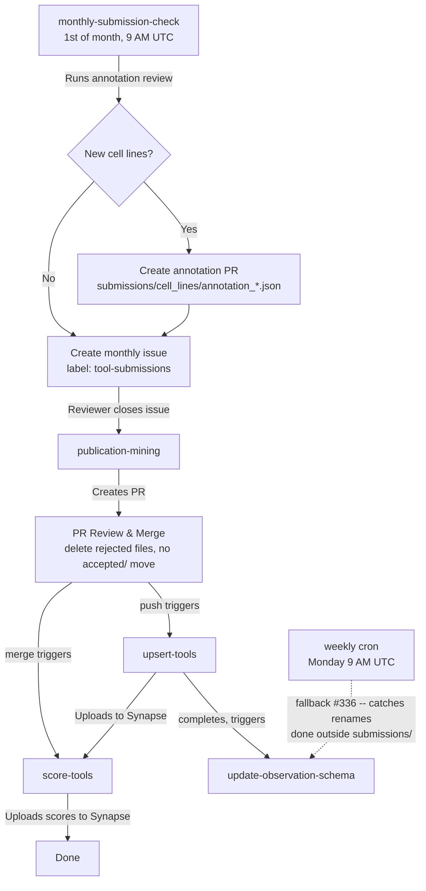

# Workflow Coordination

## Overview

The automated workflows in this repository run in a coordinated sequence. The monthly issue serves as the human-in-the-loop gate that coordinates annotation review, Formspark submission review, and publication mining.

- ✅ Human review gates between steps
- ✅ Annotation review embedded in monthly workflow (no separate weekly run)
- ✅ Unified `submissions/{type}/` review flow for all tool sources — reviewers edit/delete files in place, no `accepted/` subfolder move (dropped 2026-04)
- ✅ Clear audit trail of changes

## Workflow Sequence


```mermaid
graph TD
    A[monthly-submission-check<br/>1st of month, 9 AM UTC] -->|Runs annotation review| B{New cell lines?}
    B -->|Yes| C[Create annotation PR<br/>submissions/cell_lines/annotation_*.json]
    B -->|No| D[Create monthly issue<br/>label: tool-submissions]
    C --> D
    D -->|Reviewer closes issue| E[publication-mining]
    E -->|Creates PR| F[PR Review & Merge<br/>delete rejected files, no accepted/ move]
    F -->|push triggers| G[upsert-tools]
    F -->|merge triggers| H[score-tools]
    G -->|completes, triggers| J[update-observation-schema]
    K[weekly cron<br/>Monday 9 AM UTC] -.->|fallback #336 -- catches renames<br/>done outside submissions/| J
    G -->|Uploads to Synapse| H
    H -->|Uploads scores to Synapse| I[Done]
```

## Detailed Flow

### 1. Monthly Submission Check (Entry Point)
**Workflow**: `monthly-submission-check.yml`
**Trigger**: Schedule (1st of month, 9 AM UTC)
**Creates**: Annotation PR (if new cell lines) + monthly issue

1. Runs `scripts/review_tool_annotations.py`
2. Converts new cell line suggestions → `submissions/cell_lines/annotation_*.json`
3. Creates annotation PR (label: `annotation-submissions`) if new cells found
4. Creates monthly issue (label: `tool-submissions`) with:
   - Annotation review results and link to annotation PR
   - Formspark submission review checklist

**Manual Action Required**:
- Review the annotation PR: confirm cell line names are real NF-relevant cell lines
- Check Formspark dashboard for new form submissions; process with `process_formspark_export.py`
- Delete any rejected files from `submissions/{type}/` (no `accepted/` move — everything left at merge time uploads)
- Close the monthly issue when done (triggers next step)

**Next Step**: Closing the monthly issue → triggers `publication-mining`

---

### 2. Publication Mining
**Workflow**: `publication-mining.yml`
**Trigger**: Monthly issue closed with label `tool-submissions`
**Creates PR**: Yes (label: `tool-submissions`)

Mines NF Portal and PubMed publications for novel tools:
- Filters for research-focused publications (excludes clinical case reports, reviews)
- Checks PMC full text availability
- Maintains cache of reviewed publications for incremental processing
- Validates findings with AI (optional)
- Formats mined tools as JSON in `submissions/{type}/`
- Extracts observations into `submissions/{type}/observations/`

**Next Step**: Reviewer deletes rejected files from `submissions/{type}/` (no `accepted/` move — dropped 2026-04), then merges PR → triggers `upsert-tools` (via push) and `score-tools` (via PR merge)

---

### 3. Upsert Tools to Synapse
**Workflow**: `upsert-tools.yml`
**Trigger**: Push to main with files in `submissions/*/*.json` (observation JSONs under `submissions/*/observations/` don't match this trigger path themselves, but are picked up as part of the same compile once triggered)
**Creates PR**: No (uploads directly to Synapse)

Compiles accepted JSON submissions into `ACCEPTED_*.csv` and generates `submission_publications.csv`, `submission_dev_links.csv`, and `submission_usage_links.csv`. Uploads tools to type-specific Synapse tables (each tool type's own detail table carries its `resourceId`/`resourceName` directly — the legacy central `syn26450069` Resources table was retired in the Phase 7 LinkML migration, see `docs/MIGRATION.md`), publications to syn26486839 (DOIs stored as full `https://www.doi.org/` URLs), development links to syn26486807, and usage links (non-development publications) to syn26486841. Resolves `publicationId` for observation rows before uploading to syn26486836.

---

### 3a. Update Observation Schema
**Workflow**: `update-observation-schema.yml`
**Trigger**: After `upsert-tools.yml` completes on main, OR weekly (Monday 9 AM UTC, added for #336)
**Creates PR**: Yes, label `schema-update` (only if the enums actually changed)

Fetches current `resourceType`/`resourceName` values from `syn51730943` and updates the conditional enums in `NF-Tools-Schemas/observations/SubmitObservationSchema.json` — this is what populates the resource-picker in the public observation submission form.

**Why it also runs on a weekly schedule, not just after upsert-tools**: a `resourceName` can change directly in a live Synapse table (a rename/curation fix applied via a one-time script per `scripts/README.md`, not a `submissions/*.json` push), which never triggers `upsert-tools.yml` and so would never trigger this workflow either if that were its only path. The weekly cron re-checks Synapse regardless of what caused a change, so a direct-to-Synapse rename can't leave the form silently offering stale/removed names indefinitely.

---

### 4. Calculate Completeness Scores
**Workflow**: `score-tools.yml`
**Trigger**: PR merge with label `tool-submissions`
**Creates PR**: No (uploads directly to Synapse)

Calculates tool completeness scores and uploads to Synapse tables.

**End of Chain**: Final step in the sequence

## Technical Implementation

### Issue Close Trigger (publication-mining)

`publication-mining.yml` uses this pattern:

```yaml
on:
  issues:
    types: [closed]
  workflow_dispatch:

jobs:
  mine-publications:
    if: |
      github.event_name == 'workflow_dispatch' ||
      (github.event_name == 'issues' &&
       contains(github.event.issue.labels.*.name, 'tool-submissions'))
```

### PR Merge Triggers (score-tools)

Later workflows use this pattern:

```yaml
on:
  pull_request:
    types: [closed]
    branches:
      - main
  workflow_dispatch:

jobs:
  workflow-name:
    if: |
      github.event_name == 'workflow_dispatch' ||
      (github.event_name == 'pull_request' &&
       github.event.pull_request.merged == true &&
       contains(github.event.pull_request.labels.*.name, 'expected-label'))
```

### Label-Based Coordination

| Workflow | Checks for Label | Creates issue/PR with Label |
|----------|-----------------|----------------------|
| monthly-submission-check | N/A (entry point - scheduled) | `tool-submissions` (issue), `annotation-submissions` (PR if new cells) |
| publication-mining | `tool-submissions` (issue closed) | `tool-submissions` |
| upsert-tools | N/A (path trigger: `submissions/*/*.json`) | N/A (no PR) |
| update-observation-schema | N/A (workflow_run + weekly cron, see #336) | `schema-update` (only if enums changed) |
| score-tools | `tool-submissions` | N/A (no PR) |


### submissions/{type}/ Review Flow

All tool sources (mining, form submissions, annotation review) produce JSON files directly in `submissions/{type}/` — there is **no `accepted/` subfolder** (that step was dropped 2026-04; reviewers now edit/delete files in place, and whatever remains at merge time uploads):

```
submissions/
  cell_lines/
    annotation_NF90-8.json        ← from annotation review
    form_abc123_NF90-8.json       ← from Formspark export
    pmid12345678_NF90-8.json      ← from publication mining
    observations/                 ← per-tool observations (read-only, from mining)
  animal_models/
    observations/
  ...
```

When `submissions/*/*.json` is pushed to main, `upsert-tools.yml` triggers:
1. Compiles `submissions/{type}/*.json` (+ `submissions/{type}/observations/*.json`) → `ACCEPTED_*.csv` + `submission_publications.csv`, `submission_dev_links.csv`, `submission_usage_links.csv`
2. Validates CSV schemas (resolves `publicationId` for observations via syn26486839)
3. Uploads tool data to Synapse type-specific tables
4. Upserts publications (syn26486839), development links (syn26486807), and usage links (syn26486841)
5. Completing on main also triggers `update-observation-schema.yml` (see 3a above), which re-syncs the observation form's `resourceName` options

## Manual Trigger Guide

All workflows support manual triggers via `workflow_dispatch`:

### To Run Entire Chain Manually:

1. **Trigger**: `monthly-submission-check`
   - Go to Actions → Monthly Tool Submission Check → Run workflow
   - Wait for completion

2. **Review annotation PR** (if created)
   - Confirm cell line names are real NF-relevant cell lines
   - Delete the file if it's not a real cell line — otherwise leave it, no move needed

3. **Review Formspark submissions**
   - Export from dashboard → run `process_formspark_export.py`
   - Delete any rejected files from `submissions/{type}/`

4. **Close the monthly issue**
   - Triggers `publication-mining` automatically

5. **Automatic**: `publication-mining` runs
   - Mines NF Portal and PubMed publications
   - Creates PR with mined tools in `submissions/{type}/`

6. **Review & merge PR**
   - Delete rejected tools from `submissions/{type}/`; whatever remains at merge time uploads (no `accepted/` move)
   - Merging triggers `upsert-tools` (path-based) and `score-tools` (label-based); `upsert-tools` completing also triggers `update-observation-schema`

7. Continue through remaining workflows

### To Test Single Workflow:

1. Go to Actions tab
2. Select workflow to test
3. Click "Run workflow"
4. Provide inputs if needed
5. Run on your branch

## Monitoring the Chain

### Check Progress

1. **Actions Tab**: See all running/completed workflows
2. **Issues**: Filter by `tool-submissions` label for monthly issues
3. **Pull Requests**: Filter by labels to see chain PRs

### Troubleshooting Breaks

If a workflow doesn't trigger:

1. **publication-mining**: Check that the issue has `tool-submissions` label and was closed
2. **score-tools**: Check PR was merged (not just closed) and has `tool-submissions` label
3. **update-observation-schema looks stale**: it only re-triggers automatically after `upsert-tools.yml` completes or on its Monday cron (#336) — a resourceName change made directly in Synapse (e.g. via a one-time fix script) won't show up in the form until the next Monday unless you also run `python scripts/update_observation_schema.py` (or trigger the workflow manually) right after
4. **Check workflow permissions** in Settings

4. **Review Actions logs** for errors
5. **Verify secrets** are configured correctly

## Best Practices

### For Reviewers

1. **Annotation review**: Verify cell line names are real, NF-relevant (not sample IDs or typos)
2. **Formspark submissions**: Check for new submissions before closing the monthly issue
3. **Mining PR**: Inspect `submissions/{type}/` JSON files — delete rejects; valid tools need no move, they upload from wherever they sit at merge time
4. **Look for anomalies** in suggested values
5. **Read workflow logs** if something looks wrong

### For Maintainers

1. **Monitor Actions tab** regularly
2. **Set up notifications** for failed workflows
3. **Close monthly issues promptly** to keep chain moving
4. **Check labels** are correct on issues and PRs
5. **Update secrets** before they expire

### For Developers

1. **Test changes** with manual triggers first
2. **Don't modify labels** used for coordination
3. **Keep conditionals** in sync with labels
4. **Document changes** in workflow files
5. **Update this documentation** when changing flows

## Related Documentation

- **Workflow details**: [`.github/workflows/README.md`](../.github/workflows/README.md)
- **Tool annotation review**: [`TOOL_ANNOTATION_REVIEW.md`](TOOL_ANNOTATION_REVIEW.md)
- **Tool coverage**: [`../tool_coverage/README.md`](../tool_coverage/README.md)
- **Scripts**: [`../scripts/README.md`](../scripts/README.md)
