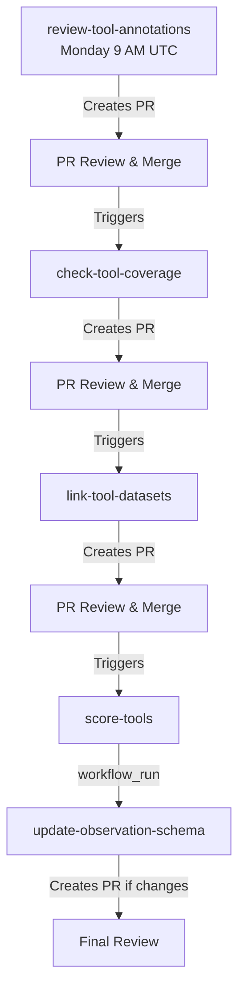

# Workflow Coordination

**Implementation of [Issue #97](https://github.com/nf-osi/nf-research-tools-schema/issues/97)**

## Overview

The automated workflows in this repository run in a coordinated sequence where each workflow creates a Pull Request, and when that PR is merged, it triggers the next workflow in the chain. This ensures:

- ✅ Data dependencies are respected
- ✅ Manual review gates between steps
- ✅ No race conditions or overlapping workflows
- ✅ Clear audit trail of changes

## Workflow Sequence



## Detailed Flow

### 1. Review Tool Annotations (Entry Point)
**Workflow**: `review-tool-annotations.yml`
**Trigger**: Schedule (Monday 9 AM UTC)
**Creates PR**: Yes (label: `automated-annotation-review`)

Two tasks in one workflow:
1. **New cell lines**: Analyzes `individualID` annotations from syn52702673, suggests new cell lines and synonyms.
2. **Field enrichment**: Queries `modelSystemName`-matched annotation data from syn16858331, fills blank fields in existing cell line, animal model, patient-derived model, and donor records using consensus values.

**Manual Action Required**:
- Fill in `organ` field for any new cell lines
- Review `SUBMIT_*_updates.csv` files (check `_match_key` column to confirm annotation match is correct)

**Next Step**: When PR is merged → triggers `check-tool-coverage`

---

### 2. Check Tool Coverage
**Workflow**: `check-tool-coverage.yml`
**Trigger**: PR merge with label `automated-annotation-review`
**Creates PR**: Yes (label: `automated-mining`)

Mines NF Portal and PubMed publications for novel tools:
- Filters for research-focused publications (excludes clinical case reports, reviews)
- Checks PMC full text availability
- Maintains cache of reviewed publications for incremental processing
- Validates findings with AI (optional)

**Next Step**: When PR is merged → triggers `link-tool-datasets`

---

### 3. Link Tool Datasets
**Workflow**: `link-tool-datasets.yml`
**Trigger**: PR merge with label `automated-mining`
**Creates PR**: Yes (label: `dataset-linking`)

Links datasets to tools via publication relationships.

**Next Step**: When PR is merged → triggers `score-tools`

---

### 4. Calculate Completeness Scores
**Workflow**: `score-tools.yml`
**Trigger**: PR merge with label `dataset-linking`
**Creates PR**: No (uploads directly to Synapse)

Calculates tool completeness scores and uploads to Synapse tables.

**Next Step**: When workflow completes → triggers `update-observation-schema`

---

### 5. Update Observation Schema
**Workflow**: `update-observation-schema.yml`
**Trigger**: `workflow_run` (after `score-tools` completes)
**Creates PR**: Only if schema changes detected

Updates observation schema with latest tool data from Synapse.

**End of Chain**: Final step in the sequence

## Technical Implementation

### PR Merge Triggers

Most workflows use this pattern:

```yaml
on:
  pull_request:
    types: [closed]
    branches:
      - main
  workflow_dispatch:  # Manual trigger

jobs:
  workflow-name:
    # Only run if PR was merged (not just closed) and has correct label
    if: |
      github.event_name == 'workflow_dispatch' ||
      (github.event_name == 'pull_request' &&
       github.event.pull_request.merged == true &&
       contains(github.event.pull_request.labels.*.name, 'expected-label'))
```

### Label-Based Coordination

Each workflow checks for specific labels to ensure correct chaining:

| Workflow | Checks for Label | Creates PR with Label |
|----------|-----------------|----------------------|
| review-tool-annotations | N/A (entry point - scheduled) | `automated-annotation-review` |
| check-tool-coverage | `automated-annotation-review` | `automated-mining` |
| link-tool-datasets | `automated-mining` | `dataset-linking` |
| score-tools | `dataset-linking` | N/A (no PR) |
| update-observation-schema | N/A (workflow_run) | `schema-update` |

### Workflow Run Trigger

The final step uses `workflow_run` since `score-tools` doesn't create a PR:

```yaml
on:
  workflow_run:
    workflows: ["Calculate Tool Completeness Scores"]
    types:
      - completed
    branches:
      - main
```

## Benefits of PR-Merge Coordination

### 1. **Manual Review Gates**
Each step can be reviewed before proceeding. Reviewers can:
- Verify data quality
- Check for errors or anomalies
- Make corrections before proceeding
- Stop the chain if issues found

### 2. **Clear Audit Trail**
- Each PR documents what changed
- Git history shows when and why changes were made
- Easy to track which workflow triggered which changes

### 3. **Fail-Safe Design**
- If a PR is closed without merging, chain stops
- Bad data doesn't propagate through the pipeline
- Can fix issues at any step

### 4. **Flexible Testing**
- Can test individual workflows without running entire chain
- Manual triggers available for all workflows
- Can merge PRs out of order if needed (for testing)

## Manual Trigger Guide

All workflows support manual triggers via `workflow_dispatch`:

### To Run Entire Chain Manually:

1. **Trigger**: `review-tool-annotations`
   - Go to Actions → Weekly Tool Annotation Review → Run workflow
   - Wait for completion

2. **Review & Merge PR**
   - Fill in required fields (organ for cell lines)
   - Check the created PR
   - Merge when ready

3. **Automatic**: `check-tool-coverage` triggers
   - Runs automatically after merge
   - Mines NF Portal and PubMed publications
   - Wait for completion

4. **Review & Merge PR**
   - Check mined tools and AI validation results
   - Merge when ready

5. **Automatic**: `link-tool-datasets` triggers
   - Continues automatically
   - Repeat review & merge pattern

6. Continue through remaining workflows

### To Test Single Workflow:

1. Go to Actions tab
2. Select workflow to test
3. Click "Run workflow"
4. Provide inputs if needed
5. Run on your branch

## Monitoring the Chain

### Check Progress

1. **Actions Tab**: See all running/completed workflows
2. **Pull Requests**: Filter by labels to see chain PRs
3. **Workflow Dependencies**: Each workflow shows what triggered it

### Troubleshooting Breaks

If a workflow doesn't trigger:

1. **Check PR was merged** (not just closed)
2. **Verify labels** on the merged PR
3. **Check workflow permissions** in Settings
4. **Review Actions logs** for errors
5. **Verify secrets** are configured correctly

## Schedule vs. PR Triggers

Only `review-tool-annotations` has a schedule (entry point). All others are triggered by PR merges.

### Why Only One Schedule?

- **Prevents race conditions**: Only one entry point
- **Ensures order**: Chain runs sequentially
- **Data consistency**: Each step uses previous step's outputs
- **Manual control**: Review gates between steps

### Schedule Pattern

```
Monday 9 AM UTC: review-tool-annotations runs
    ↓
Monday/Tuesday: Review & merge annotation PR
    ↓
Tuesday: Tool coverage runs (mines NF Portal + PubMed)
    ↓
Tuesday/Wednesday: Review & merge tool coverage PR
    ↓
Wednesday: Dataset linking runs & merges
    ↓
Wednesday/Thursday: Scoring runs (no PR)
    ↓
Thursday: Schema update runs (if changes)
```

Actual timing depends on:
- When PRs are reviewed and merged
- Workflow execution time
- Synapse data availability

## Best Practices

### For Reviewers

1. **Check data quality** before merging
2. **Fill in required fields** (e.g., organ for cell lines)
3. **Look for anomalies** in suggested values
4. **Verify counts** match expectations
5. **Read workflow logs** if something looks wrong

### For Maintainers

1. **Monitor Actions tab** regularly
2. **Set up notifications** for failed workflows
3. **Review PRs promptly** to keep chain moving
4. **Check labels** are correct on PRs
5. **Update secrets** before they expire

### For Developers

1. **Test changes** with manual triggers first
2. **Don't modify labels** used for coordination
3. **Keep PR conditionals** in sync with labels
4. **Document changes** in workflow files
5. **Update this documentation** when changing flows

## Related Documentation

- **Workflow details**: [`.github/workflows/README.md`](../.github/workflows/README.md)
- **Tool annotation review**: [`TOOL_ANNOTATION_REVIEW.md`](TOOL_ANNOTATION_REVIEW.md)
- **Tool coverage**: [`../tool_coverage/README.md`](../tool_coverage/README.md)
- **Scripts**: [`../scripts/README.md`](../scripts/README.md)
