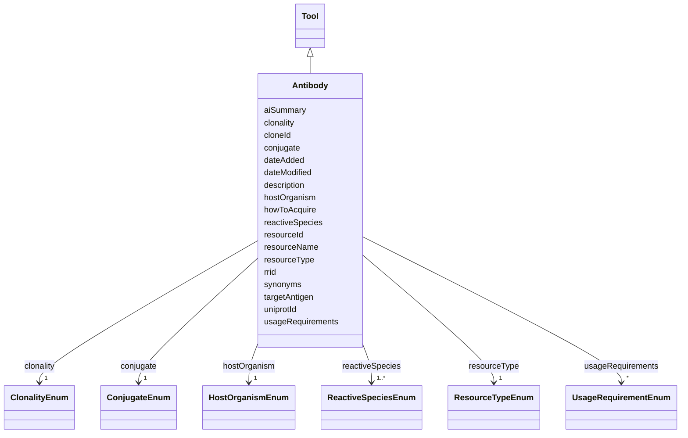

---
search:
  boost: 10.0
---

# Class: Antibody 


_A blood protein produced in response to and counteracting a specific antigen. Antibodies combine chemically with substances which the body recognizes as alien, such as bacteria, viruses, and foreign substances in the blood._


<div data-search-exclude markdown="1">


URI: [nftools:Antibody](https://w3id.org/nf-research-tools/Antibody)





## Inheritance
* [Tool](Tool.md)
    * **Antibody**


## Slots

| Name | Cardinality and Range | Description | Inheritance |
| ---  | --- | --- | --- |
| [uniprotId](uniprotId.md) | 0..1 <br/> [String](String.md) | The UniProt ID of the protein targeted by the antibody | direct |
| [targetAntigen](targetAntigen.md) | 1 <br/> [String](String.md) | Antigen that is targeted by antibody (e | direct |
| [clonality](clonality.md) | 1 <br/> [ClonalityEnum](ClonalityEnum.md) | The type of clonality of the antibody | direct |
| [cloneId](cloneId.md) | 0..1 <br/> [String](String.md) | Identification of clone (e | direct |
| [reactiveSpecies](reactiveSpecies.md) | 1..* <br/> [ReactiveSpeciesEnum](ReactiveSpeciesEnum.md) | Species the antibody has been shown to crossreact with the target protein | direct |
| [conjugate](conjugate.md) | 1 <br/> [ConjugateEnum](ConjugateEnum.md) | Whether the antibody is conjugated or nonconjugated | direct |
| [hostOrganism](hostOrganism.md) | 1 <br/> [HostOrganismEnum](HostOrganismEnum.md) | The species of the organism that hosts the antibody | direct |
| [resourceId](resourceId.md) | 1 <br/> [String](String.md) | A unique identifier for the resource | [Tool](Tool.md) |
| [rrid](rrid.md) | 0..1 <br/> [String](String.md) | The RRID, a standard resource identifier for interoperability with other data... | [Tool](Tool.md) |
| [resourceName](resourceName.md) | 1 <br/> [String](String.md) | The canonical name of the resource | [Tool](Tool.md) |
| [synonyms](synonyms.md) | * <br/> [String](String.md) | Synonyms of the resource | [Tool](Tool.md) |
| [resourceType](resourceType.md) | 1 <br/> [ResourceTypeEnum](ResourceTypeEnum.md) | Type of resource | [Tool](Tool.md) |
| [description](description.md) | 0..1 <br/> [String](String.md) | Free text description, summary, or purpose of the resource | [Tool](Tool.md) |
| [aiSummary](aiSummary.md) | 0..1 <br/> [String](String.md) | A large language model-generated summary of the resource | [Tool](Tool.md) |
| [usageRequirements](usageRequirements.md) | * <br/> [UsageRequirementEnum](UsageRequirementEnum.md) | Any known restrictions on use of the resource | [Tool](Tool.md) |
| [howToAcquire](howToAcquire.md) | 1 <br/> [String](String.md) | How to acquire a particular resource | [Tool](Tool.md) |
| [dateAdded](dateAdded.md) | 1 <br/> [Date](Date.md) | The date that the resource was originally added | [Tool](Tool.md) |
| [dateModified](dateModified.md) | 1 <br/> [Date](Date.md) | The last update of the resource metadata | [Tool](Tool.md) |


## Identifier and Mapping Information


### Annotations

| property | value |
| --- | --- |
| synapse_table_id | syn26486811 |


### Schema Source


* from schema: https://w3id.org/nf-research-tools


## Mappings

| Mapping Type | Mapped Value |
| ---  | ---  |
| self | nftools:Antibody |
| native | nftools:Antibody |


## LinkML Source

<!-- TODO: investigate https://stackoverflow.com/questions/37606292/how-to-create-tabbed-code-blocks-in-mkdocs-or-sphinx -->

### Direct

<details>
```yaml
name: Antibody
annotations:
  synapse_table_id:
    tag: synapse_table_id
    value: syn26486811
description: A blood protein produced in response to and counteracting a specific
  antigen. Antibodies combine chemically with substances which the body recognizes
  as alien, such as bacteria, viruses, and foreign substances in the blood.
from_schema: https://w3id.org/nf-research-tools
is_a: Tool
slot_usage:
  resourceType:
    name: resourceType
    ifabsent: string(Antibody)
attributes:
  uniprotId:
    name: uniprotId
    description: The UniProt ID of the protein targeted by the antibody.
    from_schema: https://w3id.org/nf-research-tools/antibody
    rank: 1000
    domain_of:
    - Antibody
  targetAntigen:
    name: targetAntigen
    description: Antigen that is targeted by antibody (e.g. Neurofibromin 1 human).
    from_schema: https://w3id.org/nf-research-tools/antibody
    rank: 1000
    domain_of:
    - Antibody
    required: true
  clonality:
    name: clonality
    description: The type of clonality of the antibody.
    from_schema: https://w3id.org/nf-research-tools/antibody
    rank: 1000
    domain_of:
    - Antibody
    range: ClonalityEnum
    required: true
  cloneId:
    name: cloneId
    description: Identification of clone (e.g. 2D1).
    from_schema: https://w3id.org/nf-research-tools/antibody
    rank: 1000
    domain_of:
    - Antibody
  reactiveSpecies:
    name: reactiveSpecies
    description: Species the antibody has been shown to crossreact with the target
      protein.
    from_schema: https://w3id.org/nf-research-tools/antibody
    rank: 1000
    domain_of:
    - Antibody
    range: ReactiveSpeciesEnum
    required: true
    multivalued: true
  conjugate:
    name: conjugate
    description: Whether the antibody is conjugated or nonconjugated.
    from_schema: https://w3id.org/nf-research-tools/antibody
    rank: 1000
    domain_of:
    - Antibody
    range: ConjugateEnum
    required: true
  hostOrganism:
    name: hostOrganism
    description: The species of the organism that hosts the antibody.
    from_schema: https://w3id.org/nf-research-tools/antibody
    rank: 1000
    domain_of:
    - Antibody
    range: HostOrganismEnum
    required: true

```
</details>

### Induced

<details>
```yaml
name: Antibody
annotations:
  synapse_table_id:
    tag: synapse_table_id
    value: syn26486811
description: A blood protein produced in response to and counteracting a specific
  antigen. Antibodies combine chemically with substances which the body recognizes
  as alien, such as bacteria, viruses, and foreign substances in the blood.
from_schema: https://w3id.org/nf-research-tools
is_a: Tool
slot_usage:
  resourceType:
    name: resourceType
    ifabsent: string(Antibody)
attributes:
  uniprotId:
    name: uniprotId
    description: The UniProt ID of the protein targeted by the antibody.
    from_schema: https://w3id.org/nf-research-tools/antibody
    rank: 1000
    owner: Antibody
    domain_of:
    - Antibody
    range: string
  targetAntigen:
    name: targetAntigen
    description: Antigen that is targeted by antibody (e.g. Neurofibromin 1 human).
    from_schema: https://w3id.org/nf-research-tools/antibody
    rank: 1000
    owner: Antibody
    domain_of:
    - Antibody
    range: string
    required: true
  clonality:
    name: clonality
    description: The type of clonality of the antibody.
    from_schema: https://w3id.org/nf-research-tools/antibody
    rank: 1000
    owner: Antibody
    domain_of:
    - Antibody
    range: ClonalityEnum
    required: true
  cloneId:
    name: cloneId
    description: Identification of clone (e.g. 2D1).
    from_schema: https://w3id.org/nf-research-tools/antibody
    rank: 1000
    owner: Antibody
    domain_of:
    - Antibody
    range: string
  reactiveSpecies:
    name: reactiveSpecies
    description: Species the antibody has been shown to crossreact with the target
      protein.
    from_schema: https://w3id.org/nf-research-tools/antibody
    rank: 1000
    owner: Antibody
    domain_of:
    - Antibody
    range: ReactiveSpeciesEnum
    required: true
    multivalued: true
  conjugate:
    name: conjugate
    description: Whether the antibody is conjugated or nonconjugated.
    from_schema: https://w3id.org/nf-research-tools/antibody
    rank: 1000
    owner: Antibody
    domain_of:
    - Antibody
    range: ConjugateEnum
    required: true
  hostOrganism:
    name: hostOrganism
    description: The species of the organism that hosts the antibody.
    from_schema: https://w3id.org/nf-research-tools/antibody
    rank: 1000
    owner: Antibody
    domain_of:
    - Antibody
    range: HostOrganismEnum
    required: true
  resourceId:
    name: resourceId
    description: A unique identifier for the resource.
    from_schema: https://w3id.org/nf-research-tools
    rank: 1000
    slot_uri: schema:identifier
    identifier: true
    owner: Antibody
    domain_of:
    - Tool
    - DevelopmentRecord
    - Usage
    range: string
    required: true
  rrid:
    name: rrid
    description: The RRID, a standard resource identifier for interoperability with
      other databases. Must include the lowercase 'rrid:' prefix.
    from_schema: https://w3id.org/nf-research-tools
    rank: 1000
    owner: Antibody
    domain_of:
    - Tool
    range: string
    pattern: ^rrid:[a-zA-Z]+.+$
  resourceName:
    name: resourceName
    description: The canonical name of the resource.
    from_schema: https://w3id.org/nf-research-tools
    rank: 1000
    slot_uri: schema:name
    owner: Antibody
    domain_of:
    - Tool
    range: string
    required: true
  synonyms:
    name: synonyms
    description: Synonyms of the resource.
    from_schema: https://w3id.org/nf-research-tools
    rank: 1000
    owner: Antibody
    domain_of:
    - Tool
    range: string
    multivalued: true
  resourceType:
    name: resourceType
    description: Type of resource.
    from_schema: https://w3id.org/nf-research-tools
    rank: 1000
    ifabsent: string(Antibody)
    owner: Antibody
    domain_of:
    - Tool
    range: ResourceTypeEnum
    required: true
  description:
    name: description
    description: Free text description, summary, or purpose of the resource.
    from_schema: https://w3id.org/nf-research-tools
    rank: 1000
    slot_uri: schema:description
    owner: Antibody
    domain_of:
    - Tool
    range: string
  aiSummary:
    name: aiSummary
    description: A large language model-generated summary of the resource.
    from_schema: https://w3id.org/nf-research-tools
    rank: 1000
    owner: Antibody
    domain_of:
    - Tool
    range: string
  usageRequirements:
    name: usageRequirements
    description: Any known restrictions on use of the resource.
    from_schema: https://w3id.org/nf-research-tools
    rank: 1000
    owner: Antibody
    domain_of:
    - Tool
    range: UsageRequirementEnum
    multivalued: true
  howToAcquire:
    name: howToAcquire
    description: How to acquire a particular resource.
    from_schema: https://w3id.org/nf-research-tools
    rank: 1000
    owner: Antibody
    domain_of:
    - Tool
    range: string
    required: true
  dateAdded:
    name: dateAdded
    description: The date that the resource was originally added.
    from_schema: https://w3id.org/nf-research-tools
    rank: 1000
    owner: Antibody
    domain_of:
    - Tool
    range: date
    required: true
  dateModified:
    name: dateModified
    description: The last update of the resource metadata.
    from_schema: https://w3id.org/nf-research-tools
    rank: 1000
    owner: Antibody
    domain_of:
    - Tool
    range: date
    required: true

```
</details></div>