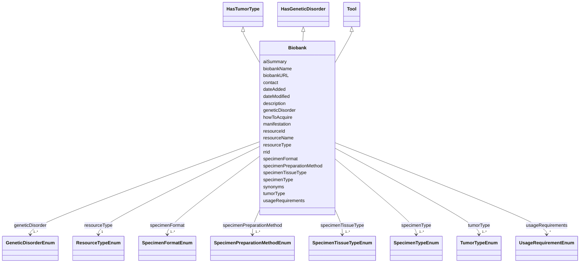

---
search:
  boost: 10.0
---

# Class: Biobank 


_A large collection of biological or medical data and tissue samples, amassed for research purposes._


<div data-search-exclude markdown="1">


URI: [nftools:Biobank](https://w3id.org/nf-research-tools/Biobank)





## Inheritance
* [Tool](Tool.md)
    * **Biobank** [ [HasTumorType](HasTumorType.md) [HasGeneticDisorder](HasGeneticDisorder.md)]


## Slots

| Name | Cardinality and Range | Description | Inheritance |
| ---  | --- | --- | --- |
| [biobankName](biobankName.md) | 1 <br/> [String](String.md) | The name of the biobank | direct |
| [biobankURL](biobankURL.md) | 1 <br/> [Uri](Uri.md) | A URL for the biobank landing page | direct |
| [contact](contact.md) | 0..1 <br/> [String](String.md) | Guidance on where to find additional information about the biobank | direct |
| [specimenType](specimenType.md) | 1..* <br/> [SpecimenTypeEnum](SpecimenTypeEnum.md) | The types of specimens that are banked | direct |
| [specimenTissueType](specimenTissueType.md) | 1..* <br/> [SpecimenTissueTypeEnum](SpecimenTissueTypeEnum.md) | The types of tissues that are banked | direct |
| [specimenPreparationMethod](specimenPreparationMethod.md) | 1..* <br/> [SpecimenPreparationMethodEnum](SpecimenPreparationMethodEnum.md) | The preservation methods used by the biobank | direct |
| [specimenFormat](specimenFormat.md) | 1..* <br/> [SpecimenFormatEnum](SpecimenFormatEnum.md) | How specimens have been processed in preparation for distribution | direct |
| [tumorType](tumorType.md) | 1..* <br/> [TumorTypeEnum](TumorTypeEnum.md) | Tumor types associated with the resource | [HasTumorType](HasTumorType.md) |
| [geneticDisorder](geneticDisorder.md) | 1..* <br/> [GeneticDisorderEnum](GeneticDisorderEnum.md) | Genetic disorders associated with the resource | [HasGeneticDisorder](HasGeneticDisorder.md) |
| [manifestation](manifestation.md) | * <br/> [String](String.md) | Manifestations or symptoms that this resource is used to model (e | [HasGeneticDisorder](HasGeneticDisorder.md) |
| [resourceId](resourceId.md) | 1 <br/> [String](String.md) | A unique identifier for the resource | [Tool](Tool.md) |
| [rrid](rrid.md) | 0..1 <br/> [String](String.md) | The RRID, a standard resource identifier for interoperability with other data... | [Tool](Tool.md) |
| [resourceName](resourceName.md) | 1 <br/> [String](String.md) | The canonical name of the resource | [Tool](Tool.md) |
| [synonyms](synonyms.md) | * <br/> [String](String.md) | Synonyms of the resource | [Tool](Tool.md) |
| [resourceType](resourceType.md) | 1 <br/> [ResourceTypeEnum](ResourceTypeEnum.md) | Type of resource | [Tool](Tool.md) |
| [description](description.md) | 0..1 <br/> [String](String.md) | Free text description, summary, or purpose of the resource | [Tool](Tool.md) |
| [aiSummary](aiSummary.md) | 0..1 <br/> [String](String.md) | A large language model-generated summary of the resource | [Tool](Tool.md) |
| [usageRequirements](usageRequirements.md) | * <br/> [UsageRequirementEnum](UsageRequirementEnum.md) | Any known restrictions on use of the resource | [Tool](Tool.md) |
| [howToAcquire](howToAcquire.md) | 1 <br/> [String](String.md) | How to acquire a particular resource | [Tool](Tool.md) |
| [dateAdded](dateAdded.md) | 1 <br/> [Date](Date.md) | The date that the resource was originally added | [Tool](Tool.md) |
| [dateModified](dateModified.md) | 1 <br/> [Date](Date.md) | The last update of the resource metadata | [Tool](Tool.md) |


## Identifier and Mapping Information


### Annotations

| property | value |
| --- | --- |
| synapse_table_id | syn26486821 |


### Schema Source


* from schema: https://w3id.org/nf-research-tools


## Mappings

| Mapping Type | Mapped Value |
| ---  | ---  |
| self | nftools:Biobank |
| native | nftools:Biobank |


## LinkML Source

<!-- TODO: investigate https://stackoverflow.com/questions/37606292/how-to-create-tabbed-code-blocks-in-mkdocs-or-sphinx -->

### Direct

<details>
```yaml
name: Biobank
annotations:
  synapse_table_id:
    tag: synapse_table_id
    value: syn26486821
description: A large collection of biological or medical data and tissue samples,
  amassed for research purposes.
from_schema: https://w3id.org/nf-research-tools
is_a: Tool
mixins:
- HasTumorType
- HasGeneticDisorder
slot_usage:
  resourceType:
    name: resourceType
    ifabsent: string(Biobank)
  geneticDisorder:
    name: geneticDisorder
    required: true
  tumorType:
    name: tumorType
    required: true
attributes:
  biobankName:
    name: biobankName
    description: The name of the biobank.
    from_schema: https://w3id.org/nf-research-tools/biobank
    rank: 1000
    domain_of:
    - Biobank
    required: true
  biobankURL:
    name: biobankURL
    description: A URL for the biobank landing page.
    from_schema: https://w3id.org/nf-research-tools/biobank
    rank: 1000
    domain_of:
    - Biobank
    range: uri
    required: true
  contact:
    name: contact
    description: Guidance on where to find additional information about the biobank.
    from_schema: https://w3id.org/nf-research-tools/biobank
    rank: 1000
    domain_of:
    - Biobank
  specimenType:
    name: specimenType
    description: The types of specimens that are banked.
    from_schema: https://w3id.org/nf-research-tools/biobank
    rank: 1000
    domain_of:
    - Biobank
    range: SpecimenTypeEnum
    required: true
    multivalued: true
  specimenTissueType:
    name: specimenTissueType
    description: The types of tissues that are banked.
    from_schema: https://w3id.org/nf-research-tools/biobank
    rank: 1000
    domain_of:
    - Biobank
    range: SpecimenTissueTypeEnum
    required: true
    multivalued: true
  specimenPreparationMethod:
    name: specimenPreparationMethod
    description: The preservation methods used by the biobank.
    from_schema: https://w3id.org/nf-research-tools/biobank
    rank: 1000
    domain_of:
    - Biobank
    range: SpecimenPreparationMethodEnum
    required: true
    multivalued: true
  specimenFormat:
    name: specimenFormat
    description: How specimens have been processed in preparation for distribution.
    from_schema: https://w3id.org/nf-research-tools/biobank
    rank: 1000
    domain_of:
    - Biobank
    range: SpecimenFormatEnum
    required: true
    multivalued: true

```
</details>

### Induced

<details>
```yaml
name: Biobank
annotations:
  synapse_table_id:
    tag: synapse_table_id
    value: syn26486821
description: A large collection of biological or medical data and tissue samples,
  amassed for research purposes.
from_schema: https://w3id.org/nf-research-tools
is_a: Tool
mixins:
- HasTumorType
- HasGeneticDisorder
slot_usage:
  resourceType:
    name: resourceType
    ifabsent: string(Biobank)
  geneticDisorder:
    name: geneticDisorder
    required: true
  tumorType:
    name: tumorType
    required: true
attributes:
  biobankName:
    name: biobankName
    description: The name of the biobank.
    from_schema: https://w3id.org/nf-research-tools/biobank
    rank: 1000
    owner: Biobank
    domain_of:
    - Biobank
    range: string
    required: true
  biobankURL:
    name: biobankURL
    description: A URL for the biobank landing page.
    from_schema: https://w3id.org/nf-research-tools/biobank
    rank: 1000
    owner: Biobank
    domain_of:
    - Biobank
    range: uri
    required: true
  contact:
    name: contact
    description: Guidance on where to find additional information about the biobank.
    from_schema: https://w3id.org/nf-research-tools/biobank
    rank: 1000
    owner: Biobank
    domain_of:
    - Biobank
    range: string
  specimenType:
    name: specimenType
    description: The types of specimens that are banked.
    from_schema: https://w3id.org/nf-research-tools/biobank
    rank: 1000
    owner: Biobank
    domain_of:
    - Biobank
    range: SpecimenTypeEnum
    required: true
    multivalued: true
  specimenTissueType:
    name: specimenTissueType
    description: The types of tissues that are banked.
    from_schema: https://w3id.org/nf-research-tools/biobank
    rank: 1000
    owner: Biobank
    domain_of:
    - Biobank
    range: SpecimenTissueTypeEnum
    required: true
    multivalued: true
  specimenPreparationMethod:
    name: specimenPreparationMethod
    description: The preservation methods used by the biobank.
    from_schema: https://w3id.org/nf-research-tools/biobank
    rank: 1000
    owner: Biobank
    domain_of:
    - Biobank
    range: SpecimenPreparationMethodEnum
    required: true
    multivalued: true
  specimenFormat:
    name: specimenFormat
    description: How specimens have been processed in preparation for distribution.
    from_schema: https://w3id.org/nf-research-tools/biobank
    rank: 1000
    owner: Biobank
    domain_of:
    - Biobank
    range: SpecimenFormatEnum
    required: true
    multivalued: true
  tumorType:
    name: tumorType
    description: Tumor types associated with the resource.
    from_schema: https://w3id.org/nf-research-tools
    rank: 1000
    owner: Biobank
    domain_of:
    - HasTumorType
    range: TumorTypeEnum
    required: true
    multivalued: true
  geneticDisorder:
    name: geneticDisorder
    description: Genetic disorders associated with the resource.
    from_schema: https://w3id.org/nf-research-tools
    rank: 1000
    owner: Biobank
    domain_of:
    - HasGeneticDisorder
    range: GeneticDisorderEnum
    required: true
    multivalued: true
  manifestation:
    name: manifestation
    description: Manifestations or symptoms that this resource is used to model (e.g.
      tumor type, behavioral phenotype).
    from_schema: https://w3id.org/nf-research-tools
    rank: 1000
    owner: Biobank
    domain_of:
    - HasGeneticDisorder
    range: string
    multivalued: true
  resourceId:
    name: resourceId
    description: A unique identifier for the resource.
    from_schema: https://w3id.org/nf-research-tools
    rank: 1000
    slot_uri: schema:identifier
    identifier: true
    owner: Biobank
    domain_of:
    - Tool
    - DevelopmentRecord
    - Usage
    range: string
    required: true
  rrid:
    name: rrid
    description: The RRID, a standard resource identifier for interoperability with
      other databases. Must include the lowercase 'rrid:' prefix.
    from_schema: https://w3id.org/nf-research-tools
    rank: 1000
    owner: Biobank
    domain_of:
    - Tool
    range: string
    pattern: ^rrid:[a-zA-Z]+.+$
  resourceName:
    name: resourceName
    description: The canonical name of the resource.
    from_schema: https://w3id.org/nf-research-tools
    rank: 1000
    slot_uri: schema:name
    owner: Biobank
    domain_of:
    - Tool
    range: string
    required: true
  synonyms:
    name: synonyms
    description: Synonyms of the resource.
    from_schema: https://w3id.org/nf-research-tools
    rank: 1000
    owner: Biobank
    domain_of:
    - Tool
    range: string
    multivalued: true
  resourceType:
    name: resourceType
    description: Type of resource.
    from_schema: https://w3id.org/nf-research-tools
    rank: 1000
    ifabsent: string(Biobank)
    owner: Biobank
    domain_of:
    - Tool
    range: ResourceTypeEnum
    required: true
  description:
    name: description
    description: Free text description, summary, or purpose of the resource.
    from_schema: https://w3id.org/nf-research-tools
    rank: 1000
    slot_uri: schema:description
    owner: Biobank
    domain_of:
    - Tool
    range: string
  aiSummary:
    name: aiSummary
    description: A large language model-generated summary of the resource.
    from_schema: https://w3id.org/nf-research-tools
    rank: 1000
    owner: Biobank
    domain_of:
    - Tool
    range: string
  usageRequirements:
    name: usageRequirements
    description: Any known restrictions on use of the resource.
    from_schema: https://w3id.org/nf-research-tools
    rank: 1000
    owner: Biobank
    domain_of:
    - Tool
    range: UsageRequirementEnum
    multivalued: true
  howToAcquire:
    name: howToAcquire
    description: How to acquire a particular resource.
    from_schema: https://w3id.org/nf-research-tools
    rank: 1000
    owner: Biobank
    domain_of:
    - Tool
    range: string
    required: true
  dateAdded:
    name: dateAdded
    description: The date that the resource was originally added.
    from_schema: https://w3id.org/nf-research-tools
    rank: 1000
    owner: Biobank
    domain_of:
    - Tool
    range: date
    required: true
  dateModified:
    name: dateModified
    description: The last update of the resource metadata.
    from_schema: https://w3id.org/nf-research-tools
    rank: 1000
    owner: Biobank
    domain_of:
    - Tool
    range: date
    required: true

```
</details></div>