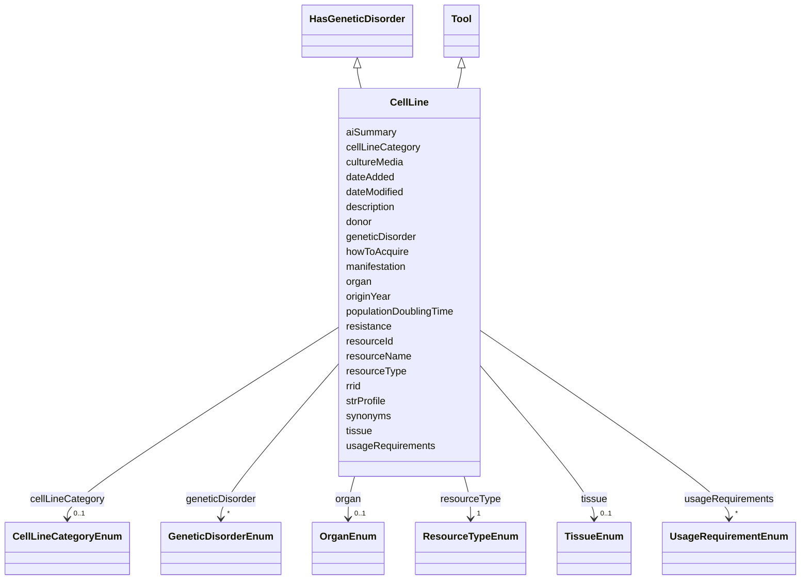

---
search:
  boost: 10.0
---

# Class: CellLine 


_A cell culture selected for uniformity from a cell population derived from a usually homogeneous tissue source._


<div data-search-exclude markdown="1">


URI: [nftools:CellLine](https://w3id.org/nf-research-tools/CellLine)





## Inheritance
* [Tool](Tool.md)
    * **CellLine** [ [HasGeneticDisorder](HasGeneticDisorder.md)]


## Slots

| Name | Cardinality and Range | Description | Inheritance |
| ---  | --- | --- | --- |
| [donor](donor.md) | 0..1 <br/> [String](String.md) | Foreign key to Donor (donorId) | direct |
| [organ](organ.md) | 0..1 <br/> [OrganEnum](OrganEnum.md) | The organ the cell line is derived from | direct |
| [tissue](tissue.md) | 0..1 <br/> [TissueEnum](TissueEnum.md) | The tissue the cell line is derived from | direct |
| [cellLineCategory](cellLineCategory.md) | 0..1 <br/> [CellLineCategoryEnum](CellLineCategoryEnum.md) | The category to which the cell line belongs | direct |
| [originYear](originYear.md) | 0..1 <br/> [Integer](Integer.md) | The year the cell line originated | direct |
| [strProfile](strProfile.md) | 0..1 <br/> [String](String.md) | Short tandem repeat profile information | direct |
| [populationDoublingTime](populationDoublingTime.md) | 0..1 <br/> [String](String.md) | Time for cell line to double | direct |
| [resistance](resistance.md) | * <br/> [String](String.md) | List of compounds the cell line has been selected for | direct |
| [cultureMedia](cultureMedia.md) | 0..1 <br/> [String](String.md) | The base culture medium and supplements used to maintain the cell line (e | direct |
| [geneticDisorder](geneticDisorder.md) | * <br/> [GeneticDisorderEnum](GeneticDisorderEnum.md) | Genetic disorders associated with the resource | [HasGeneticDisorder](HasGeneticDisorder.md) |
| [manifestation](manifestation.md) | * <br/> [String](String.md) | Manifestations or symptoms that this resource is used to model (e | [HasGeneticDisorder](HasGeneticDisorder.md) |
| [resourceId](resourceId.md) | 1 <br/> [String](String.md) | A unique identifier for the resource | [Tool](Tool.md) |
| [rrid](rrid.md) | 0..1 <br/> [String](String.md) | The RRID, a standard resource identifier for interoperability with other data... | [Tool](Tool.md) |
| [resourceName](resourceName.md) | 1 <br/> [String](String.md) | The canonical name of the resource | [Tool](Tool.md) |
| [synonyms](synonyms.md) | * <br/> [String](String.md) | Synonyms of the resource | [Tool](Tool.md) |
| [resourceType](resourceType.md) | 1 <br/> [ResourceTypeEnum](ResourceTypeEnum.md) | Type of resource | [Tool](Tool.md) |
| [description](description.md) | 0..1 <br/> [String](String.md) | Free text description, summary, or purpose of the resource | [Tool](Tool.md) |
| [aiSummary](aiSummary.md) | 0..1 <br/> [String](String.md) | A large language model-generated summary of the resource | [Tool](Tool.md) |
| [usageRequirements](usageRequirements.md) | * <br/> [UsageRequirementEnum](UsageRequirementEnum.md) | Any known restrictions on use of the resource | [Tool](Tool.md) |
| [howToAcquire](howToAcquire.md) | 1 <br/> [String](String.md) | How to acquire a particular resource | [Tool](Tool.md) |
| [dateAdded](dateAdded.md) | 1 <br/> [Date](Date.md) | The date that the resource was originally added | [Tool](Tool.md) |
| [dateModified](dateModified.md) | 1 <br/> [Date](Date.md) | The last update of the resource metadata | [Tool](Tool.md) |


## Identifier and Mapping Information


### Annotations

| property | value |
| --- | --- |
| synapse_table_id | syn26486823 |


### Schema Source


* from schema: https://w3id.org/nf-research-tools


## Mappings

| Mapping Type | Mapped Value |
| ---  | ---  |
| self | nftools:CellLine |
| native | nftools:CellLine |


## LinkML Source

<!-- TODO: investigate https://stackoverflow.com/questions/37606292/how-to-create-tabbed-code-blocks-in-mkdocs-or-sphinx -->

### Direct

<details>
```yaml
name: CellLine
annotations:
  synapse_table_id:
    tag: synapse_table_id
    value: syn26486823
description: A cell culture selected for uniformity from a cell population derived
  from a usually homogeneous tissue source.
from_schema: https://w3id.org/nf-research-tools
is_a: Tool
mixins:
- HasGeneticDisorder
slots:
- donor
slot_usage:
  resourceType:
    name: resourceType
    ifabsent: string(Cell Line)
attributes:
  organ:
    name: organ
    description: The organ the cell line is derived from.
    from_schema: https://w3id.org/nf-research-tools/cell_line
    rank: 1000
    domain_of:
    - CellLine
    range: OrganEnum
  tissue:
    name: tissue
    description: The tissue the cell line is derived from.
    from_schema: https://w3id.org/nf-research-tools/cell_line
    rank: 1000
    domain_of:
    - CellLine
    range: TissueEnum
  cellLineCategory:
    name: cellLineCategory
    description: The category to which the cell line belongs.
    from_schema: https://w3id.org/nf-research-tools/cell_line
    rank: 1000
    domain_of:
    - CellLine
    range: CellLineCategoryEnum
  originYear:
    name: originYear
    description: The year the cell line originated.
    from_schema: https://w3id.org/nf-research-tools/cell_line
    rank: 1000
    domain_of:
    - CellLine
    range: integer
  strProfile:
    name: strProfile
    description: Short tandem repeat profile information.
    from_schema: https://w3id.org/nf-research-tools/cell_line
    rank: 1000
    domain_of:
    - CellLine
  populationDoublingTime:
    name: populationDoublingTime
    description: Time for cell line to double.
    from_schema: https://w3id.org/nf-research-tools/cell_line
    rank: 1000
    domain_of:
    - CellLine
  resistance:
    name: resistance
    description: List of compounds the cell line has been selected for.
    from_schema: https://w3id.org/nf-research-tools/cell_line
    rank: 1000
    domain_of:
    - CellLine
    multivalued: true
  cultureMedia:
    name: cultureMedia
    description: The base culture medium and supplements used to maintain the cell
      line (e.g. RPMI supplemented with 10% FBS).
    from_schema: https://w3id.org/nf-research-tools/cell_line
    rank: 1000
    domain_of:
    - CellLine

```
</details>

### Induced

<details>
```yaml
name: CellLine
annotations:
  synapse_table_id:
    tag: synapse_table_id
    value: syn26486823
description: A cell culture selected for uniformity from a cell population derived
  from a usually homogeneous tissue source.
from_schema: https://w3id.org/nf-research-tools
is_a: Tool
mixins:
- HasGeneticDisorder
slot_usage:
  resourceType:
    name: resourceType
    ifabsent: string(Cell Line)
attributes:
  organ:
    name: organ
    description: The organ the cell line is derived from.
    from_schema: https://w3id.org/nf-research-tools/cell_line
    rank: 1000
    owner: CellLine
    domain_of:
    - CellLine
    range: OrganEnum
  tissue:
    name: tissue
    description: The tissue the cell line is derived from.
    from_schema: https://w3id.org/nf-research-tools/cell_line
    rank: 1000
    owner: CellLine
    domain_of:
    - CellLine
    range: TissueEnum
  cellLineCategory:
    name: cellLineCategory
    description: The category to which the cell line belongs.
    from_schema: https://w3id.org/nf-research-tools/cell_line
    rank: 1000
    owner: CellLine
    domain_of:
    - CellLine
    range: CellLineCategoryEnum
  originYear:
    name: originYear
    description: The year the cell line originated.
    from_schema: https://w3id.org/nf-research-tools/cell_line
    rank: 1000
    owner: CellLine
    domain_of:
    - CellLine
    range: integer
  strProfile:
    name: strProfile
    description: Short tandem repeat profile information.
    from_schema: https://w3id.org/nf-research-tools/cell_line
    rank: 1000
    owner: CellLine
    domain_of:
    - CellLine
    range: string
  populationDoublingTime:
    name: populationDoublingTime
    description: Time for cell line to double.
    from_schema: https://w3id.org/nf-research-tools/cell_line
    rank: 1000
    owner: CellLine
    domain_of:
    - CellLine
    range: string
  resistance:
    name: resistance
    description: List of compounds the cell line has been selected for.
    from_schema: https://w3id.org/nf-research-tools/cell_line
    rank: 1000
    owner: CellLine
    domain_of:
    - CellLine
    range: string
    multivalued: true
  cultureMedia:
    name: cultureMedia
    description: The base culture medium and supplements used to maintain the cell
      line (e.g. RPMI supplemented with 10% FBS).
    from_schema: https://w3id.org/nf-research-tools/cell_line
    rank: 1000
    owner: CellLine
    domain_of:
    - CellLine
    range: string
  donor:
    name: donor
    description: Foreign key to Donor (donorId). The biological donor from which the
      resource was derived.
    from_schema: https://w3id.org/nf-research-tools
    rank: 1000
    owner: CellLine
    domain_of:
    - AnimalModel
    - CellLine
    range: string
  geneticDisorder:
    name: geneticDisorder
    description: Genetic disorders associated with the resource.
    from_schema: https://w3id.org/nf-research-tools
    rank: 1000
    owner: CellLine
    domain_of:
    - HasGeneticDisorder
    range: GeneticDisorderEnum
    multivalued: true
  manifestation:
    name: manifestation
    description: Manifestations or symptoms that this resource is used to model (e.g.
      tumor type, behavioral phenotype).
    from_schema: https://w3id.org/nf-research-tools
    rank: 1000
    owner: CellLine
    domain_of:
    - HasGeneticDisorder
    range: string
    multivalued: true
  resourceId:
    name: resourceId
    description: A unique identifier for the resource.
    from_schema: https://w3id.org/nf-research-tools
    rank: 1000
    slot_uri: schema:identifier
    identifier: true
    owner: CellLine
    domain_of:
    - Tool
    - DevelopmentRecord
    - Usage
    range: string
    required: true
  rrid:
    name: rrid
    description: The RRID, a standard resource identifier for interoperability with
      other databases. Must include the lowercase 'rrid:' prefix.
    from_schema: https://w3id.org/nf-research-tools
    rank: 1000
    owner: CellLine
    domain_of:
    - Tool
    range: string
    pattern: ^rrid:[a-zA-Z]+.+$
  resourceName:
    name: resourceName
    description: The canonical name of the resource.
    from_schema: https://w3id.org/nf-research-tools
    rank: 1000
    slot_uri: schema:name
    owner: CellLine
    domain_of:
    - Tool
    range: string
    required: true
  synonyms:
    name: synonyms
    description: Synonyms of the resource.
    from_schema: https://w3id.org/nf-research-tools
    rank: 1000
    owner: CellLine
    domain_of:
    - Tool
    range: string
    multivalued: true
  resourceType:
    name: resourceType
    description: Type of resource.
    from_schema: https://w3id.org/nf-research-tools
    rank: 1000
    ifabsent: string(Cell Line)
    owner: CellLine
    domain_of:
    - Tool
    range: ResourceTypeEnum
    required: true
  description:
    name: description
    description: Free text description, summary, or purpose of the resource.
    from_schema: https://w3id.org/nf-research-tools
    rank: 1000
    slot_uri: schema:description
    owner: CellLine
    domain_of:
    - Tool
    range: string
  aiSummary:
    name: aiSummary
    description: A large language model-generated summary of the resource.
    from_schema: https://w3id.org/nf-research-tools
    rank: 1000
    owner: CellLine
    domain_of:
    - Tool
    range: string
  usageRequirements:
    name: usageRequirements
    description: Any known restrictions on use of the resource.
    from_schema: https://w3id.org/nf-research-tools
    rank: 1000
    owner: CellLine
    domain_of:
    - Tool
    range: UsageRequirementEnum
    multivalued: true
  howToAcquire:
    name: howToAcquire
    description: How to acquire a particular resource.
    from_schema: https://w3id.org/nf-research-tools
    rank: 1000
    owner: CellLine
    domain_of:
    - Tool
    range: string
    required: true
  dateAdded:
    name: dateAdded
    description: The date that the resource was originally added.
    from_schema: https://w3id.org/nf-research-tools
    rank: 1000
    owner: CellLine
    domain_of:
    - Tool
    range: date
    required: true
  dateModified:
    name: dateModified
    description: The last update of the resource metadata.
    from_schema: https://w3id.org/nf-research-tools
    rank: 1000
    owner: CellLine
    domain_of:
    - Tool
    range: date
    required: true

```
</details></div>