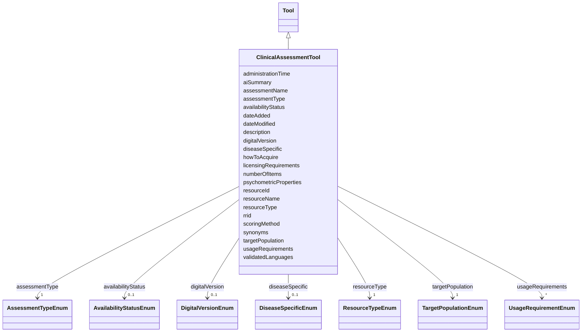

---
search:
  boost: 10.0
---

# Class: ClinicalAssessmentTool 


_Clinical assessment tools including questionnaires, quality of life instruments, and patient-reported outcome measures._


<div data-search-exclude markdown="1">


URI: [nftools:ClinicalAssessmentTool](https://w3id.org/nf-research-tools/ClinicalAssessmentTool)





## Inheritance
* [Tool](Tool.md)
    * **ClinicalAssessmentTool**


## Slots

| Name | Cardinality and Range | Description | Inheritance |
| ---  | --- | --- | --- |
| [assessmentName](assessmentName.md) | 1 <br/> [String](String.md) | Name of the assessment tool or instrument | direct |
| [assessmentType](assessmentType.md) | 1 <br/> [AssessmentTypeEnum](AssessmentTypeEnum.md) | Type of clinical assessment | direct |
| [targetPopulation](targetPopulation.md) | 1 <br/> [TargetPopulationEnum](TargetPopulationEnum.md) | Intended population for the assessment | direct |
| [diseaseSpecific](diseaseSpecific.md) | 0..1 <br/> [DiseaseSpecificEnum](DiseaseSpecificEnum.md) | Whether the assessment is specific to NF or general | direct |
| [numberOfItems](numberOfItems.md) | 0..1 <br/> [Integer](Integer.md) | Number of items or questions in the assessment | direct |
| [scoringMethod](scoringMethod.md) | 0..1 <br/> [String](String.md) | Description of scoring methodology | direct |
| [validatedLanguages](validatedLanguages.md) | * <br/> [String](String.md) | Languages in which the tool has been validated | direct |
| [psychometricProperties](psychometricProperties.md) | 0..1 <br/> [String](String.md) | Validated psychometric properties (reliability, validity) | direct |
| [administrationTime](administrationTime.md) | 0..1 <br/> [String](String.md) | Typical time required to complete the assessment | direct |
| [availabilityStatus](availabilityStatus.md) | 0..1 <br/> [AvailabilityStatusEnum](AvailabilityStatusEnum.md) | Availability status of the tool | direct |
| [licensingRequirements](licensingRequirements.md) | 0..1 <br/> [String](String.md) | Licensing or permission requirements | direct |
| [digitalVersion](digitalVersion.md) | 0..1 <br/> [DigitalVersionEnum](DigitalVersionEnum.md) | Whether a digital/electronic version is available | direct |
| [resourceId](resourceId.md) | 1 <br/> [String](String.md) | A unique identifier for the resource | [Tool](Tool.md) |
| [rrid](rrid.md) | 0..1 <br/> [String](String.md) | The RRID, a standard resource identifier for interoperability with other data... | [Tool](Tool.md) |
| [resourceName](resourceName.md) | 1 <br/> [String](String.md) | The canonical name of the resource | [Tool](Tool.md) |
| [synonyms](synonyms.md) | * <br/> [String](String.md) | Synonyms of the resource | [Tool](Tool.md) |
| [resourceType](resourceType.md) | 1 <br/> [ResourceTypeEnum](ResourceTypeEnum.md) | Type of resource | [Tool](Tool.md) |
| [description](description.md) | 0..1 <br/> [String](String.md) | Free text description, summary, or purpose of the resource | [Tool](Tool.md) |
| [aiSummary](aiSummary.md) | 0..1 <br/> [String](String.md) | A large language model-generated summary of the resource | [Tool](Tool.md) |
| [usageRequirements](usageRequirements.md) | * <br/> [UsageRequirementEnum](UsageRequirementEnum.md) | Any known restrictions on use of the resource | [Tool](Tool.md) |
| [howToAcquire](howToAcquire.md) | 1 <br/> [String](String.md) | How to acquire a particular resource | [Tool](Tool.md) |
| [dateAdded](dateAdded.md) | 1 <br/> [Date](Date.md) | The date that the resource was originally added | [Tool](Tool.md) |
| [dateModified](dateModified.md) | 1 <br/> [Date](Date.md) | The last update of the resource metadata | [Tool](Tool.md) |


## Identifier and Mapping Information


### Annotations

| property | value |
| --- | --- |
| synapse_table_id | syn73709229 |


### Schema Source


* from schema: https://w3id.org/nf-research-tools


## Mappings

| Mapping Type | Mapped Value |
| ---  | ---  |
| self | nftools:ClinicalAssessmentTool |
| native | nftools:ClinicalAssessmentTool |


## LinkML Source

<!-- TODO: investigate https://stackoverflow.com/questions/37606292/how-to-create-tabbed-code-blocks-in-mkdocs-or-sphinx -->

### Direct

<details>
```yaml
name: ClinicalAssessmentTool
annotations:
  synapse_table_id:
    tag: synapse_table_id
    value: syn73709229
description: Clinical assessment tools including questionnaires, quality of life instruments,
  and patient-reported outcome measures.
from_schema: https://w3id.org/nf-research-tools
is_a: Tool
slot_usage:
  resourceType:
    name: resourceType
    ifabsent: string(Clinical Assessment Tool)
attributes:
  assessmentName:
    name: assessmentName
    description: Name of the assessment tool or instrument.
    from_schema: https://w3id.org/nf-research-tools/clinical_assessment_tool
    rank: 1000
    domain_of:
    - ClinicalAssessmentTool
    required: true
  assessmentType:
    name: assessmentType
    description: Type of clinical assessment.
    from_schema: https://w3id.org/nf-research-tools/clinical_assessment_tool
    rank: 1000
    domain_of:
    - ClinicalAssessmentTool
    range: AssessmentTypeEnum
    required: true
  targetPopulation:
    name: targetPopulation
    description: Intended population for the assessment.
    from_schema: https://w3id.org/nf-research-tools/clinical_assessment_tool
    rank: 1000
    domain_of:
    - ClinicalAssessmentTool
    range: TargetPopulationEnum
    required: true
  diseaseSpecific:
    name: diseaseSpecific
    description: Whether the assessment is specific to NF or general.
    from_schema: https://w3id.org/nf-research-tools/clinical_assessment_tool
    rank: 1000
    domain_of:
    - ClinicalAssessmentTool
    range: DiseaseSpecificEnum
  numberOfItems:
    name: numberOfItems
    description: Number of items or questions in the assessment.
    from_schema: https://w3id.org/nf-research-tools/clinical_assessment_tool
    rank: 1000
    domain_of:
    - ClinicalAssessmentTool
    range: integer
  scoringMethod:
    name: scoringMethod
    description: Description of scoring methodology.
    from_schema: https://w3id.org/nf-research-tools/clinical_assessment_tool
    rank: 1000
    domain_of:
    - ClinicalAssessmentTool
  validatedLanguages:
    name: validatedLanguages
    description: Languages in which the tool has been validated.
    from_schema: https://w3id.org/nf-research-tools/clinical_assessment_tool
    rank: 1000
    domain_of:
    - ClinicalAssessmentTool
    multivalued: true
  psychometricProperties:
    name: psychometricProperties
    description: Validated psychometric properties (reliability, validity).
    from_schema: https://w3id.org/nf-research-tools/clinical_assessment_tool
    rank: 1000
    domain_of:
    - ClinicalAssessmentTool
  administrationTime:
    name: administrationTime
    description: Typical time required to complete the assessment.
    from_schema: https://w3id.org/nf-research-tools/clinical_assessment_tool
    rank: 1000
    domain_of:
    - ClinicalAssessmentTool
  availabilityStatus:
    name: availabilityStatus
    description: Availability status of the tool.
    from_schema: https://w3id.org/nf-research-tools/clinical_assessment_tool
    rank: 1000
    domain_of:
    - ClinicalAssessmentTool
    range: AvailabilityStatusEnum
  licensingRequirements:
    name: licensingRequirements
    description: Licensing or permission requirements.
    from_schema: https://w3id.org/nf-research-tools/clinical_assessment_tool
    rank: 1000
    domain_of:
    - ClinicalAssessmentTool
  digitalVersion:
    name: digitalVersion
    description: Whether a digital/electronic version is available.
    from_schema: https://w3id.org/nf-research-tools/clinical_assessment_tool
    rank: 1000
    domain_of:
    - ClinicalAssessmentTool
    range: DigitalVersionEnum

```
</details>

### Induced

<details>
```yaml
name: ClinicalAssessmentTool
annotations:
  synapse_table_id:
    tag: synapse_table_id
    value: syn73709229
description: Clinical assessment tools including questionnaires, quality of life instruments,
  and patient-reported outcome measures.
from_schema: https://w3id.org/nf-research-tools
is_a: Tool
slot_usage:
  resourceType:
    name: resourceType
    ifabsent: string(Clinical Assessment Tool)
attributes:
  assessmentName:
    name: assessmentName
    description: Name of the assessment tool or instrument.
    from_schema: https://w3id.org/nf-research-tools/clinical_assessment_tool
    rank: 1000
    owner: ClinicalAssessmentTool
    domain_of:
    - ClinicalAssessmentTool
    range: string
    required: true
  assessmentType:
    name: assessmentType
    description: Type of clinical assessment.
    from_schema: https://w3id.org/nf-research-tools/clinical_assessment_tool
    rank: 1000
    owner: ClinicalAssessmentTool
    domain_of:
    - ClinicalAssessmentTool
    range: AssessmentTypeEnum
    required: true
  targetPopulation:
    name: targetPopulation
    description: Intended population for the assessment.
    from_schema: https://w3id.org/nf-research-tools/clinical_assessment_tool
    rank: 1000
    owner: ClinicalAssessmentTool
    domain_of:
    - ClinicalAssessmentTool
    range: TargetPopulationEnum
    required: true
  diseaseSpecific:
    name: diseaseSpecific
    description: Whether the assessment is specific to NF or general.
    from_schema: https://w3id.org/nf-research-tools/clinical_assessment_tool
    rank: 1000
    owner: ClinicalAssessmentTool
    domain_of:
    - ClinicalAssessmentTool
    range: DiseaseSpecificEnum
  numberOfItems:
    name: numberOfItems
    description: Number of items or questions in the assessment.
    from_schema: https://w3id.org/nf-research-tools/clinical_assessment_tool
    rank: 1000
    owner: ClinicalAssessmentTool
    domain_of:
    - ClinicalAssessmentTool
    range: integer
  scoringMethod:
    name: scoringMethod
    description: Description of scoring methodology.
    from_schema: https://w3id.org/nf-research-tools/clinical_assessment_tool
    rank: 1000
    owner: ClinicalAssessmentTool
    domain_of:
    - ClinicalAssessmentTool
    range: string
  validatedLanguages:
    name: validatedLanguages
    description: Languages in which the tool has been validated.
    from_schema: https://w3id.org/nf-research-tools/clinical_assessment_tool
    rank: 1000
    owner: ClinicalAssessmentTool
    domain_of:
    - ClinicalAssessmentTool
    range: string
    multivalued: true
  psychometricProperties:
    name: psychometricProperties
    description: Validated psychometric properties (reliability, validity).
    from_schema: https://w3id.org/nf-research-tools/clinical_assessment_tool
    rank: 1000
    owner: ClinicalAssessmentTool
    domain_of:
    - ClinicalAssessmentTool
    range: string
  administrationTime:
    name: administrationTime
    description: Typical time required to complete the assessment.
    from_schema: https://w3id.org/nf-research-tools/clinical_assessment_tool
    rank: 1000
    owner: ClinicalAssessmentTool
    domain_of:
    - ClinicalAssessmentTool
    range: string
  availabilityStatus:
    name: availabilityStatus
    description: Availability status of the tool.
    from_schema: https://w3id.org/nf-research-tools/clinical_assessment_tool
    rank: 1000
    owner: ClinicalAssessmentTool
    domain_of:
    - ClinicalAssessmentTool
    range: AvailabilityStatusEnum
  licensingRequirements:
    name: licensingRequirements
    description: Licensing or permission requirements.
    from_schema: https://w3id.org/nf-research-tools/clinical_assessment_tool
    rank: 1000
    owner: ClinicalAssessmentTool
    domain_of:
    - ClinicalAssessmentTool
    range: string
  digitalVersion:
    name: digitalVersion
    description: Whether a digital/electronic version is available.
    from_schema: https://w3id.org/nf-research-tools/clinical_assessment_tool
    rank: 1000
    owner: ClinicalAssessmentTool
    domain_of:
    - ClinicalAssessmentTool
    range: DigitalVersionEnum
  resourceId:
    name: resourceId
    description: A unique identifier for the resource.
    from_schema: https://w3id.org/nf-research-tools
    rank: 1000
    slot_uri: schema:identifier
    identifier: true
    owner: ClinicalAssessmentTool
    domain_of:
    - Tool
    - DevelopmentRecord
    - Usage
    range: string
    required: true
  rrid:
    name: rrid
    description: The RRID, a standard resource identifier for interoperability with
      other databases. Must include the lowercase 'rrid:' prefix.
    from_schema: https://w3id.org/nf-research-tools
    rank: 1000
    owner: ClinicalAssessmentTool
    domain_of:
    - Tool
    range: string
    pattern: ^rrid:[a-zA-Z]+.+$
  resourceName:
    name: resourceName
    description: The canonical name of the resource.
    from_schema: https://w3id.org/nf-research-tools
    rank: 1000
    slot_uri: schema:name
    owner: ClinicalAssessmentTool
    domain_of:
    - Tool
    range: string
    required: true
  synonyms:
    name: synonyms
    description: Synonyms of the resource.
    from_schema: https://w3id.org/nf-research-tools
    rank: 1000
    owner: ClinicalAssessmentTool
    domain_of:
    - Tool
    range: string
    multivalued: true
  resourceType:
    name: resourceType
    description: Type of resource.
    from_schema: https://w3id.org/nf-research-tools
    rank: 1000
    ifabsent: string(Clinical Assessment Tool)
    owner: ClinicalAssessmentTool
    domain_of:
    - Tool
    range: ResourceTypeEnum
    required: true
  description:
    name: description
    description: Free text description, summary, or purpose of the resource.
    from_schema: https://w3id.org/nf-research-tools
    rank: 1000
    slot_uri: schema:description
    owner: ClinicalAssessmentTool
    domain_of:
    - Tool
    range: string
  aiSummary:
    name: aiSummary
    description: A large language model-generated summary of the resource.
    from_schema: https://w3id.org/nf-research-tools
    rank: 1000
    owner: ClinicalAssessmentTool
    domain_of:
    - Tool
    range: string
  usageRequirements:
    name: usageRequirements
    description: Any known restrictions on use of the resource.
    from_schema: https://w3id.org/nf-research-tools
    rank: 1000
    owner: ClinicalAssessmentTool
    domain_of:
    - Tool
    range: UsageRequirementEnum
    multivalued: true
  howToAcquire:
    name: howToAcquire
    description: How to acquire a particular resource.
    from_schema: https://w3id.org/nf-research-tools
    rank: 1000
    owner: ClinicalAssessmentTool
    domain_of:
    - Tool
    range: string
    required: true
  dateAdded:
    name: dateAdded
    description: The date that the resource was originally added.
    from_schema: https://w3id.org/nf-research-tools
    rank: 1000
    owner: ClinicalAssessmentTool
    domain_of:
    - Tool
    range: date
    required: true
  dateModified:
    name: dateModified
    description: The last update of the resource metadata.
    from_schema: https://w3id.org/nf-research-tools
    rank: 1000
    owner: ClinicalAssessmentTool
    domain_of:
    - Tool
    range: date
    required: true

```
</details></div>