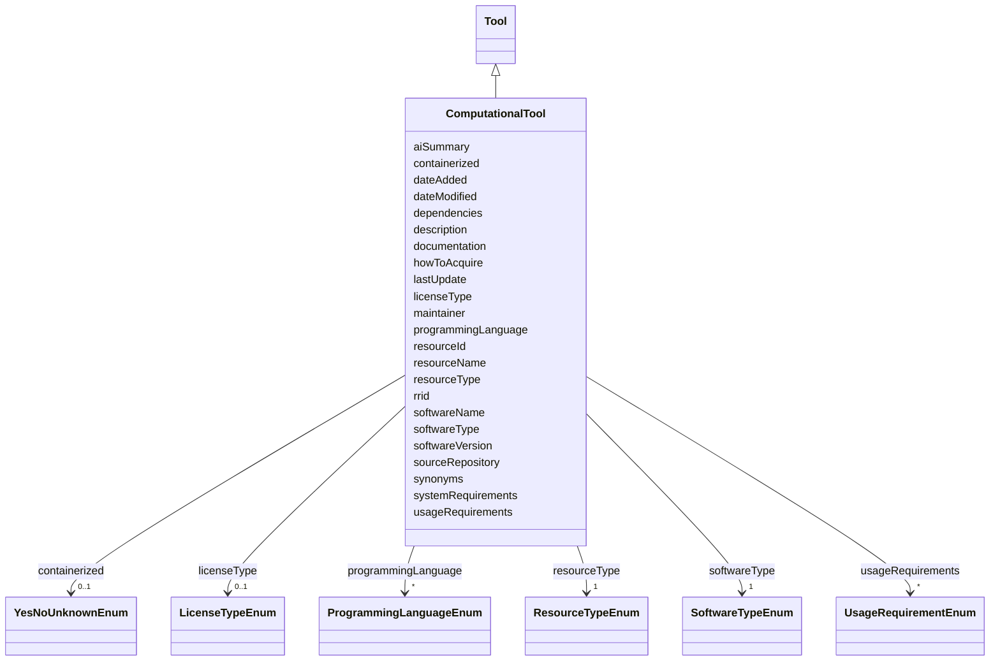

---
search:
  boost: 10.0
---

# Class: ComputationalTool 


_Computational tools including software and analysis pipelines used in NF research._


<div data-search-exclude markdown="1">


URI: [nftools:ComputationalTool](https://w3id.org/nf-research-tools/ComputationalTool)





## Inheritance
* [Tool](Tool.md)
    * **ComputationalTool**


## Slots

| Name | Cardinality and Range | Description | Inheritance |
| ---  | --- | --- | --- |
| [softwareName](softwareName.md) | 1 <br/> [String](String.md) | The name of the software or computational tool | direct |
| [softwareType](softwareType.md) | 1 <br/> [SoftwareTypeEnum](SoftwareTypeEnum.md) | Type of computational tool | direct |
| [softwareVersion](softwareVersion.md) | 0..1 <br/> [String](String.md) | Version number or identifier of the software | direct |
| [programmingLanguage](programmingLanguage.md) | * <br/> [ProgrammingLanguageEnum](ProgrammingLanguageEnum.md) | Primary programming language(s) used | direct |
| [sourceRepository](sourceRepository.md) | 0..1 <br/> [Uri](Uri.md) | URL to source code repository (e | direct |
| [documentation](documentation.md) | 0..1 <br/> [Uri](Uri.md) | URL to documentation or user manual | direct |
| [licenseType](licenseType.md) | 0..1 <br/> [LicenseTypeEnum](LicenseTypeEnum.md) | Software license type | direct |
| [containerized](containerized.md) | 0..1 <br/> [YesNoUnknownEnum](YesNoUnknownEnum.md) | Whether containerized versions (Docker, Singularity) are available | direct |
| [dependencies](dependencies.md) | * <br/> [String](String.md) | Key software dependencies or requirements | direct |
| [systemRequirements](systemRequirements.md) | 0..1 <br/> [String](String.md) | System requirements (OS, memory, compute) | direct |
| [lastUpdate](lastUpdate.md) | 0..1 <br/> [Date](Date.md) | Date of last software update or release | direct |
| [maintainer](maintainer.md) | 0..1 <br/> [String](String.md) | Name or organization maintaining the software | direct |
| [resourceId](resourceId.md) | 1 <br/> [String](String.md) | A unique identifier for the resource | [Tool](Tool.md) |
| [rrid](rrid.md) | 0..1 <br/> [String](String.md) | The RRID, a standard resource identifier for interoperability with other data... | [Tool](Tool.md) |
| [resourceName](resourceName.md) | 1 <br/> [String](String.md) | The canonical name of the resource | [Tool](Tool.md) |
| [synonyms](synonyms.md) | * <br/> [String](String.md) | Synonyms of the resource | [Tool](Tool.md) |
| [resourceType](resourceType.md) | 1 <br/> [ResourceTypeEnum](ResourceTypeEnum.md) | Type of resource | [Tool](Tool.md) |
| [description](description.md) | 0..1 <br/> [String](String.md) | Free text description, summary, or purpose of the resource | [Tool](Tool.md) |
| [aiSummary](aiSummary.md) | 0..1 <br/> [String](String.md) | A large language model-generated summary of the resource | [Tool](Tool.md) |
| [usageRequirements](usageRequirements.md) | * <br/> [UsageRequirementEnum](UsageRequirementEnum.md) | Any known restrictions on use of the resource | [Tool](Tool.md) |
| [howToAcquire](howToAcquire.md) | 1 <br/> [String](String.md) | How to acquire a particular resource | [Tool](Tool.md) |
| [dateAdded](dateAdded.md) | 1 <br/> [Date](Date.md) | The date that the resource was originally added | [Tool](Tool.md) |
| [dateModified](dateModified.md) | 1 <br/> [Date](Date.md) | The last update of the resource metadata | [Tool](Tool.md) |


## Identifier and Mapping Information


### Annotations

| property | value |
| --- | --- |
| synapse_table_id | syn73709226 |


### Schema Source


* from schema: https://w3id.org/nf-research-tools


## Mappings

| Mapping Type | Mapped Value |
| ---  | ---  |
| self | nftools:ComputationalTool |
| native | nftools:ComputationalTool |


## LinkML Source

<!-- TODO: investigate https://stackoverflow.com/questions/37606292/how-to-create-tabbed-code-blocks-in-mkdocs-or-sphinx -->

### Direct

<details>
```yaml
name: ComputationalTool
annotations:
  synapse_table_id:
    tag: synapse_table_id
    value: syn73709226
description: Computational tools including software and analysis pipelines used in
  NF research.
from_schema: https://w3id.org/nf-research-tools
is_a: Tool
slot_usage:
  resourceType:
    name: resourceType
    ifabsent: string(Computational Tool)
attributes:
  softwareName:
    name: softwareName
    description: The name of the software or computational tool.
    from_schema: https://w3id.org/nf-research-tools/computational_tool
    rank: 1000
    domain_of:
    - ComputationalTool
    required: true
  softwareType:
    name: softwareType
    description: Type of computational tool.
    from_schema: https://w3id.org/nf-research-tools/computational_tool
    rank: 1000
    domain_of:
    - ComputationalTool
    range: SoftwareTypeEnum
    required: true
  softwareVersion:
    name: softwareVersion
    description: Version number or identifier of the software.
    from_schema: https://w3id.org/nf-research-tools/computational_tool
    rank: 1000
    domain_of:
    - ComputationalTool
  programmingLanguage:
    name: programmingLanguage
    description: Primary programming language(s) used.
    from_schema: https://w3id.org/nf-research-tools/computational_tool
    rank: 1000
    domain_of:
    - ComputationalTool
    range: ProgrammingLanguageEnum
    multivalued: true
  sourceRepository:
    name: sourceRepository
    description: URL to source code repository (e.g. GitHub, GitLab).
    from_schema: https://w3id.org/nf-research-tools/computational_tool
    rank: 1000
    domain_of:
    - ComputationalTool
    range: uri
  documentation:
    name: documentation
    description: URL to documentation or user manual.
    from_schema: https://w3id.org/nf-research-tools/computational_tool
    rank: 1000
    domain_of:
    - ComputationalTool
    range: uri
  licenseType:
    name: licenseType
    description: Software license type.
    from_schema: https://w3id.org/nf-research-tools/computational_tool
    rank: 1000
    domain_of:
    - ComputationalTool
    range: LicenseTypeEnum
  containerized:
    name: containerized
    description: Whether containerized versions (Docker, Singularity) are available.
    from_schema: https://w3id.org/nf-research-tools/computational_tool
    rank: 1000
    domain_of:
    - ComputationalTool
    range: YesNoUnknownEnum
  dependencies:
    name: dependencies
    description: Key software dependencies or requirements.
    from_schema: https://w3id.org/nf-research-tools/computational_tool
    rank: 1000
    domain_of:
    - ComputationalTool
    multivalued: true
  systemRequirements:
    name: systemRequirements
    description: System requirements (OS, memory, compute).
    from_schema: https://w3id.org/nf-research-tools/computational_tool
    rank: 1000
    domain_of:
    - ComputationalTool
  lastUpdate:
    name: lastUpdate
    description: Date of last software update or release.
    from_schema: https://w3id.org/nf-research-tools/computational_tool
    rank: 1000
    domain_of:
    - ComputationalTool
    range: date
  maintainer:
    name: maintainer
    description: Name or organization maintaining the software.
    from_schema: https://w3id.org/nf-research-tools/computational_tool
    rank: 1000
    domain_of:
    - ComputationalTool

```
</details>

### Induced

<details>
```yaml
name: ComputationalTool
annotations:
  synapse_table_id:
    tag: synapse_table_id
    value: syn73709226
description: Computational tools including software and analysis pipelines used in
  NF research.
from_schema: https://w3id.org/nf-research-tools
is_a: Tool
slot_usage:
  resourceType:
    name: resourceType
    ifabsent: string(Computational Tool)
attributes:
  softwareName:
    name: softwareName
    description: The name of the software or computational tool.
    from_schema: https://w3id.org/nf-research-tools/computational_tool
    rank: 1000
    owner: ComputationalTool
    domain_of:
    - ComputationalTool
    range: string
    required: true
  softwareType:
    name: softwareType
    description: Type of computational tool.
    from_schema: https://w3id.org/nf-research-tools/computational_tool
    rank: 1000
    owner: ComputationalTool
    domain_of:
    - ComputationalTool
    range: SoftwareTypeEnum
    required: true
  softwareVersion:
    name: softwareVersion
    description: Version number or identifier of the software.
    from_schema: https://w3id.org/nf-research-tools/computational_tool
    rank: 1000
    owner: ComputationalTool
    domain_of:
    - ComputationalTool
    range: string
  programmingLanguage:
    name: programmingLanguage
    description: Primary programming language(s) used.
    from_schema: https://w3id.org/nf-research-tools/computational_tool
    rank: 1000
    owner: ComputationalTool
    domain_of:
    - ComputationalTool
    range: ProgrammingLanguageEnum
    multivalued: true
  sourceRepository:
    name: sourceRepository
    description: URL to source code repository (e.g. GitHub, GitLab).
    from_schema: https://w3id.org/nf-research-tools/computational_tool
    rank: 1000
    owner: ComputationalTool
    domain_of:
    - ComputationalTool
    range: uri
  documentation:
    name: documentation
    description: URL to documentation or user manual.
    from_schema: https://w3id.org/nf-research-tools/computational_tool
    rank: 1000
    owner: ComputationalTool
    domain_of:
    - ComputationalTool
    range: uri
  licenseType:
    name: licenseType
    description: Software license type.
    from_schema: https://w3id.org/nf-research-tools/computational_tool
    rank: 1000
    owner: ComputationalTool
    domain_of:
    - ComputationalTool
    range: LicenseTypeEnum
  containerized:
    name: containerized
    description: Whether containerized versions (Docker, Singularity) are available.
    from_schema: https://w3id.org/nf-research-tools/computational_tool
    rank: 1000
    owner: ComputationalTool
    domain_of:
    - ComputationalTool
    range: YesNoUnknownEnum
  dependencies:
    name: dependencies
    description: Key software dependencies or requirements.
    from_schema: https://w3id.org/nf-research-tools/computational_tool
    rank: 1000
    owner: ComputationalTool
    domain_of:
    - ComputationalTool
    range: string
    multivalued: true
  systemRequirements:
    name: systemRequirements
    description: System requirements (OS, memory, compute).
    from_schema: https://w3id.org/nf-research-tools/computational_tool
    rank: 1000
    owner: ComputationalTool
    domain_of:
    - ComputationalTool
    range: string
  lastUpdate:
    name: lastUpdate
    description: Date of last software update or release.
    from_schema: https://w3id.org/nf-research-tools/computational_tool
    rank: 1000
    owner: ComputationalTool
    domain_of:
    - ComputationalTool
    range: date
  maintainer:
    name: maintainer
    description: Name or organization maintaining the software.
    from_schema: https://w3id.org/nf-research-tools/computational_tool
    rank: 1000
    owner: ComputationalTool
    domain_of:
    - ComputationalTool
    range: string
  resourceId:
    name: resourceId
    description: A unique identifier for the resource.
    from_schema: https://w3id.org/nf-research-tools
    rank: 1000
    slot_uri: schema:identifier
    identifier: true
    owner: ComputationalTool
    domain_of:
    - Tool
    - DevelopmentRecord
    - Usage
    range: string
    required: true
  rrid:
    name: rrid
    description: The RRID, a standard resource identifier for interoperability with
      other databases. Must include the lowercase 'rrid:' prefix.
    from_schema: https://w3id.org/nf-research-tools
    rank: 1000
    owner: ComputationalTool
    domain_of:
    - Tool
    range: string
    pattern: ^rrid:[a-zA-Z]+.+$
  resourceName:
    name: resourceName
    description: The canonical name of the resource.
    from_schema: https://w3id.org/nf-research-tools
    rank: 1000
    slot_uri: schema:name
    owner: ComputationalTool
    domain_of:
    - Tool
    range: string
    required: true
  synonyms:
    name: synonyms
    description: Synonyms of the resource.
    from_schema: https://w3id.org/nf-research-tools
    rank: 1000
    owner: ComputationalTool
    domain_of:
    - Tool
    range: string
    multivalued: true
  resourceType:
    name: resourceType
    description: Type of resource.
    from_schema: https://w3id.org/nf-research-tools
    rank: 1000
    ifabsent: string(Computational Tool)
    owner: ComputationalTool
    domain_of:
    - Tool
    range: ResourceTypeEnum
    required: true
  description:
    name: description
    description: Free text description, summary, or purpose of the resource.
    from_schema: https://w3id.org/nf-research-tools
    rank: 1000
    slot_uri: schema:description
    owner: ComputationalTool
    domain_of:
    - Tool
    range: string
  aiSummary:
    name: aiSummary
    description: A large language model-generated summary of the resource.
    from_schema: https://w3id.org/nf-research-tools
    rank: 1000
    owner: ComputationalTool
    domain_of:
    - Tool
    range: string
  usageRequirements:
    name: usageRequirements
    description: Any known restrictions on use of the resource.
    from_schema: https://w3id.org/nf-research-tools
    rank: 1000
    owner: ComputationalTool
    domain_of:
    - Tool
    range: UsageRequirementEnum
    multivalued: true
  howToAcquire:
    name: howToAcquire
    description: How to acquire a particular resource.
    from_schema: https://w3id.org/nf-research-tools
    rank: 1000
    owner: ComputationalTool
    domain_of:
    - Tool
    range: string
    required: true
  dateAdded:
    name: dateAdded
    description: The date that the resource was originally added.
    from_schema: https://w3id.org/nf-research-tools
    rank: 1000
    owner: ComputationalTool
    domain_of:
    - Tool
    range: date
    required: true
  dateModified:
    name: dateModified
    description: The last update of the resource metadata.
    from_schema: https://w3id.org/nf-research-tools
    rank: 1000
    owner: ComputationalTool
    domain_of:
    - Tool
    range: date
    required: true

```
</details></div>