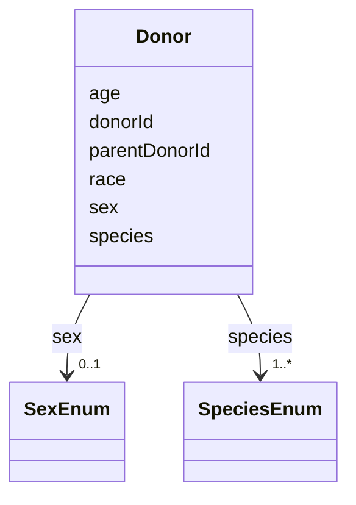

---
search:
  boost: 10.0
---

# Class: Donor 


_A person, animal, or other organism that is the contributor of the resource._


<div data-search-exclude markdown="1">


URI: [nftools:Donor](https://w3id.org/nf-research-tools/Donor)





<!-- no inheritance hierarchy -->

## Slots

| Name | Cardinality and Range | Description | Inheritance |
| ---  | --- | --- | --- |
| [donorId](donorId.md) | 1 <br/> [String](String.md) | A unique identifier for the donor | direct |
| [parentDonorId](parentDonorId.md) | 0..1 <br/> [String](String.md) | The ID of the parent donor | direct |
| [species](species.md) | 1..* <br/> [SpeciesEnum](SpeciesEnum.md) | The species of the individual the resource was derived from | direct |
| [sex](sex.md) | 0..1 <br/> [SexEnum](SexEnum.md) | The sex of the individual from which the resource was derived | direct |
| [age](age.md) | 0..1 <br/> [String](String.md) | The age of the individual from which the resource was derived | direct |
| [race](race.md) | 0..1 <br/> [String](String.md) | The ethnicity of the individual the resource was derived from | direct |


## Identifier and Mapping Information


### Annotations

| property | value |
| --- | --- |
| synapse_table_id | syn26486829 |


### Schema Source


* from schema: https://w3id.org/nf-research-tools


## Mappings

| Mapping Type | Mapped Value |
| ---  | ---  |
| self | nftools:Donor |
| native | nftools:Donor |


## LinkML Source

<!-- TODO: investigate https://stackoverflow.com/questions/37606292/how-to-create-tabbed-code-blocks-in-mkdocs-or-sphinx -->

### Direct

<details>
```yaml
name: Donor
annotations:
  synapse_table_id:
    tag: synapse_table_id
    value: syn26486829
description: A person, animal, or other organism that is the contributor of the resource.
from_schema: https://w3id.org/nf-research-tools
slots:
- donorId
- parentDonorId
- species
- sex
- age
- race

```
</details>

### Induced

<details>
```yaml
name: Donor
annotations:
  synapse_table_id:
    tag: synapse_table_id
    value: syn26486829
description: A person, animal, or other organism that is the contributor of the resource.
from_schema: https://w3id.org/nf-research-tools
attributes:
  donorId:
    name: donorId
    description: A unique identifier for the donor.
    from_schema: https://w3id.org/nf-research-tools
    rank: 1000
    identifier: true
    owner: Donor
    domain_of:
    - Donor
    range: string
    required: true
  parentDonorId:
    name: parentDonorId
    description: The ID of the parent donor.
    from_schema: https://w3id.org/nf-research-tools
    rank: 1000
    owner: Donor
    domain_of:
    - Donor
    range: string
  species:
    name: species
    description: The species of the individual the resource was derived from.
    from_schema: https://w3id.org/nf-research-tools
    rank: 1000
    owner: Donor
    domain_of:
    - Donor
    range: SpeciesEnum
    required: true
    multivalued: true
  sex:
    name: sex
    description: The sex of the individual from which the resource was derived.
    from_schema: https://w3id.org/nf-research-tools
    rank: 1000
    owner: Donor
    domain_of:
    - Donor
    range: SexEnum
  age:
    name: age
    description: The age of the individual from which the resource was derived.
    from_schema: https://w3id.org/nf-research-tools
    rank: 1000
    owner: Donor
    domain_of:
    - Donor
    range: string
  race:
    name: race
    description: The ethnicity of the individual the resource was derived from.
    from_schema: https://w3id.org/nf-research-tools
    rank: 1000
    owner: Donor
    domain_of:
    - Donor
    range: string

```
</details></div>