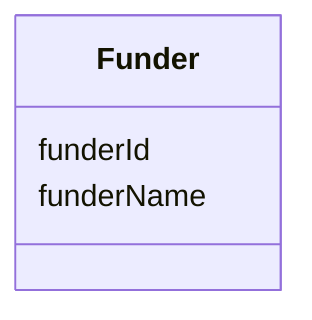

---
search:
  boost: 10.0
---

# Class: Funder 


_A person or organization that provides money for a particular resource._


<div data-search-exclude markdown="1">


URI: [schema:Organization](http://schema.org/Organization)





<!-- no inheritance hierarchy -->

## Class Properties

| Property | Value |
| --- | --- |
| Class URI | [schema:Organization](http://schema.org/Organization) |


## Slots

| Name | Cardinality and Range | Description | Inheritance |
| ---  | --- | --- | --- |
| [funderId](funderId.md) | 1 <br/> [String](String.md) | A unique identifier for the funder | direct |
| [funderName](funderName.md) | 0..1 <br/> [String](String.md) | The name of the person or agency that funded the development of the resource | direct |


## Identifier and Mapping Information


### Annotations

| property | value |
| --- | --- |
| synapse_table_id | syn26486830 |


### Schema Source


* from schema: https://w3id.org/nf-research-tools


## Mappings

| Mapping Type | Mapped Value |
| ---  | ---  |
| self | schema:Organization |
| native | nftools:Funder |


## LinkML Source

<!-- TODO: investigate https://stackoverflow.com/questions/37606292/how-to-create-tabbed-code-blocks-in-mkdocs-or-sphinx -->

### Direct

<details>
```yaml
name: Funder
annotations:
  synapse_table_id:
    tag: synapse_table_id
    value: syn26486830
description: A person or organization that provides money for a particular resource.
from_schema: https://w3id.org/nf-research-tools
slots:
- funderId
- funderName
class_uri: schema:Organization

```
</details>

### Induced

<details>
```yaml
name: Funder
annotations:
  synapse_table_id:
    tag: synapse_table_id
    value: syn26486830
description: A person or organization that provides money for a particular resource.
from_schema: https://w3id.org/nf-research-tools
attributes:
  funderId:
    name: funderId
    description: A unique identifier for the funder.
    from_schema: https://w3id.org/nf-research-tools
    rank: 1000
    identifier: true
    owner: Funder
    domain_of:
    - DevelopmentRecord
    - Funder
    range: string
    required: true
  funderName:
    name: funderName
    description: The name of the person or agency that funded the development of the
      resource.
    from_schema: https://w3id.org/nf-research-tools
    rank: 1000
    slot_uri: schema:name
    owner: Funder
    domain_of:
    - Funder
    range: string
class_uri: schema:Organization

```
</details></div>