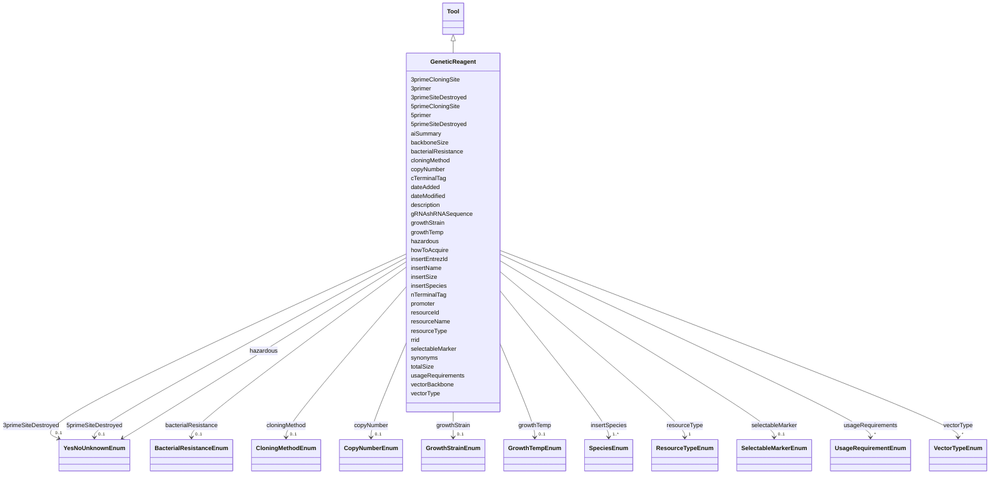

---
search:
  boost: 10.0
---

# Class: GeneticReagent 


_Genetic reagents including plasmids, viral vectors, CRISPR constructs, and other molecular biology tools._


<div data-search-exclude markdown="1">


URI: [nftools:GeneticReagent](https://w3id.org/nf-research-tools/GeneticReagent)





## Inheritance
* [Tool](Tool.md)
    * **GeneticReagent**


## Slots

| Name | Cardinality and Range | Description | Inheritance |
| ---  | --- | --- | --- |
| [insertName](insertName.md) | 1 <br/> [String](String.md) | Name of the main gene insert in the plasmid | direct |
| [insertEntrezId](insertEntrezId.md) | 0..1 <br/> [String](String.md) | The Entrez Gene ID for the gene insert | direct |
| [gRNAshRNASequence](gRNAshRNASequence.md) | 0..1 <br/> [String](String.md) | The sequence of the gRNA or shRNA for the gene insert, if present | direct |
| [insertSize](insertSize.md) | 0..1 <br/> [Integer](Integer.md) | Size, in bp, of the gene insert as it is in the plasmid | direct |
| [insertSpecies](insertSpecies.md) | 1..* <br/> [SpeciesEnum](SpeciesEnum.md) | Species of the insert | direct |
| [nTerminalTag](nTerminalTag.md) | * <br/> [String](String.md) | Tags on the N terminal 5' end of the gene insert | direct |
| [cTerminalTag](cTerminalTag.md) | * <br/> [String](String.md) | Tags on the C terminal 3' end of the gene insert | direct |
| [cloningMethod](cloningMethod.md) | 0..1 <br/> [CloningMethodEnum](CloningMethodEnum.md) | How the vector was constructed | direct |
| [5primeCloningSite](5primeCloningSite.md) | 0..1 <br/> [String](String.md) | If Restriction Enzyme was selected as the cloning method, the enzyme used on ... | direct |
| [5primeSiteDestroyed](5primeSiteDestroyed.md) | 0..1 <br/> [YesNoUnknownEnum](YesNoUnknownEnum.md) | Whether 5' site was destroyed during cloning | direct |
| [3primeCloningSite](3primeCloningSite.md) | 0..1 <br/> [String](String.md) | If Restriction Enzyme was selected as the cloning method, the enzyme used on ... | direct |
| [3primeSiteDestroyed](3primeSiteDestroyed.md) | 0..1 <br/> [YesNoUnknownEnum](YesNoUnknownEnum.md) | Whether 3' site was destroyed during cloning | direct |
| [promoter](promoter.md) | 0..1 <br/> [String](String.md) | Promoter driving the expression of the insert in the plasmid | direct |
| [5primer](5primer.md) | 0..1 <br/> [String](String.md) | Primer to sequence the 5' end (N-terminal) of the insert | direct |
| [3primer](3primer.md) | 0..1 <br/> [String](String.md) | Primer to sequence the 3' end (C-terminal) of the insert | direct |
| [vectorBackbone](vectorBackbone.md) | 0..1 <br/> [String](String.md) | Name of the backbone the plasmid is built on (e | direct |
| [vectorType](vectorType.md) | * <br/> [VectorTypeEnum](VectorTypeEnum.md) | Primary function of the plasmid | direct |
| [backboneSize](backboneSize.md) | 0..1 <br/> [Integer](Integer.md) | Size in bp of the backbone without the insert | direct |
| [totalSize](totalSize.md) | 0..1 <br/> [Integer](Integer.md) | Size of vector with insert | direct |
| [bacterialResistance](bacterialResistance.md) | 0..1 <br/> [BacterialResistanceEnum](BacterialResistanceEnum.md) | Antibiotic(s) for selection in bacteria | direct |
| [selectableMarker](selectableMarker.md) | 0..1 <br/> [SelectableMarkerEnum](SelectableMarkerEnum.md) | Additional selection markers, such as mammalian selection markers or fluoresc... | direct |
| [copyNumber](copyNumber.md) | 0..1 <br/> [CopyNumberEnum](CopyNumberEnum.md) | Whether the plasmid produces sufficient DNA from a normal miniprep or require... | direct |
| [growthTemp](growthTemp.md) | 0..1 <br/> [GrowthTempEnum](GrowthTempEnum.md) | Temperature for growing the bacteria hosting the plasmid | direct |
| [growthStrain](growthStrain.md) | 0..1 <br/> [GrowthStrainEnum](GrowthStrainEnum.md) | The E | direct |
| [hazardous](hazardous.md) | 1 <br/> [YesNoUnknownEnum](YesNoUnknownEnum.md) | Whether the unmodified plasmid DNA requires handling at Biosafety Level 2 or ... | direct |
| [resourceId](resourceId.md) | 1 <br/> [String](String.md) | A unique identifier for the resource | [Tool](Tool.md) |
| [rrid](rrid.md) | 0..1 <br/> [String](String.md) | The RRID, a standard resource identifier for interoperability with other data... | [Tool](Tool.md) |
| [resourceName](resourceName.md) | 1 <br/> [String](String.md) | The canonical name of the resource | [Tool](Tool.md) |
| [synonyms](synonyms.md) | * <br/> [String](String.md) | Synonyms of the resource | [Tool](Tool.md) |
| [resourceType](resourceType.md) | 1 <br/> [ResourceTypeEnum](ResourceTypeEnum.md) | Type of resource | [Tool](Tool.md) |
| [description](description.md) | 0..1 <br/> [String](String.md) | Free text description, summary, or purpose of the resource | [Tool](Tool.md) |
| [aiSummary](aiSummary.md) | 0..1 <br/> [String](String.md) | A large language model-generated summary of the resource | [Tool](Tool.md) |
| [usageRequirements](usageRequirements.md) | * <br/> [UsageRequirementEnum](UsageRequirementEnum.md) | Any known restrictions on use of the resource | [Tool](Tool.md) |
| [howToAcquire](howToAcquire.md) | 1 <br/> [String](String.md) | How to acquire a particular resource | [Tool](Tool.md) |
| [dateAdded](dateAdded.md) | 1 <br/> [Date](Date.md) | The date that the resource was originally added | [Tool](Tool.md) |
| [dateModified](dateModified.md) | 1 <br/> [Date](Date.md) | The last update of the resource metadata | [Tool](Tool.md) |


## Identifier and Mapping Information


### Annotations

| property | value |
| --- | --- |
| synapse_table_id | syn26486832 |


### Schema Source


* from schema: https://w3id.org/nf-research-tools


## Mappings

| Mapping Type | Mapped Value |
| ---  | ---  |
| self | nftools:GeneticReagent |
| native | nftools:GeneticReagent |


## LinkML Source

<!-- TODO: investigate https://stackoverflow.com/questions/37606292/how-to-create-tabbed-code-blocks-in-mkdocs-or-sphinx -->

### Direct

<details>
```yaml
name: GeneticReagent
annotations:
  synapse_table_id:
    tag: synapse_table_id
    value: syn26486832
description: Genetic reagents including plasmids, viral vectors, CRISPR constructs,
  and other molecular biology tools.
from_schema: https://w3id.org/nf-research-tools
is_a: Tool
slot_usage:
  resourceType:
    name: resourceType
    ifabsent: string(Genetic Reagent)
attributes:
  insertName:
    name: insertName
    description: Name of the main gene insert in the plasmid.
    from_schema: https://w3id.org/nf-research-tools/genetic_reagent
    rank: 1000
    domain_of:
    - GeneticReagent
    required: true
  insertEntrezId:
    name: insertEntrezId
    description: The Entrez Gene ID for the gene insert.
    from_schema: https://w3id.org/nf-research-tools/genetic_reagent
    rank: 1000
    domain_of:
    - GeneticReagent
  gRNAshRNASequence:
    name: gRNAshRNASequence
    description: The sequence of the gRNA or shRNA for the gene insert, if present.
    from_schema: https://w3id.org/nf-research-tools/genetic_reagent
    rank: 1000
    domain_of:
    - GeneticReagent
  insertSize:
    name: insertSize
    description: Size, in bp, of the gene insert as it is in the plasmid.
    from_schema: https://w3id.org/nf-research-tools/genetic_reagent
    rank: 1000
    domain_of:
    - GeneticReagent
    range: integer
  insertSpecies:
    name: insertSpecies
    description: Species of the insert.
    from_schema: https://w3id.org/nf-research-tools/genetic_reagent
    rank: 1000
    domain_of:
    - GeneticReagent
    range: SpeciesEnum
    required: true
    multivalued: true
  nTerminalTag:
    name: nTerminalTag
    description: Tags on the N terminal 5' end of the gene insert. Only tags that
      are in frame.
    from_schema: https://w3id.org/nf-research-tools/genetic_reagent
    rank: 1000
    domain_of:
    - GeneticReagent
    multivalued: true
  cTerminalTag:
    name: cTerminalTag
    description: Tags on the C terminal 3' end of the gene insert. Only tags that
      are in frame.
    from_schema: https://w3id.org/nf-research-tools/genetic_reagent
    rank: 1000
    domain_of:
    - GeneticReagent
    multivalued: true
  cloningMethod:
    name: cloningMethod
    description: How the vector was constructed.
    from_schema: https://w3id.org/nf-research-tools/genetic_reagent
    rank: 1000
    domain_of:
    - GeneticReagent
    range: CloningMethodEnum
  5primeCloningSite:
    name: 5primeCloningSite
    description: If Restriction Enzyme was selected as the cloning method, the enzyme
      used on the 5' (N-terminal) end.
    from_schema: https://w3id.org/nf-research-tools/genetic_reagent
    rank: 1000
    domain_of:
    - GeneticReagent
  5primeSiteDestroyed:
    name: 5primeSiteDestroyed
    description: Whether 5' site was destroyed during cloning.
    from_schema: https://w3id.org/nf-research-tools/genetic_reagent
    rank: 1000
    domain_of:
    - GeneticReagent
    range: YesNoUnknownEnum
  3primeCloningSite:
    name: 3primeCloningSite
    description: If Restriction Enzyme was selected as the cloning method, the enzyme
      used on the 3' (C-terminal) end.
    from_schema: https://w3id.org/nf-research-tools/genetic_reagent
    rank: 1000
    domain_of:
    - GeneticReagent
  3primeSiteDestroyed:
    name: 3primeSiteDestroyed
    description: Whether 3' site was destroyed during cloning.
    from_schema: https://w3id.org/nf-research-tools/genetic_reagent
    rank: 1000
    domain_of:
    - GeneticReagent
    range: YesNoUnknownEnum
  promoter:
    name: promoter
    description: Promoter driving the expression of the insert in the plasmid.
    from_schema: https://w3id.org/nf-research-tools/genetic_reagent
    rank: 1000
    domain_of:
    - GeneticReagent
  5primer:
    name: 5primer
    description: Primer to sequence the 5' end (N-terminal) of the insert.
    from_schema: https://w3id.org/nf-research-tools/genetic_reagent
    rank: 1000
    domain_of:
    - GeneticReagent
  3primer:
    name: 3primer
    description: Primer to sequence the 3' end (C-terminal) of the insert.
    from_schema: https://w3id.org/nf-research-tools/genetic_reagent
    rank: 1000
    domain_of:
    - GeneticReagent
  vectorBackbone:
    name: vectorBackbone
    description: Name of the backbone the plasmid is built on (e.g. pGBT9).
    from_schema: https://w3id.org/nf-research-tools/genetic_reagent
    rank: 1000
    domain_of:
    - GeneticReagent
  vectorType:
    name: vectorType
    description: Primary function of the plasmid.
    from_schema: https://w3id.org/nf-research-tools/genetic_reagent
    rank: 1000
    domain_of:
    - GeneticReagent
    range: VectorTypeEnum
    multivalued: true
  backboneSize:
    name: backboneSize
    description: Size in bp of the backbone without the insert.
    from_schema: https://w3id.org/nf-research-tools/genetic_reagent
    rank: 1000
    domain_of:
    - GeneticReagent
    range: integer
  totalSize:
    name: totalSize
    description: Size of vector with insert. Derived from insertSize and backboneSize.
    from_schema: https://w3id.org/nf-research-tools/genetic_reagent
    rank: 1000
    domain_of:
    - GeneticReagent
    range: integer
  bacterialResistance:
    name: bacterialResistance
    description: Antibiotic(s) for selection in bacteria.
    from_schema: https://w3id.org/nf-research-tools/genetic_reagent
    rank: 1000
    domain_of:
    - GeneticReagent
    range: BacterialResistanceEnum
  selectableMarker:
    name: selectableMarker
    description: Additional selection markers, such as mammalian selection markers
      or fluorescent proteins.
    from_schema: https://w3id.org/nf-research-tools/genetic_reagent
    rank: 1000
    domain_of:
    - GeneticReagent
    range: SelectableMarkerEnum
  copyNumber:
    name: copyNumber
    description: Whether the plasmid produces sufficient DNA from a normal miniprep
      or requires special conditions.
    from_schema: https://w3id.org/nf-research-tools/genetic_reagent
    rank: 1000
    domain_of:
    - GeneticReagent
    range: CopyNumberEnum
  growthTemp:
    name: growthTemp
    description: Temperature for growing the bacteria hosting the plasmid.
    from_schema: https://w3id.org/nf-research-tools/genetic_reagent
    rank: 1000
    domain_of:
    - GeneticReagent
    range: GrowthTempEnum
  growthStrain:
    name: growthStrain
    description: The E. coli strain for distributing the plasmid.
    from_schema: https://w3id.org/nf-research-tools/genetic_reagent
    rank: 1000
    domain_of:
    - GeneticReagent
    range: GrowthStrainEnum
  hazardous:
    name: hazardous
    description: Whether the unmodified plasmid DNA requires handling at Biosafety
      Level 2 or higher.
    from_schema: https://w3id.org/nf-research-tools/genetic_reagent
    rank: 1000
    domain_of:
    - GeneticReagent
    range: YesNoUnknownEnum
    required: true

```
</details>

### Induced

<details>
```yaml
name: GeneticReagent
annotations:
  synapse_table_id:
    tag: synapse_table_id
    value: syn26486832
description: Genetic reagents including plasmids, viral vectors, CRISPR constructs,
  and other molecular biology tools.
from_schema: https://w3id.org/nf-research-tools
is_a: Tool
slot_usage:
  resourceType:
    name: resourceType
    ifabsent: string(Genetic Reagent)
attributes:
  insertName:
    name: insertName
    description: Name of the main gene insert in the plasmid.
    from_schema: https://w3id.org/nf-research-tools/genetic_reagent
    rank: 1000
    owner: GeneticReagent
    domain_of:
    - GeneticReagent
    range: string
    required: true
  insertEntrezId:
    name: insertEntrezId
    description: The Entrez Gene ID for the gene insert.
    from_schema: https://w3id.org/nf-research-tools/genetic_reagent
    rank: 1000
    owner: GeneticReagent
    domain_of:
    - GeneticReagent
    range: string
  gRNAshRNASequence:
    name: gRNAshRNASequence
    description: The sequence of the gRNA or shRNA for the gene insert, if present.
    from_schema: https://w3id.org/nf-research-tools/genetic_reagent
    rank: 1000
    owner: GeneticReagent
    domain_of:
    - GeneticReagent
    range: string
  insertSize:
    name: insertSize
    description: Size, in bp, of the gene insert as it is in the plasmid.
    from_schema: https://w3id.org/nf-research-tools/genetic_reagent
    rank: 1000
    owner: GeneticReagent
    domain_of:
    - GeneticReagent
    range: integer
  insertSpecies:
    name: insertSpecies
    description: Species of the insert.
    from_schema: https://w3id.org/nf-research-tools/genetic_reagent
    rank: 1000
    owner: GeneticReagent
    domain_of:
    - GeneticReagent
    range: SpeciesEnum
    required: true
    multivalued: true
  nTerminalTag:
    name: nTerminalTag
    description: Tags on the N terminal 5' end of the gene insert. Only tags that
      are in frame.
    from_schema: https://w3id.org/nf-research-tools/genetic_reagent
    rank: 1000
    owner: GeneticReagent
    domain_of:
    - GeneticReagent
    range: string
    multivalued: true
  cTerminalTag:
    name: cTerminalTag
    description: Tags on the C terminal 3' end of the gene insert. Only tags that
      are in frame.
    from_schema: https://w3id.org/nf-research-tools/genetic_reagent
    rank: 1000
    owner: GeneticReagent
    domain_of:
    - GeneticReagent
    range: string
    multivalued: true
  cloningMethod:
    name: cloningMethod
    description: How the vector was constructed.
    from_schema: https://w3id.org/nf-research-tools/genetic_reagent
    rank: 1000
    owner: GeneticReagent
    domain_of:
    - GeneticReagent
    range: CloningMethodEnum
  5primeCloningSite:
    name: 5primeCloningSite
    description: If Restriction Enzyme was selected as the cloning method, the enzyme
      used on the 5' (N-terminal) end.
    from_schema: https://w3id.org/nf-research-tools/genetic_reagent
    rank: 1000
    owner: GeneticReagent
    domain_of:
    - GeneticReagent
    range: string
  5primeSiteDestroyed:
    name: 5primeSiteDestroyed
    description: Whether 5' site was destroyed during cloning.
    from_schema: https://w3id.org/nf-research-tools/genetic_reagent
    rank: 1000
    owner: GeneticReagent
    domain_of:
    - GeneticReagent
    range: YesNoUnknownEnum
  3primeCloningSite:
    name: 3primeCloningSite
    description: If Restriction Enzyme was selected as the cloning method, the enzyme
      used on the 3' (C-terminal) end.
    from_schema: https://w3id.org/nf-research-tools/genetic_reagent
    rank: 1000
    owner: GeneticReagent
    domain_of:
    - GeneticReagent
    range: string
  3primeSiteDestroyed:
    name: 3primeSiteDestroyed
    description: Whether 3' site was destroyed during cloning.
    from_schema: https://w3id.org/nf-research-tools/genetic_reagent
    rank: 1000
    owner: GeneticReagent
    domain_of:
    - GeneticReagent
    range: YesNoUnknownEnum
  promoter:
    name: promoter
    description: Promoter driving the expression of the insert in the plasmid.
    from_schema: https://w3id.org/nf-research-tools/genetic_reagent
    rank: 1000
    owner: GeneticReagent
    domain_of:
    - GeneticReagent
    range: string
  5primer:
    name: 5primer
    description: Primer to sequence the 5' end (N-terminal) of the insert.
    from_schema: https://w3id.org/nf-research-tools/genetic_reagent
    rank: 1000
    owner: GeneticReagent
    domain_of:
    - GeneticReagent
    range: string
  3primer:
    name: 3primer
    description: Primer to sequence the 3' end (C-terminal) of the insert.
    from_schema: https://w3id.org/nf-research-tools/genetic_reagent
    rank: 1000
    owner: GeneticReagent
    domain_of:
    - GeneticReagent
    range: string
  vectorBackbone:
    name: vectorBackbone
    description: Name of the backbone the plasmid is built on (e.g. pGBT9).
    from_schema: https://w3id.org/nf-research-tools/genetic_reagent
    rank: 1000
    owner: GeneticReagent
    domain_of:
    - GeneticReagent
    range: string
  vectorType:
    name: vectorType
    description: Primary function of the plasmid.
    from_schema: https://w3id.org/nf-research-tools/genetic_reagent
    rank: 1000
    owner: GeneticReagent
    domain_of:
    - GeneticReagent
    range: VectorTypeEnum
    multivalued: true
  backboneSize:
    name: backboneSize
    description: Size in bp of the backbone without the insert.
    from_schema: https://w3id.org/nf-research-tools/genetic_reagent
    rank: 1000
    owner: GeneticReagent
    domain_of:
    - GeneticReagent
    range: integer
  totalSize:
    name: totalSize
    description: Size of vector with insert. Derived from insertSize and backboneSize.
    from_schema: https://w3id.org/nf-research-tools/genetic_reagent
    rank: 1000
    owner: GeneticReagent
    domain_of:
    - GeneticReagent
    range: integer
  bacterialResistance:
    name: bacterialResistance
    description: Antibiotic(s) for selection in bacteria.
    from_schema: https://w3id.org/nf-research-tools/genetic_reagent
    rank: 1000
    owner: GeneticReagent
    domain_of:
    - GeneticReagent
    range: BacterialResistanceEnum
  selectableMarker:
    name: selectableMarker
    description: Additional selection markers, such as mammalian selection markers
      or fluorescent proteins.
    from_schema: https://w3id.org/nf-research-tools/genetic_reagent
    rank: 1000
    owner: GeneticReagent
    domain_of:
    - GeneticReagent
    range: SelectableMarkerEnum
  copyNumber:
    name: copyNumber
    description: Whether the plasmid produces sufficient DNA from a normal miniprep
      or requires special conditions.
    from_schema: https://w3id.org/nf-research-tools/genetic_reagent
    rank: 1000
    owner: GeneticReagent
    domain_of:
    - GeneticReagent
    range: CopyNumberEnum
  growthTemp:
    name: growthTemp
    description: Temperature for growing the bacteria hosting the plasmid.
    from_schema: https://w3id.org/nf-research-tools/genetic_reagent
    rank: 1000
    owner: GeneticReagent
    domain_of:
    - GeneticReagent
    range: GrowthTempEnum
  growthStrain:
    name: growthStrain
    description: The E. coli strain for distributing the plasmid.
    from_schema: https://w3id.org/nf-research-tools/genetic_reagent
    rank: 1000
    owner: GeneticReagent
    domain_of:
    - GeneticReagent
    range: GrowthStrainEnum
  hazardous:
    name: hazardous
    description: Whether the unmodified plasmid DNA requires handling at Biosafety
      Level 2 or higher.
    from_schema: https://w3id.org/nf-research-tools/genetic_reagent
    rank: 1000
    owner: GeneticReagent
    domain_of:
    - GeneticReagent
    range: YesNoUnknownEnum
    required: true
  resourceId:
    name: resourceId
    description: A unique identifier for the resource.
    from_schema: https://w3id.org/nf-research-tools
    rank: 1000
    slot_uri: schema:identifier
    identifier: true
    owner: GeneticReagent
    domain_of:
    - Tool
    - DevelopmentRecord
    - Usage
    range: string
    required: true
  rrid:
    name: rrid
    description: The RRID, a standard resource identifier for interoperability with
      other databases. Must include the lowercase 'rrid:' prefix.
    from_schema: https://w3id.org/nf-research-tools
    rank: 1000
    owner: GeneticReagent
    domain_of:
    - Tool
    range: string
    pattern: ^rrid:[a-zA-Z]+.+$
  resourceName:
    name: resourceName
    description: The canonical name of the resource.
    from_schema: https://w3id.org/nf-research-tools
    rank: 1000
    slot_uri: schema:name
    owner: GeneticReagent
    domain_of:
    - Tool
    range: string
    required: true
  synonyms:
    name: synonyms
    description: Synonyms of the resource.
    from_schema: https://w3id.org/nf-research-tools
    rank: 1000
    owner: GeneticReagent
    domain_of:
    - Tool
    range: string
    multivalued: true
  resourceType:
    name: resourceType
    description: Type of resource.
    from_schema: https://w3id.org/nf-research-tools
    rank: 1000
    ifabsent: string(Genetic Reagent)
    owner: GeneticReagent
    domain_of:
    - Tool
    range: ResourceTypeEnum
    required: true
  description:
    name: description
    description: Free text description, summary, or purpose of the resource.
    from_schema: https://w3id.org/nf-research-tools
    rank: 1000
    slot_uri: schema:description
    owner: GeneticReagent
    domain_of:
    - Tool
    range: string
  aiSummary:
    name: aiSummary
    description: A large language model-generated summary of the resource.
    from_schema: https://w3id.org/nf-research-tools
    rank: 1000
    owner: GeneticReagent
    domain_of:
    - Tool
    range: string
  usageRequirements:
    name: usageRequirements
    description: Any known restrictions on use of the resource.
    from_schema: https://w3id.org/nf-research-tools
    rank: 1000
    owner: GeneticReagent
    domain_of:
    - Tool
    range: UsageRequirementEnum
    multivalued: true
  howToAcquire:
    name: howToAcquire
    description: How to acquire a particular resource.
    from_schema: https://w3id.org/nf-research-tools
    rank: 1000
    owner: GeneticReagent
    domain_of:
    - Tool
    range: string
    required: true
  dateAdded:
    name: dateAdded
    description: The date that the resource was originally added.
    from_schema: https://w3id.org/nf-research-tools
    rank: 1000
    owner: GeneticReagent
    domain_of:
    - Tool
    range: date
    required: true
  dateModified:
    name: dateModified
    description: The last update of the resource metadata.
    from_schema: https://w3id.org/nf-research-tools
    rank: 1000
    owner: GeneticReagent
    domain_of:
    - Tool
    range: date
    required: true

```
</details></div>