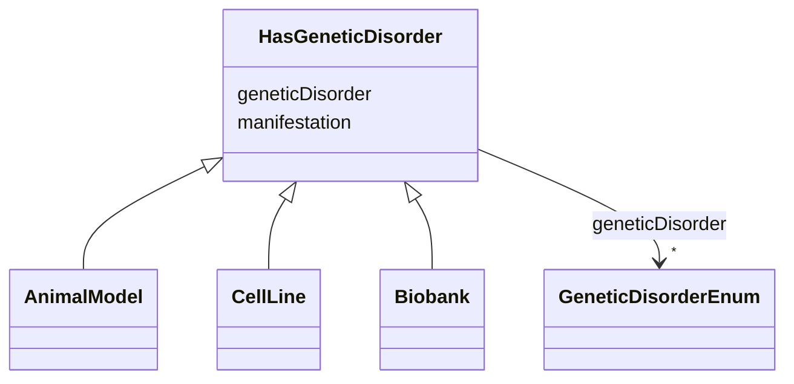

---
search:
  boost: 10.0
---

# Class: HasGeneticDisorder 


_Mixin for tool types associated with a genetic disorder and its manifestations._


<div data-search-exclude markdown="1">


URI: [nftools:HasGeneticDisorder](https://w3id.org/nf-research-tools/HasGeneticDisorder)





<!-- no inheritance hierarchy -->

## Class Properties

| Property | Value |
| --- | --- |
| Mixin | Yes |


## Slots

| Name | Cardinality and Range | Description | Inheritance |
| ---  | --- | --- | --- |
| [geneticDisorder](geneticDisorder.md) | * <br/> [GeneticDisorderEnum](GeneticDisorderEnum.md) | Genetic disorders associated with the resource | direct |
| [manifestation](manifestation.md) | * <br/> [String](String.md) | Manifestations or symptoms that this resource is used to model (e | direct |


## Mixin Usage

| mixed into | description |
| --- | --- |
| [AnimalModel](AnimalModel.md) | An animal sufficiently like humans in its anatomy, physiology, or response to... |
| [CellLine](CellLine.md) | A cell culture selected for uniformity from a cell population derived from a ... |
| [Biobank](Biobank.md) | A large collection of biological or medical data and tissue samples, amassed ... |


## Identifier and Mapping Information


### Schema Source


* from schema: https://w3id.org/nf-research-tools


## Mappings

| Mapping Type | Mapped Value |
| ---  | ---  |
| self | nftools:HasGeneticDisorder |
| native | nftools:HasGeneticDisorder |


## LinkML Source

<!-- TODO: investigate https://stackoverflow.com/questions/37606292/how-to-create-tabbed-code-blocks-in-mkdocs-or-sphinx -->

### Direct

<details>
```yaml
name: HasGeneticDisorder
description: Mixin for tool types associated with a genetic disorder and its manifestations.
from_schema: https://w3id.org/nf-research-tools
mixin: true
slots:
- geneticDisorder
- manifestation

```
</details>

### Induced

<details>
```yaml
name: HasGeneticDisorder
description: Mixin for tool types associated with a genetic disorder and its manifestations.
from_schema: https://w3id.org/nf-research-tools
mixin: true
attributes:
  geneticDisorder:
    name: geneticDisorder
    description: Genetic disorders associated with the resource.
    from_schema: https://w3id.org/nf-research-tools
    rank: 1000
    owner: HasGeneticDisorder
    domain_of:
    - HasGeneticDisorder
    range: GeneticDisorderEnum
    multivalued: true
  manifestation:
    name: manifestation
    description: Manifestations or symptoms that this resource is used to model (e.g.
      tumor type, behavioral phenotype).
    from_schema: https://w3id.org/nf-research-tools
    rank: 1000
    owner: HasGeneticDisorder
    domain_of:
    - HasGeneticDisorder
    range: string
    multivalued: true

```
</details></div>