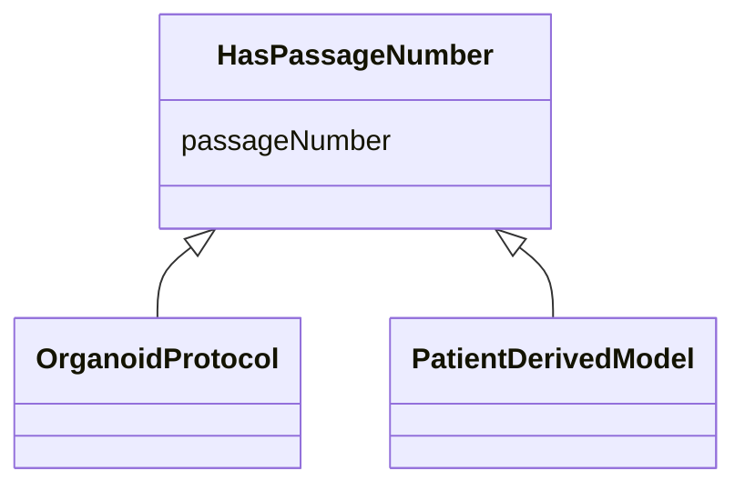

---
search:
  boost: 10.0
---

# Class: HasPassageNumber 


_Mixin for tool types that track passage number._


<div data-search-exclude markdown="1">


URI: [nftools:HasPassageNumber](https://w3id.org/nf-research-tools/HasPassageNumber)





<!-- no inheritance hierarchy -->

## Class Properties

| Property | Value |
| --- | --- |
| Mixin | Yes |


## Slots

| Name | Cardinality and Range | Description | Inheritance |
| ---  | --- | --- | --- |
| [passageNumber](passageNumber.md) | 0..1 <br/> [String](String.md) | Current passage number, if applicable | direct |


## Mixin Usage

| mixed into | description |
| --- | --- |
| [OrganoidProtocol](OrganoidProtocol.md) | Advanced 3D cellular models including organoids, assembloids, spheroids, and ... |
| [PatientDerivedModel](PatientDerivedModel.md) | Patient-derived models including patient-derived xenografts (PDX), humanized ... |


## Identifier and Mapping Information


### Schema Source


* from schema: https://w3id.org/nf-research-tools


## Mappings

| Mapping Type | Mapped Value |
| ---  | ---  |
| self | nftools:HasPassageNumber |
| native | nftools:HasPassageNumber |


## LinkML Source

<!-- TODO: investigate https://stackoverflow.com/questions/37606292/how-to-create-tabbed-code-blocks-in-mkdocs-or-sphinx -->

### Direct

<details>
```yaml
name: HasPassageNumber
description: Mixin for tool types that track passage number.
from_schema: https://w3id.org/nf-research-tools
mixin: true
slots:
- passageNumber

```
</details>

### Induced

<details>
```yaml
name: HasPassageNumber
description: Mixin for tool types that track passage number.
from_schema: https://w3id.org/nf-research-tools
mixin: true
attributes:
  passageNumber:
    name: passageNumber
    description: Current passage number, if applicable.
    from_schema: https://w3id.org/nf-research-tools
    rank: 1000
    owner: HasPassageNumber
    domain_of:
    - HasPassageNumber
    range: string

```
</details></div>