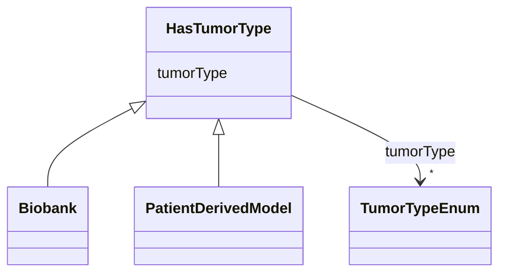

---
search:
  boost: 10.0
---

# Class: HasTumorType 


_Mixin for tool types that model or bank specific tumor types._


<div data-search-exclude markdown="1">


URI: [nftools:HasTumorType](https://w3id.org/nf-research-tools/HasTumorType)





<!-- no inheritance hierarchy -->

## Class Properties

| Property | Value |
| --- | --- |
| Mixin | Yes |


## Slots

| Name | Cardinality and Range | Description | Inheritance |
| ---  | --- | --- | --- |
| [tumorType](tumorType.md) | * <br/> [TumorTypeEnum](TumorTypeEnum.md) | Tumor types associated with the resource | direct |


## Mixin Usage

| mixed into | description |
| --- | --- |
| [Biobank](Biobank.md) | A large collection of biological or medical data and tissue samples, amassed ... |
| [PatientDerivedModel](PatientDerivedModel.md) | Patient-derived models including patient-derived xenografts (PDX), humanized ... |


## Identifier and Mapping Information


### Schema Source


* from schema: https://w3id.org/nf-research-tools


## Mappings

| Mapping Type | Mapped Value |
| ---  | ---  |
| self | nftools:HasTumorType |
| native | nftools:HasTumorType |


## LinkML Source

<!-- TODO: investigate https://stackoverflow.com/questions/37606292/how-to-create-tabbed-code-blocks-in-mkdocs-or-sphinx -->

### Direct

<details>
```yaml
name: HasTumorType
description: Mixin for tool types that model or bank specific tumor types.
from_schema: https://w3id.org/nf-research-tools
mixin: true
slots:
- tumorType

```
</details>

### Induced

<details>
```yaml
name: HasTumorType
description: Mixin for tool types that model or bank specific tumor types.
from_schema: https://w3id.org/nf-research-tools
mixin: true
attributes:
  tumorType:
    name: tumorType
    description: Tumor types associated with the resource.
    from_schema: https://w3id.org/nf-research-tools
    rank: 1000
    owner: HasTumorType
    domain_of:
    - HasTumorType
    range: TumorTypeEnum
    multivalued: true

```
</details></div>