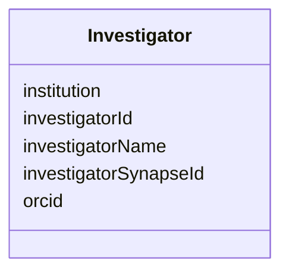

---
search:
  boost: 10.0
---

# Class: Investigator 


_A person who carries out a formal inquiry or investigation into the development of the resource._


<div data-search-exclude markdown="1">


URI: [schema:Person](http://schema.org/Person)





<!-- no inheritance hierarchy -->

## Class Properties

| Property | Value |
| --- | --- |
| Class URI | [schema:Person](http://schema.org/Person) |


## Slots

| Name | Cardinality and Range | Description | Inheritance |
| ---  | --- | --- | --- |
| [investigatorId](investigatorId.md) | 1 <br/> [String](String.md) | A unique identifier for the investigator | direct |
| [orcid](orcid.md) | 0..1 <br/> [String](String.md) | The ORCID iD of the investigator | direct |
| [investigatorName](investigatorName.md) | 1 <br/> [String](String.md) | The name of the investigator | direct |
| [institution](institution.md) | 0..1 <br/> [String](String.md) | The institution of the investigator | direct |
| [investigatorSynapseId](investigatorSynapseId.md) | 0..1 <br/> [String](String.md) | The Synapse identifier for the investigator | direct |


## Identifier and Mapping Information


### Annotations

| property | value |
| --- | --- |
| synapse_table_id | syn26486833 |


### Schema Source


* from schema: https://w3id.org/nf-research-tools


## Mappings

| Mapping Type | Mapped Value |
| ---  | ---  |
| self | schema:Person |
| native | nftools:Investigator |


## LinkML Source

<!-- TODO: investigate https://stackoverflow.com/questions/37606292/how-to-create-tabbed-code-blocks-in-mkdocs-or-sphinx -->

### Direct

<details>
```yaml
name: Investigator
annotations:
  synapse_table_id:
    tag: synapse_table_id
    value: syn26486833
description: A person who carries out a formal inquiry or investigation into the development
  of the resource.
from_schema: https://w3id.org/nf-research-tools
slots:
- investigatorId
- orcid
- investigatorName
- institution
- investigatorSynapseId
class_uri: schema:Person

```
</details>

### Induced

<details>
```yaml
name: Investigator
annotations:
  synapse_table_id:
    tag: synapse_table_id
    value: syn26486833
description: A person who carries out a formal inquiry or investigation into the development
  of the resource.
from_schema: https://w3id.org/nf-research-tools
attributes:
  investigatorId:
    name: investigatorId
    description: A unique identifier for the investigator.
    from_schema: https://w3id.org/nf-research-tools
    rank: 1000
    identifier: true
    owner: Investigator
    domain_of:
    - DevelopmentRecord
    - Investigator
    range: string
    required: true
  orcid:
    name: orcid
    description: The ORCID iD of the investigator.
    from_schema: https://w3id.org/nf-research-tools
    rank: 1000
    owner: Investigator
    domain_of:
    - Investigator
    range: string
  investigatorName:
    name: investigatorName
    description: The name of the investigator.
    from_schema: https://w3id.org/nf-research-tools
    rank: 1000
    slot_uri: schema:name
    owner: Investigator
    domain_of:
    - Investigator
    range: string
    required: true
  institution:
    name: institution
    description: The institution of the investigator.
    from_schema: https://w3id.org/nf-research-tools
    rank: 1000
    owner: Investigator
    domain_of:
    - Investigator
    range: string
  investigatorSynapseId:
    name: investigatorSynapseId
    description: The Synapse identifier for the investigator.
    from_schema: https://w3id.org/nf-research-tools
    rank: 1000
    owner: Investigator
    domain_of:
    - Investigator
    range: string
class_uri: schema:Person

```
</details></div>