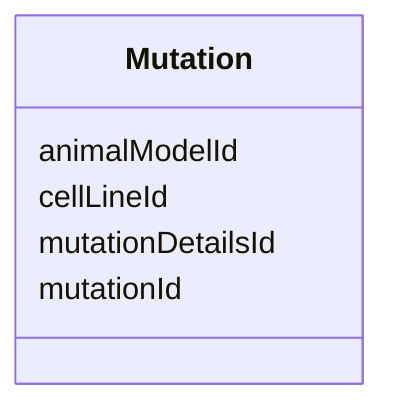

---
search:
  boost: 10.0
---

# Class: Mutation 


_Junction table linking tool-type resources (AnimalModel, CellLine) to their MutationDetails records._


<div data-search-exclude markdown="1">


URI: [nftools:Mutation](https://w3id.org/nf-research-tools/Mutation)





<!-- no inheritance hierarchy -->

## Slots

| Name | Cardinality and Range | Description | Inheritance |
| ---  | --- | --- | --- |
| [mutationId](mutationId.md) | 1 <br/> [String](String.md) | A unique identifier for this junction record | direct |
| [mutationDetailsId](mutationDetailsId.md) | 1 <br/> [String](String.md) | Foreign key to MutationDetails (mutationDetailsId) | direct |
| [animalModelId](animalModelId.md) | 0..1 <br/> [String](String.md) | Foreign key to AnimalModel (resourceId) | direct |
| [cellLineId](cellLineId.md) | 0..1 <br/> [String](String.md) | Foreign key to CellLine (resourceId) | direct |


## Identifier and Mapping Information


### Annotations

| property | value |
| --- | --- |
| synapse_table_id | syn26486834 |


### Schema Source


* from schema: https://w3id.org/nf-research-tools


## Mappings

| Mapping Type | Mapped Value |
| ---  | ---  |
| self | nftools:Mutation |
| native | nftools:Mutation |


## LinkML Source

<!-- TODO: investigate https://stackoverflow.com/questions/37606292/how-to-create-tabbed-code-blocks-in-mkdocs-or-sphinx -->

### Direct

<details>
```yaml
name: Mutation
annotations:
  synapse_table_id:
    tag: synapse_table_id
    value: syn26486834
description: Junction table linking tool-type resources (AnimalModel, CellLine) to
  their MutationDetails records.
from_schema: https://w3id.org/nf-research-tools
attributes:
  mutationId:
    name: mutationId
    description: A unique identifier for this junction record.
    from_schema: https://w3id.org/nf-research-tools/mutation
    rank: 1000
    identifier: true
    domain_of:
    - Mutation
    required: true
  mutationDetailsId:
    name: mutationDetailsId
    description: Foreign key to MutationDetails (mutationDetailsId).
    from_schema: https://w3id.org/nf-research-tools/mutation
    domain_of:
    - Mutation
    - MutationDetails
    required: true
  animalModelId:
    name: animalModelId
    description: Foreign key to AnimalModel (resourceId). Null if this mutation is
      linked to a CellLine instead.
    from_schema: https://w3id.org/nf-research-tools/mutation
    rank: 1000
    domain_of:
    - Mutation
  cellLineId:
    name: cellLineId
    description: Foreign key to CellLine (resourceId). Null if this mutation is linked
      to an AnimalModel instead.
    from_schema: https://w3id.org/nf-research-tools/mutation
    rank: 1000
    domain_of:
    - Mutation

```
</details>

### Induced

<details>
```yaml
name: Mutation
annotations:
  synapse_table_id:
    tag: synapse_table_id
    value: syn26486834
description: Junction table linking tool-type resources (AnimalModel, CellLine) to
  their MutationDetails records.
from_schema: https://w3id.org/nf-research-tools
attributes:
  mutationId:
    name: mutationId
    description: A unique identifier for this junction record.
    from_schema: https://w3id.org/nf-research-tools/mutation
    rank: 1000
    identifier: true
    owner: Mutation
    domain_of:
    - Mutation
    range: string
    required: true
  mutationDetailsId:
    name: mutationDetailsId
    description: Foreign key to MutationDetails (mutationDetailsId).
    from_schema: https://w3id.org/nf-research-tools/mutation
    owner: Mutation
    domain_of:
    - Mutation
    - MutationDetails
    range: string
    required: true
  animalModelId:
    name: animalModelId
    description: Foreign key to AnimalModel (resourceId). Null if this mutation is
      linked to a CellLine instead.
    from_schema: https://w3id.org/nf-research-tools/mutation
    rank: 1000
    owner: Mutation
    domain_of:
    - Mutation
    range: string
  cellLineId:
    name: cellLineId
    description: Foreign key to CellLine (resourceId). Null if this mutation is linked
      to an AnimalModel instead.
    from_schema: https://w3id.org/nf-research-tools/mutation
    rank: 1000
    owner: Mutation
    domain_of:
    - Mutation
    range: string

```
</details></div>