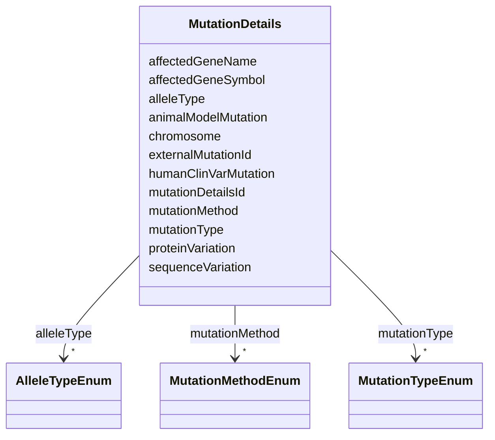

---
search:
  boost: 10.0
---

# Class: MutationDetails 


_Details of a genetic mutation, including type, method, affected gene, and sequence-level information._


<div data-search-exclude markdown="1">


URI: [nftools:MutationDetails](https://w3id.org/nf-research-tools/MutationDetails)





<!-- no inheritance hierarchy -->

## Slots

| Name | Cardinality and Range | Description | Inheritance |
| ---  | --- | --- | --- |
| [mutationDetailsId](mutationDetailsId.md) | 1 <br/> [String](String.md) | A unique identifier for the mutation | direct |
| [externalMutationId](externalMutationId.md) | 0..1 <br/> [String](String.md) | An identifier from an organism database such as MGI or other curated variant ... | direct |
| [alleleType](alleleType.md) | * <br/> [AlleleTypeEnum](AlleleTypeEnum.md) | The type of genetic alteration, vocabulary aligned with MGI allele subtypes | direct |
| [mutationType](mutationType.md) | * <br/> [MutationTypeEnum](MutationTypeEnum.md) | The type of mutation, vocabulary aligned with MGI mutation types | direct |
| [mutationMethod](mutationMethod.md) | * <br/> [MutationMethodEnum](MutationMethodEnum.md) | The method used to alter the resource, vocabulary aligned with MGI allele ori... | direct |
| [affectedGeneSymbol](affectedGeneSymbol.md) | 0..1 <br/> [String](String.md) | The gene symbol for the mutated gene (e | direct |
| [affectedGeneName](affectedGeneName.md) | 0..1 <br/> [String](String.md) | Gene name for the affected gene (e | direct |
| [sequenceVariation](sequenceVariation.md) | 0..1 <br/> [String](String.md) | Important sequence variations in HGVS notation (e | direct |
| [proteinVariation](proteinVariation.md) | 0..1 <br/> [String](String.md) | The protein consequence of the mutation (e | direct |
| [animalModelMutation](animalModelMutation.md) | 0..1 <br/> [String](String.md) | A description of the specific mutation(s) created in the genome | direct |
| [humanClinVarMutation](humanClinVarMutation.md) | 0..1 <br/> [String](String.md) | The human equivalent of the mutation in ClinVar/HGVS notation | direct |
| [chromosome](chromosome.md) | 0..1 <br/> [String](String.md) | Chromosome number of the affected gene (e | direct |


## Identifier and Mapping Information


### Annotations

| property | value |
| --- | --- |
| synapse_table_id | syn26486835 |


### Schema Source


* from schema: https://w3id.org/nf-research-tools


## Mappings

| Mapping Type | Mapped Value |
| ---  | ---  |
| self | nftools:MutationDetails |
| native | nftools:MutationDetails |


## LinkML Source

<!-- TODO: investigate https://stackoverflow.com/questions/37606292/how-to-create-tabbed-code-blocks-in-mkdocs-or-sphinx -->

### Direct

<details>
```yaml
name: MutationDetails
annotations:
  synapse_table_id:
    tag: synapse_table_id
    value: syn26486835
description: Details of a genetic mutation, including type, method, affected gene,
  and sequence-level information.
from_schema: https://w3id.org/nf-research-tools
slots:
- mutationDetailsId
- externalMutationId
- alleleType
- mutationType
- mutationMethod
- affectedGeneSymbol
- affectedGeneName
- sequenceVariation
- proteinVariation
- animalModelMutation
- humanClinVarMutation
- chromosome

```
</details>

### Induced

<details>
```yaml
name: MutationDetails
annotations:
  synapse_table_id:
    tag: synapse_table_id
    value: syn26486835
description: Details of a genetic mutation, including type, method, affected gene,
  and sequence-level information.
from_schema: https://w3id.org/nf-research-tools
attributes:
  mutationDetailsId:
    name: mutationDetailsId
    description: A unique identifier for the mutation.
    from_schema: https://w3id.org/nf-research-tools
    rank: 1000
    identifier: true
    owner: MutationDetails
    domain_of:
    - Mutation
    - MutationDetails
    range: string
    required: true
  externalMutationId:
    name: externalMutationId
    description: An identifier from an organism database such as MGI or other curated
      variant resource, if available.
    from_schema: https://w3id.org/nf-research-tools
    rank: 1000
    owner: MutationDetails
    domain_of:
    - MutationDetails
    range: string
  alleleType:
    name: alleleType
    description: The type of genetic alteration, vocabulary aligned with MGI allele
      subtypes.
    from_schema: https://w3id.org/nf-research-tools
    rank: 1000
    owner: MutationDetails
    domain_of:
    - MutationDetails
    range: AlleleTypeEnum
    multivalued: true
  mutationType:
    name: mutationType
    description: The type of mutation, vocabulary aligned with MGI mutation types.
    from_schema: https://w3id.org/nf-research-tools
    rank: 1000
    owner: MutationDetails
    domain_of:
    - MutationDetails
    range: MutationTypeEnum
    multivalued: true
  mutationMethod:
    name: mutationMethod
    description: The method used to alter the resource, vocabulary aligned with MGI
      allele origin types.
    from_schema: https://w3id.org/nf-research-tools
    rank: 1000
    owner: MutationDetails
    domain_of:
    - MutationDetails
    range: MutationMethodEnum
    multivalued: true
  affectedGeneSymbol:
    name: affectedGeneSymbol
    description: The gene symbol for the mutated gene (e.g. NF1, SUZ12, SMARCB1).
    from_schema: https://w3id.org/nf-research-tools
    rank: 1000
    owner: MutationDetails
    domain_of:
    - MutationDetails
    range: string
  affectedGeneName:
    name: affectedGeneName
    description: Gene name for the affected gene (e.g. neurofibromin 1).
    from_schema: https://w3id.org/nf-research-tools
    rank: 1000
    owner: MutationDetails
    domain_of:
    - MutationDetails
    range: string
  sequenceVariation:
    name: sequenceVariation
    description: Important sequence variations in HGVS notation (e.g. g.123_127del).
      See http://varnomen.hgvs.org/ for nomenclature.
    from_schema: https://w3id.org/nf-research-tools
    rank: 1000
    owner: MutationDetails
    domain_of:
    - MutationDetails
    range: string
  proteinVariation:
    name: proteinVariation
    description: The protein consequence of the mutation (e.g. p.Asn58fs). See http://varnomen.hgvs.org/recommendations/protein/
      for nomenclature.
    from_schema: https://w3id.org/nf-research-tools
    rank: 1000
    owner: MutationDetails
    domain_of:
    - MutationDetails
    range: string
  animalModelMutation:
    name: animalModelMutation
    description: A description of the specific mutation(s) created in the genome.
    from_schema: https://w3id.org/nf-research-tools
    rank: 1000
    owner: MutationDetails
    domain_of:
    - MutationDetails
    range: string
  humanClinVarMutation:
    name: humanClinVarMutation
    description: The human equivalent of the mutation in ClinVar/HGVS notation. Used
      to link animal model mutations to human disease mutations.
    from_schema: https://w3id.org/nf-research-tools
    rank: 1000
    owner: MutationDetails
    domain_of:
    - MutationDetails
    range: string
  chromosome:
    name: chromosome
    description: Chromosome number of the affected gene (e.g. 11).
    from_schema: https://w3id.org/nf-research-tools
    rank: 1000
    owner: MutationDetails
    domain_of:
    - MutationDetails
    range: string

```
</details></div>