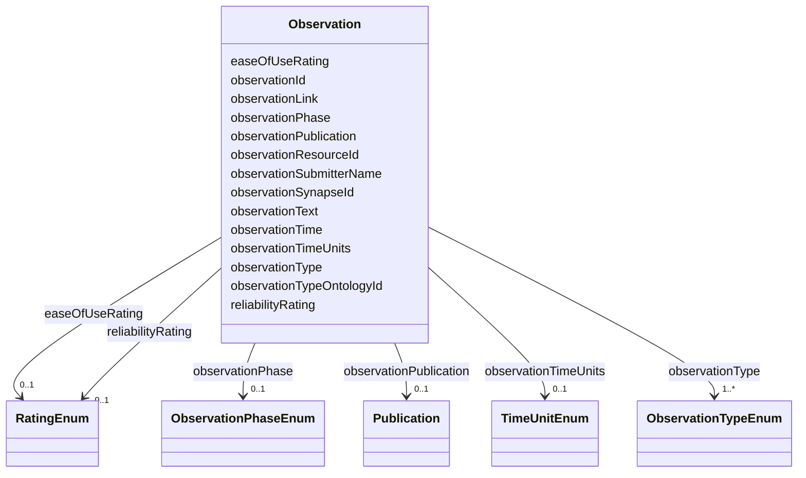

---
search:
  boost: 10.0
---

# Class: Observation 


_A remark, statement, or comment based on the resource._


<div data-search-exclude markdown="1">


URI: [nftools:Observation](https://w3id.org/nf-research-tools/Observation)





<!-- no inheritance hierarchy -->

## Slots

| Name | Cardinality and Range | Description | Inheritance |
| ---  | --- | --- | --- |
| [observationId](observationId.md) | 1 <br/> [String](String.md) | A unique identifier for the observation | direct |
| [observationResourceId](observationResourceId.md) | 1 <br/> [String](String.md) | The resource this observation is about | direct |
| [observationPublication](observationPublication.md) | 0..1 <br/> [Publication](Publication.md) | Publication associated with this observation | direct |
| [observationSubmitterName](observationSubmitterName.md) | 1 <br/> [String](String.md) | The name of the person submitting the observation | direct |
| [observationSynapseId](observationSynapseId.md) | 0..1 <br/> [String](String.md) | The Synapse identifier for the person submitting the observation | direct |
| [observationText](observationText.md) | 1 <br/> [String](String.md) | Free text observation about the resource | direct |
| [observationType](observationType.md) | 1..* <br/> [ObservationTypeEnum](ObservationTypeEnum.md) | Type of observation | direct |
| [observationTypeOntologyId](observationTypeOntologyId.md) | 0..1 <br/> [String](String.md) | Mammalian Phenotype Ontology (MP) term identifier | direct |
| [observationPhase](observationPhase.md) | 0..1 <br/> [ObservationPhaseEnum](ObservationPhaseEnum.md) | What t=0 for the observation time is (life stage or phase) | direct |
| [observationTime](observationTime.md) | 0..1 <br/> [String](String.md) | When the observation was made | direct |
| [observationTimeUnits](observationTimeUnits.md) | 0..1 <br/> [TimeUnitEnum](TimeUnitEnum.md) | The unit of time pertaining to the observation | direct |
| [reliabilityRating](reliabilityRating.md) | 0..1 <br/> [RatingEnum](RatingEnum.md) | A 1-5 rating of reliability: does the resource produce consistent results and... | direct |
| [easeOfUseRating](easeOfUseRating.md) | 0..1 <br/> [RatingEnum](RatingEnum.md) | A 1-5 rating of ease of use: how easy is it to obtain the resource, comply wi... | direct |
| [observationLink](observationLink.md) | 0..1 <br/> [Uri](Uri.md) | A link/reference related to the observation | direct |


## Identifier and Mapping Information


### Annotations

| property | value |
| --- | --- |
| synapse_table_id | syn26486836 |


### Schema Source


* from schema: https://w3id.org/nf-research-tools


## Mappings

| Mapping Type | Mapped Value |
| ---  | ---  |
| self | nftools:Observation |
| native | nftools:Observation |


## LinkML Source

<!-- TODO: investigate https://stackoverflow.com/questions/37606292/how-to-create-tabbed-code-blocks-in-mkdocs-or-sphinx -->

### Direct

<details>
```yaml
name: Observation
annotations:
  synapse_table_id:
    tag: synapse_table_id
    value: syn26486836
description: A remark, statement, or comment based on the resource.
from_schema: https://w3id.org/nf-research-tools
slots:
- observationId
- observationResourceId
- observationPublication
- observationSubmitterName
- observationSynapseId
- observationText
- observationType
- observationTypeOntologyId
- observationPhase
- observationTime
- observationTimeUnits
- reliabilityRating
- easeOfUseRating
- observationLink

```
</details>

### Induced

<details>
```yaml
name: Observation
annotations:
  synapse_table_id:
    tag: synapse_table_id
    value: syn26486836
description: A remark, statement, or comment based on the resource.
from_schema: https://w3id.org/nf-research-tools
attributes:
  observationId:
    name: observationId
    description: A unique identifier for the observation.
    from_schema: https://w3id.org/nf-research-tools
    rank: 1000
    identifier: true
    owner: Observation
    domain_of:
    - Observation
    range: string
    required: true
  observationResourceId:
    name: observationResourceId
    description: The resource this observation is about.
    from_schema: https://w3id.org/nf-research-tools
    rank: 1000
    owner: Observation
    domain_of:
    - Observation
    range: string
    required: true
  observationPublication:
    name: observationPublication
    description: Publication associated with this observation.
    from_schema: https://w3id.org/nf-research-tools
    rank: 1000
    owner: Observation
    domain_of:
    - Observation
    range: Publication
    inlined: true
  observationSubmitterName:
    name: observationSubmitterName
    description: The name of the person submitting the observation.
    from_schema: https://w3id.org/nf-research-tools
    rank: 1000
    owner: Observation
    domain_of:
    - Observation
    range: string
    required: true
  observationSynapseId:
    name: observationSynapseId
    description: The Synapse identifier for the person submitting the observation.
    from_schema: https://w3id.org/nf-research-tools
    rank: 1000
    owner: Observation
    domain_of:
    - Observation
    range: string
  observationText:
    name: observationText
    description: Free text observation about the resource.
    from_schema: https://w3id.org/nf-research-tools
    rank: 1000
    owner: Observation
    domain_of:
    - Observation
    range: string
    required: true
  observationType:
    name: observationType
    description: Type of observation. Valid values depend on the resource type.
    from_schema: https://w3id.org/nf-research-tools
    rank: 1000
    owner: Observation
    domain_of:
    - Observation
    range: ObservationTypeEnum
    required: true
    multivalued: true
  observationTypeOntologyId:
    name: observationTypeOntologyId
    description: Mammalian Phenotype Ontology (MP) term identifier.
    from_schema: https://w3id.org/nf-research-tools
    rank: 1000
    owner: Observation
    domain_of:
    - Observation
    range: string
  observationPhase:
    name: observationPhase
    description: What t=0 for the observation time is (life stage or phase).
    from_schema: https://w3id.org/nf-research-tools
    rank: 1000
    owner: Observation
    domain_of:
    - Observation
    range: ObservationPhaseEnum
  observationTime:
    name: observationTime
    description: When the observation was made.
    from_schema: https://w3id.org/nf-research-tools
    rank: 1000
    owner: Observation
    domain_of:
    - Observation
    range: string
  observationTimeUnits:
    name: observationTimeUnits
    description: The unit of time pertaining to the observation.
    from_schema: https://w3id.org/nf-research-tools
    rank: 1000
    owner: Observation
    domain_of:
    - Observation
    range: TimeUnitEnum
  reliabilityRating:
    name: reliabilityRating
    description: 'A 1-5 rating of reliability: does the resource produce consistent
      results and reasonably recapitulate human disease?'
    from_schema: https://w3id.org/nf-research-tools
    rank: 1000
    owner: Observation
    domain_of:
    - Observation
    range: RatingEnum
  easeOfUseRating:
    name: easeOfUseRating
    description: 'A 1-5 rating of ease of use: how easy is it to obtain the resource,
      comply with agreements, etc?'
    from_schema: https://w3id.org/nf-research-tools
    rank: 1000
    owner: Observation
    domain_of:
    - Observation
    range: RatingEnum
  observationLink:
    name: observationLink
    description: A link/reference related to the observation. If the reference has
      a DOI or PubMed ID, use the publication field instead.
    from_schema: https://w3id.org/nf-research-tools
    rank: 1000
    owner: Observation
    domain_of:
    - Observation
    range: uri

```
</details></div>