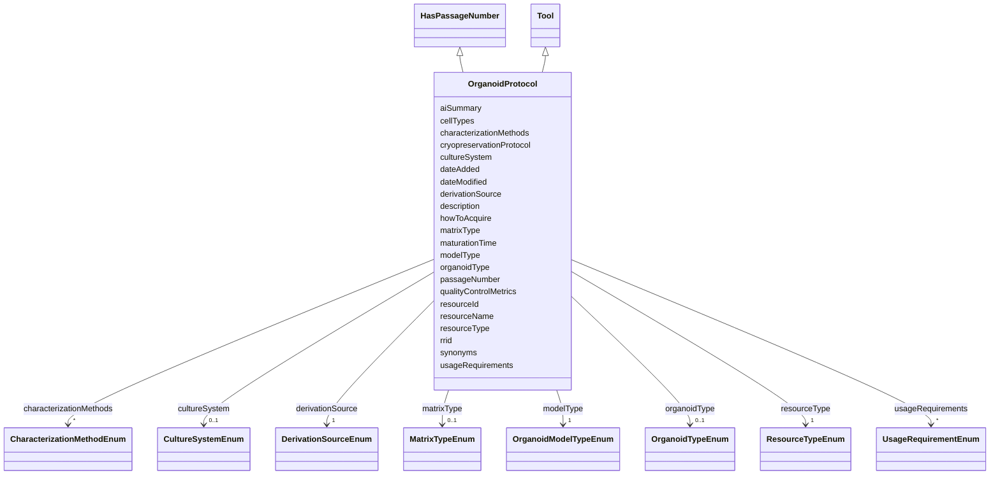

---
search:
  boost: 10.0
---

# Class: OrganoidProtocol 


_Advanced 3D cellular models including organoids, assembloids, spheroids, and other 3D culture systems._


<div data-search-exclude markdown="1">


URI: [nftools:OrganoidProtocol](https://w3id.org/nf-research-tools/OrganoidProtocol)





## Inheritance
* [Tool](Tool.md)
    * **OrganoidProtocol** [ [HasPassageNumber](HasPassageNumber.md)]


## Slots

| Name | Cardinality and Range | Description | Inheritance |
| ---  | --- | --- | --- |
| [modelType](modelType.md) | 1 <br/> [OrganoidModelTypeEnum](OrganoidModelTypeEnum.md) | Type of 3D cellular model | direct |
| [derivationSource](derivationSource.md) | 1 <br/> [DerivationSourceEnum](DerivationSourceEnum.md) | Source of cells used to generate the model | direct |
| [cellTypes](cellTypes.md) | 1..* <br/> [String](String.md) | Cell types present in the model | direct |
| [organoidType](organoidType.md) | 0..1 <br/> [OrganoidTypeEnum](OrganoidTypeEnum.md) | Specific type of organoid, if applicable | direct |
| [matrixType](matrixType.md) | 0..1 <br/> [MatrixTypeEnum](MatrixTypeEnum.md) | Extracellular matrix or scaffold used | direct |
| [cultureSystem](cultureSystem.md) | 0..1 <br/> [CultureSystemEnum](CultureSystemEnum.md) | Culture system used for maintenance | direct |
| [maturationTime](maturationTime.md) | 0..1 <br/> [String](String.md) | Time required for model maturation | direct |
| [characterizationMethods](characterizationMethods.md) | * <br/> [CharacterizationMethodEnum](CharacterizationMethodEnum.md) | Methods used to characterize the model | direct |
| [cryopreservationProtocol](cryopreservationProtocol.md) | 0..1 <br/> [String](String.md) | Protocol for freezing/thawing, if available | direct |
| [qualityControlMetrics](qualityControlMetrics.md) | * <br/> [String](String.md) | Quality control metrics used | direct |
| [passageNumber](passageNumber.md) | 0..1 <br/> [String](String.md) | Current passage number, if applicable | [HasPassageNumber](HasPassageNumber.md) |
| [resourceId](resourceId.md) | 1 <br/> [String](String.md) | A unique identifier for the resource | [Tool](Tool.md) |
| [rrid](rrid.md) | 0..1 <br/> [String](String.md) | The RRID, a standard resource identifier for interoperability with other data... | [Tool](Tool.md) |
| [resourceName](resourceName.md) | 1 <br/> [String](String.md) | The canonical name of the resource | [Tool](Tool.md) |
| [synonyms](synonyms.md) | * <br/> [String](String.md) | Synonyms of the resource | [Tool](Tool.md) |
| [resourceType](resourceType.md) | 1 <br/> [ResourceTypeEnum](ResourceTypeEnum.md) | Type of resource | [Tool](Tool.md) |
| [description](description.md) | 0..1 <br/> [String](String.md) | Free text description, summary, or purpose of the resource | [Tool](Tool.md) |
| [aiSummary](aiSummary.md) | 0..1 <br/> [String](String.md) | A large language model-generated summary of the resource | [Tool](Tool.md) |
| [usageRequirements](usageRequirements.md) | * <br/> [UsageRequirementEnum](UsageRequirementEnum.md) | Any known restrictions on use of the resource | [Tool](Tool.md) |
| [howToAcquire](howToAcquire.md) | 1 <br/> [String](String.md) | How to acquire a particular resource | [Tool](Tool.md) |
| [dateAdded](dateAdded.md) | 1 <br/> [Date](Date.md) | The date that the resource was originally added | [Tool](Tool.md) |
| [dateModified](dateModified.md) | 1 <br/> [Date](Date.md) | The last update of the resource metadata | [Tool](Tool.md) |


## Identifier and Mapping Information


### Annotations

| property | value |
| --- | --- |
| synapse_table_id | syn73709227 |


### Schema Source


* from schema: https://w3id.org/nf-research-tools


## Mappings

| Mapping Type | Mapped Value |
| ---  | ---  |
| self | nftools:OrganoidProtocol |
| native | nftools:OrganoidProtocol |


## LinkML Source

<!-- TODO: investigate https://stackoverflow.com/questions/37606292/how-to-create-tabbed-code-blocks-in-mkdocs-or-sphinx -->

### Direct

<details>
```yaml
name: OrganoidProtocol
annotations:
  synapse_table_id:
    tag: synapse_table_id
    value: syn73709227
description: Advanced 3D cellular models including organoids, assembloids, spheroids,
  and other 3D culture systems.
from_schema: https://w3id.org/nf-research-tools
is_a: Tool
mixins:
- HasPassageNumber
slot_usage:
  resourceType:
    name: resourceType
    ifabsent: string(Organoid Protocol)
attributes:
  modelType:
    name: modelType
    description: Type of 3D cellular model.
    from_schema: https://w3id.org/nf-research-tools/organoid_protocol
    rank: 1000
    domain_of:
    - OrganoidProtocol
    range: OrganoidModelTypeEnum
    required: true
  derivationSource:
    name: derivationSource
    description: Source of cells used to generate the model.
    from_schema: https://w3id.org/nf-research-tools/organoid_protocol
    rank: 1000
    domain_of:
    - OrganoidProtocol
    range: DerivationSourceEnum
    required: true
  cellTypes:
    name: cellTypes
    description: Cell types present in the model.
    from_schema: https://w3id.org/nf-research-tools/organoid_protocol
    rank: 1000
    domain_of:
    - OrganoidProtocol
    required: true
    multivalued: true
  organoidType:
    name: organoidType
    description: Specific type of organoid, if applicable.
    from_schema: https://w3id.org/nf-research-tools/organoid_protocol
    rank: 1000
    domain_of:
    - OrganoidProtocol
    range: OrganoidTypeEnum
  matrixType:
    name: matrixType
    description: Extracellular matrix or scaffold used.
    from_schema: https://w3id.org/nf-research-tools/organoid_protocol
    rank: 1000
    domain_of:
    - OrganoidProtocol
    range: MatrixTypeEnum
  cultureSystem:
    name: cultureSystem
    description: Culture system used for maintenance.
    from_schema: https://w3id.org/nf-research-tools/organoid_protocol
    rank: 1000
    domain_of:
    - OrganoidProtocol
    range: CultureSystemEnum
  maturationTime:
    name: maturationTime
    description: Time required for model maturation.
    from_schema: https://w3id.org/nf-research-tools/organoid_protocol
    rank: 1000
    domain_of:
    - OrganoidProtocol
  characterizationMethods:
    name: characterizationMethods
    description: Methods used to characterize the model.
    from_schema: https://w3id.org/nf-research-tools/organoid_protocol
    rank: 1000
    domain_of:
    - OrganoidProtocol
    range: CharacterizationMethodEnum
    multivalued: true
  cryopreservationProtocol:
    name: cryopreservationProtocol
    description: Protocol for freezing/thawing, if available.
    from_schema: https://w3id.org/nf-research-tools/organoid_protocol
    rank: 1000
    domain_of:
    - OrganoidProtocol
  qualityControlMetrics:
    name: qualityControlMetrics
    description: Quality control metrics used.
    from_schema: https://w3id.org/nf-research-tools/organoid_protocol
    rank: 1000
    domain_of:
    - OrganoidProtocol
    multivalued: true

```
</details>

### Induced

<details>
```yaml
name: OrganoidProtocol
annotations:
  synapse_table_id:
    tag: synapse_table_id
    value: syn73709227
description: Advanced 3D cellular models including organoids, assembloids, spheroids,
  and other 3D culture systems.
from_schema: https://w3id.org/nf-research-tools
is_a: Tool
mixins:
- HasPassageNumber
slot_usage:
  resourceType:
    name: resourceType
    ifabsent: string(Organoid Protocol)
attributes:
  modelType:
    name: modelType
    description: Type of 3D cellular model.
    from_schema: https://w3id.org/nf-research-tools/organoid_protocol
    rank: 1000
    owner: OrganoidProtocol
    domain_of:
    - OrganoidProtocol
    range: OrganoidModelTypeEnum
    required: true
  derivationSource:
    name: derivationSource
    description: Source of cells used to generate the model.
    from_schema: https://w3id.org/nf-research-tools/organoid_protocol
    rank: 1000
    owner: OrganoidProtocol
    domain_of:
    - OrganoidProtocol
    range: DerivationSourceEnum
    required: true
  cellTypes:
    name: cellTypes
    description: Cell types present in the model.
    from_schema: https://w3id.org/nf-research-tools/organoid_protocol
    rank: 1000
    owner: OrganoidProtocol
    domain_of:
    - OrganoidProtocol
    range: string
    required: true
    multivalued: true
  organoidType:
    name: organoidType
    description: Specific type of organoid, if applicable.
    from_schema: https://w3id.org/nf-research-tools/organoid_protocol
    rank: 1000
    owner: OrganoidProtocol
    domain_of:
    - OrganoidProtocol
    range: OrganoidTypeEnum
  matrixType:
    name: matrixType
    description: Extracellular matrix or scaffold used.
    from_schema: https://w3id.org/nf-research-tools/organoid_protocol
    rank: 1000
    owner: OrganoidProtocol
    domain_of:
    - OrganoidProtocol
    range: MatrixTypeEnum
  cultureSystem:
    name: cultureSystem
    description: Culture system used for maintenance.
    from_schema: https://w3id.org/nf-research-tools/organoid_protocol
    rank: 1000
    owner: OrganoidProtocol
    domain_of:
    - OrganoidProtocol
    range: CultureSystemEnum
  maturationTime:
    name: maturationTime
    description: Time required for model maturation.
    from_schema: https://w3id.org/nf-research-tools/organoid_protocol
    rank: 1000
    owner: OrganoidProtocol
    domain_of:
    - OrganoidProtocol
    range: string
  characterizationMethods:
    name: characterizationMethods
    description: Methods used to characterize the model.
    from_schema: https://w3id.org/nf-research-tools/organoid_protocol
    rank: 1000
    owner: OrganoidProtocol
    domain_of:
    - OrganoidProtocol
    range: CharacterizationMethodEnum
    multivalued: true
  cryopreservationProtocol:
    name: cryopreservationProtocol
    description: Protocol for freezing/thawing, if available.
    from_schema: https://w3id.org/nf-research-tools/organoid_protocol
    rank: 1000
    owner: OrganoidProtocol
    domain_of:
    - OrganoidProtocol
    range: string
  qualityControlMetrics:
    name: qualityControlMetrics
    description: Quality control metrics used.
    from_schema: https://w3id.org/nf-research-tools/organoid_protocol
    rank: 1000
    owner: OrganoidProtocol
    domain_of:
    - OrganoidProtocol
    range: string
    multivalued: true
  passageNumber:
    name: passageNumber
    description: Current passage number, if applicable.
    from_schema: https://w3id.org/nf-research-tools
    rank: 1000
    owner: OrganoidProtocol
    domain_of:
    - HasPassageNumber
    range: string
  resourceId:
    name: resourceId
    description: A unique identifier for the resource.
    from_schema: https://w3id.org/nf-research-tools
    rank: 1000
    slot_uri: schema:identifier
    identifier: true
    owner: OrganoidProtocol
    domain_of:
    - Tool
    - DevelopmentRecord
    - Usage
    range: string
    required: true
  rrid:
    name: rrid
    description: The RRID, a standard resource identifier for interoperability with
      other databases. Must include the lowercase 'rrid:' prefix.
    from_schema: https://w3id.org/nf-research-tools
    rank: 1000
    owner: OrganoidProtocol
    domain_of:
    - Tool
    range: string
    pattern: ^rrid:[a-zA-Z]+.+$
  resourceName:
    name: resourceName
    description: The canonical name of the resource.
    from_schema: https://w3id.org/nf-research-tools
    rank: 1000
    slot_uri: schema:name
    owner: OrganoidProtocol
    domain_of:
    - Tool
    range: string
    required: true
  synonyms:
    name: synonyms
    description: Synonyms of the resource.
    from_schema: https://w3id.org/nf-research-tools
    rank: 1000
    owner: OrganoidProtocol
    domain_of:
    - Tool
    range: string
    multivalued: true
  resourceType:
    name: resourceType
    description: Type of resource.
    from_schema: https://w3id.org/nf-research-tools
    rank: 1000
    ifabsent: string(Organoid Protocol)
    owner: OrganoidProtocol
    domain_of:
    - Tool
    range: ResourceTypeEnum
    required: true
  description:
    name: description
    description: Free text description, summary, or purpose of the resource.
    from_schema: https://w3id.org/nf-research-tools
    rank: 1000
    slot_uri: schema:description
    owner: OrganoidProtocol
    domain_of:
    - Tool
    range: string
  aiSummary:
    name: aiSummary
    description: A large language model-generated summary of the resource.
    from_schema: https://w3id.org/nf-research-tools
    rank: 1000
    owner: OrganoidProtocol
    domain_of:
    - Tool
    range: string
  usageRequirements:
    name: usageRequirements
    description: Any known restrictions on use of the resource.
    from_schema: https://w3id.org/nf-research-tools
    rank: 1000
    owner: OrganoidProtocol
    domain_of:
    - Tool
    range: UsageRequirementEnum
    multivalued: true
  howToAcquire:
    name: howToAcquire
    description: How to acquire a particular resource.
    from_schema: https://w3id.org/nf-research-tools
    rank: 1000
    owner: OrganoidProtocol
    domain_of:
    - Tool
    range: string
    required: true
  dateAdded:
    name: dateAdded
    description: The date that the resource was originally added.
    from_schema: https://w3id.org/nf-research-tools
    rank: 1000
    owner: OrganoidProtocol
    domain_of:
    - Tool
    range: date
    required: true
  dateModified:
    name: dateModified
    description: The last update of the resource metadata.
    from_schema: https://w3id.org/nf-research-tools
    rank: 1000
    owner: OrganoidProtocol
    domain_of:
    - Tool
    range: date
    required: true

```
</details></div>