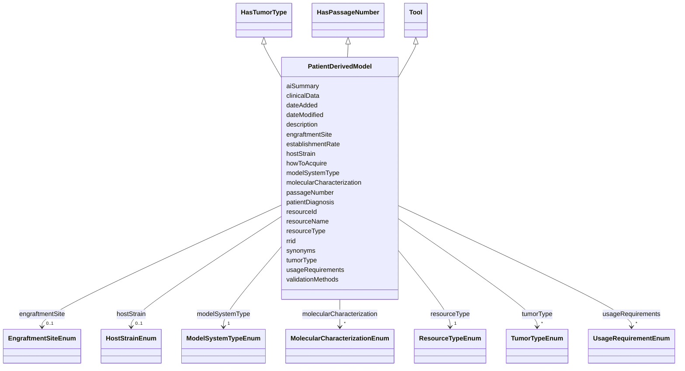

---
search:
  boost: 10.0
---

# Class: PatientDerivedModel 


_Patient-derived models including patient-derived xenografts (PDX), humanized mice, patient-derived organoids, and patient-derived cell lines._


<div data-search-exclude markdown="1">


URI: [nftools:PatientDerivedModel](https://w3id.org/nf-research-tools/PatientDerivedModel)





## Inheritance
* [Tool](Tool.md)
    * **PatientDerivedModel** [ [HasTumorType](HasTumorType.md) [HasPassageNumber](HasPassageNumber.md)]


## Slots

| Name | Cardinality and Range | Description | Inheritance |
| ---  | --- | --- | --- |
| [modelSystemType](modelSystemType.md) | 1 <br/> [ModelSystemTypeEnum](ModelSystemTypeEnum.md) | Type of patient-derived model system | direct |
| [patientDiagnosis](patientDiagnosis.md) | 1 <br/> [String](String.md) | Original patient diagnosis or condition | direct |
| [hostStrain](hostStrain.md) | 0..1 <br/> [HostStrainEnum](HostStrainEnum.md) | Host organism strain for xenografts | direct |
| [engraftmentSite](engraftmentSite.md) | 0..1 <br/> [EngraftmentSiteEnum](EngraftmentSiteEnum.md) | Site of engraftment in host organism | direct |
| [establishmentRate](establishmentRate.md) | 0..1 <br/> [String](String.md) | Success rate of model establishment | direct |
| [molecularCharacterization](molecularCharacterization.md) | * <br/> [MolecularCharacterizationEnum](MolecularCharacterizationEnum.md) | Molecular characterization performed | direct |
| [clinicalData](clinicalData.md) | 0..1 <br/> [String](String.md) | Available clinical data from the patient | direct |
| [validationMethods](validationMethods.md) | * <br/> [String](String.md) | Methods used to validate model fidelity to patient | direct |
| [tumorType](tumorType.md) | * <br/> [TumorTypeEnum](TumorTypeEnum.md) | Tumor types associated with the resource | [HasTumorType](HasTumorType.md) |
| [passageNumber](passageNumber.md) | 0..1 <br/> [String](String.md) | Current passage number, if applicable | [HasPassageNumber](HasPassageNumber.md) |
| [resourceId](resourceId.md) | 1 <br/> [String](String.md) | A unique identifier for the resource | [Tool](Tool.md) |
| [rrid](rrid.md) | 0..1 <br/> [String](String.md) | The RRID, a standard resource identifier for interoperability with other data... | [Tool](Tool.md) |
| [resourceName](resourceName.md) | 1 <br/> [String](String.md) | The canonical name of the resource | [Tool](Tool.md) |
| [synonyms](synonyms.md) | * <br/> [String](String.md) | Synonyms of the resource | [Tool](Tool.md) |
| [resourceType](resourceType.md) | 1 <br/> [ResourceTypeEnum](ResourceTypeEnum.md) | Type of resource | [Tool](Tool.md) |
| [description](description.md) | 0..1 <br/> [String](String.md) | Free text description, summary, or purpose of the resource | [Tool](Tool.md) |
| [aiSummary](aiSummary.md) | 0..1 <br/> [String](String.md) | A large language model-generated summary of the resource | [Tool](Tool.md) |
| [usageRequirements](usageRequirements.md) | * <br/> [UsageRequirementEnum](UsageRequirementEnum.md) | Any known restrictions on use of the resource | [Tool](Tool.md) |
| [howToAcquire](howToAcquire.md) | 1 <br/> [String](String.md) | How to acquire a particular resource | [Tool](Tool.md) |
| [dateAdded](dateAdded.md) | 1 <br/> [Date](Date.md) | The date that the resource was originally added | [Tool](Tool.md) |
| [dateModified](dateModified.md) | 1 <br/> [Date](Date.md) | The last update of the resource metadata | [Tool](Tool.md) |


## Identifier and Mapping Information


### Annotations

| property | value |
| --- | --- |
| synapse_table_id | syn73709228 |


### Schema Source


* from schema: https://w3id.org/nf-research-tools


## Mappings

| Mapping Type | Mapped Value |
| ---  | ---  |
| self | nftools:PatientDerivedModel |
| native | nftools:PatientDerivedModel |


## LinkML Source

<!-- TODO: investigate https://stackoverflow.com/questions/37606292/how-to-create-tabbed-code-blocks-in-mkdocs-or-sphinx -->

### Direct

<details>
```yaml
name: PatientDerivedModel
annotations:
  synapse_table_id:
    tag: synapse_table_id
    value: syn73709228
description: Patient-derived models including patient-derived xenografts (PDX), humanized
  mice, patient-derived organoids, and patient-derived cell lines.
from_schema: https://w3id.org/nf-research-tools
is_a: Tool
mixins:
- HasTumorType
- HasPassageNumber
slot_usage:
  resourceType:
    name: resourceType
    ifabsent: string(Patient-Derived Model)
attributes:
  modelSystemType:
    name: modelSystemType
    description: Type of patient-derived model system.
    from_schema: https://w3id.org/nf-research-tools/patient_derived_model
    rank: 1000
    domain_of:
    - PatientDerivedModel
    range: ModelSystemTypeEnum
    required: true
  patientDiagnosis:
    name: patientDiagnosis
    description: Original patient diagnosis or condition.
    from_schema: https://w3id.org/nf-research-tools/patient_derived_model
    rank: 1000
    domain_of:
    - PatientDerivedModel
    required: true
  hostStrain:
    name: hostStrain
    description: Host organism strain for xenografts.
    from_schema: https://w3id.org/nf-research-tools/patient_derived_model
    rank: 1000
    domain_of:
    - PatientDerivedModel
    range: HostStrainEnum
  engraftmentSite:
    name: engraftmentSite
    description: Site of engraftment in host organism.
    from_schema: https://w3id.org/nf-research-tools/patient_derived_model
    rank: 1000
    domain_of:
    - PatientDerivedModel
    range: EngraftmentSiteEnum
  establishmentRate:
    name: establishmentRate
    description: Success rate of model establishment.
    from_schema: https://w3id.org/nf-research-tools/patient_derived_model
    rank: 1000
    domain_of:
    - PatientDerivedModel
  molecularCharacterization:
    name: molecularCharacterization
    description: Molecular characterization performed.
    from_schema: https://w3id.org/nf-research-tools/patient_derived_model
    rank: 1000
    domain_of:
    - PatientDerivedModel
    range: MolecularCharacterizationEnum
    multivalued: true
  clinicalData:
    name: clinicalData
    description: Available clinical data from the patient.
    from_schema: https://w3id.org/nf-research-tools/patient_derived_model
    rank: 1000
    domain_of:
    - PatientDerivedModel
  validationMethods:
    name: validationMethods
    description: Methods used to validate model fidelity to patient.
    from_schema: https://w3id.org/nf-research-tools/patient_derived_model
    rank: 1000
    domain_of:
    - PatientDerivedModel
    multivalued: true

```
</details>

### Induced

<details>
```yaml
name: PatientDerivedModel
annotations:
  synapse_table_id:
    tag: synapse_table_id
    value: syn73709228
description: Patient-derived models including patient-derived xenografts (PDX), humanized
  mice, patient-derived organoids, and patient-derived cell lines.
from_schema: https://w3id.org/nf-research-tools
is_a: Tool
mixins:
- HasTumorType
- HasPassageNumber
slot_usage:
  resourceType:
    name: resourceType
    ifabsent: string(Patient-Derived Model)
attributes:
  modelSystemType:
    name: modelSystemType
    description: Type of patient-derived model system.
    from_schema: https://w3id.org/nf-research-tools/patient_derived_model
    rank: 1000
    owner: PatientDerivedModel
    domain_of:
    - PatientDerivedModel
    range: ModelSystemTypeEnum
    required: true
  patientDiagnosis:
    name: patientDiagnosis
    description: Original patient diagnosis or condition.
    from_schema: https://w3id.org/nf-research-tools/patient_derived_model
    rank: 1000
    owner: PatientDerivedModel
    domain_of:
    - PatientDerivedModel
    range: string
    required: true
  hostStrain:
    name: hostStrain
    description: Host organism strain for xenografts.
    from_schema: https://w3id.org/nf-research-tools/patient_derived_model
    rank: 1000
    owner: PatientDerivedModel
    domain_of:
    - PatientDerivedModel
    range: HostStrainEnum
  engraftmentSite:
    name: engraftmentSite
    description: Site of engraftment in host organism.
    from_schema: https://w3id.org/nf-research-tools/patient_derived_model
    rank: 1000
    owner: PatientDerivedModel
    domain_of:
    - PatientDerivedModel
    range: EngraftmentSiteEnum
  establishmentRate:
    name: establishmentRate
    description: Success rate of model establishment.
    from_schema: https://w3id.org/nf-research-tools/patient_derived_model
    rank: 1000
    owner: PatientDerivedModel
    domain_of:
    - PatientDerivedModel
    range: string
  molecularCharacterization:
    name: molecularCharacterization
    description: Molecular characterization performed.
    from_schema: https://w3id.org/nf-research-tools/patient_derived_model
    rank: 1000
    owner: PatientDerivedModel
    domain_of:
    - PatientDerivedModel
    range: MolecularCharacterizationEnum
    multivalued: true
  clinicalData:
    name: clinicalData
    description: Available clinical data from the patient.
    from_schema: https://w3id.org/nf-research-tools/patient_derived_model
    rank: 1000
    owner: PatientDerivedModel
    domain_of:
    - PatientDerivedModel
    range: string
  validationMethods:
    name: validationMethods
    description: Methods used to validate model fidelity to patient.
    from_schema: https://w3id.org/nf-research-tools/patient_derived_model
    rank: 1000
    owner: PatientDerivedModel
    domain_of:
    - PatientDerivedModel
    range: string
    multivalued: true
  tumorType:
    name: tumorType
    description: Tumor types associated with the resource.
    from_schema: https://w3id.org/nf-research-tools
    rank: 1000
    owner: PatientDerivedModel
    domain_of:
    - HasTumorType
    range: TumorTypeEnum
    multivalued: true
  passageNumber:
    name: passageNumber
    description: Current passage number, if applicable.
    from_schema: https://w3id.org/nf-research-tools
    rank: 1000
    owner: PatientDerivedModel
    domain_of:
    - HasPassageNumber
    range: string
  resourceId:
    name: resourceId
    description: A unique identifier for the resource.
    from_schema: https://w3id.org/nf-research-tools
    rank: 1000
    slot_uri: schema:identifier
    identifier: true
    owner: PatientDerivedModel
    domain_of:
    - Tool
    - DevelopmentRecord
    - Usage
    range: string
    required: true
  rrid:
    name: rrid
    description: The RRID, a standard resource identifier for interoperability with
      other databases. Must include the lowercase 'rrid:' prefix.
    from_schema: https://w3id.org/nf-research-tools
    rank: 1000
    owner: PatientDerivedModel
    domain_of:
    - Tool
    range: string
    pattern: ^rrid:[a-zA-Z]+.+$
  resourceName:
    name: resourceName
    description: The canonical name of the resource.
    from_schema: https://w3id.org/nf-research-tools
    rank: 1000
    slot_uri: schema:name
    owner: PatientDerivedModel
    domain_of:
    - Tool
    range: string
    required: true
  synonyms:
    name: synonyms
    description: Synonyms of the resource.
    from_schema: https://w3id.org/nf-research-tools
    rank: 1000
    owner: PatientDerivedModel
    domain_of:
    - Tool
    range: string
    multivalued: true
  resourceType:
    name: resourceType
    description: Type of resource.
    from_schema: https://w3id.org/nf-research-tools
    rank: 1000
    ifabsent: string(Patient-Derived Model)
    owner: PatientDerivedModel
    domain_of:
    - Tool
    range: ResourceTypeEnum
    required: true
  description:
    name: description
    description: Free text description, summary, or purpose of the resource.
    from_schema: https://w3id.org/nf-research-tools
    rank: 1000
    slot_uri: schema:description
    owner: PatientDerivedModel
    domain_of:
    - Tool
    range: string
  aiSummary:
    name: aiSummary
    description: A large language model-generated summary of the resource.
    from_schema: https://w3id.org/nf-research-tools
    rank: 1000
    owner: PatientDerivedModel
    domain_of:
    - Tool
    range: string
  usageRequirements:
    name: usageRequirements
    description: Any known restrictions on use of the resource.
    from_schema: https://w3id.org/nf-research-tools
    rank: 1000
    owner: PatientDerivedModel
    domain_of:
    - Tool
    range: UsageRequirementEnum
    multivalued: true
  howToAcquire:
    name: howToAcquire
    description: How to acquire a particular resource.
    from_schema: https://w3id.org/nf-research-tools
    rank: 1000
    owner: PatientDerivedModel
    domain_of:
    - Tool
    range: string
    required: true
  dateAdded:
    name: dateAdded
    description: The date that the resource was originally added.
    from_schema: https://w3id.org/nf-research-tools
    rank: 1000
    owner: PatientDerivedModel
    domain_of:
    - Tool
    range: date
    required: true
  dateModified:
    name: dateModified
    description: The last update of the resource metadata.
    from_schema: https://w3id.org/nf-research-tools
    rank: 1000
    owner: PatientDerivedModel
    domain_of:
    - Tool
    range: date
    required: true

```
</details></div>