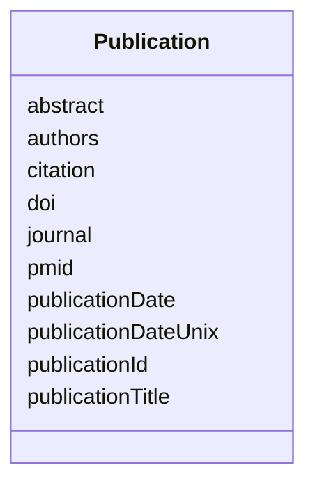

---
search:
  boost: 10.0
---

# Class: Publication 


_A publication associated with the development or usage of a resource._


<div data-search-exclude markdown="1">


URI: [schema:ScholarlyArticle](http://schema.org/ScholarlyArticle)





<!-- no inheritance hierarchy -->

## Class Properties

| Property | Value |
| --- | --- |
| Class URI | [schema:ScholarlyArticle](http://schema.org/ScholarlyArticle) |


## Slots

| Name | Cardinality and Range | Description | Inheritance |
| ---  | --- | --- | --- |
| [publicationId](publicationId.md) | 1 <br/> [String](String.md) | A unique identifier for the publication | direct |
| [publicationTitle](publicationTitle.md) | 1 <br/> [String](String.md) | The title of the publication | direct |
| [authors](authors.md) | * <br/> [String](String.md) | Writers of the publication | direct |
| [abstract](abstract.md) | 0..1 <br/> [String](String.md) | A brief, comprehensive summary of the contents of the publication | direct |
| [journal](journal.md) | 0..1 <br/> [String](String.md) | The name of the periodical publication in which the paper was published | direct |
| [publicationDate](publicationDate.md) | 0..1 <br/> [Date](Date.md) | The date of the paper's publication | direct |
| [pmid](pmid.md) | 0..1 <br/> [String](String.md) | The PubMed Identifier associated with the publication | direct |
| [doi](doi.md) | 0..1 <br/> [String](String.md) | The digital object identifier in the form https://www | direct |
| [citation](citation.md) | 1 <br/> [String](String.md) | A merged citation string for the publication, used to render citation on deta... | direct |
| [publicationDateUnix](publicationDateUnix.md) | 0..1 <br/> [Integer](Integer.md) | The date of the paper's publication in UNIX time | direct |


## Usages

| used by | used in | type | used |
| ---  | --- | --- | --- |
| [Observation](Observation.md) | [observationPublication](observationPublication.md) | range | [Publication](Publication.md) |


## Identifier and Mapping Information


### Annotations

| property | value |
| --- | --- |
| synapse_table_id | syn26486839 |


### Schema Source


* from schema: https://w3id.org/nf-research-tools


## Mappings

| Mapping Type | Mapped Value |
| ---  | ---  |
| self | schema:ScholarlyArticle |
| native | nftools:Publication |


## LinkML Source

<!-- TODO: investigate https://stackoverflow.com/questions/37606292/how-to-create-tabbed-code-blocks-in-mkdocs-or-sphinx -->

### Direct

<details>
```yaml
name: Publication
annotations:
  synapse_table_id:
    tag: synapse_table_id
    value: syn26486839
description: A publication associated with the development or usage of a resource.
from_schema: https://w3id.org/nf-research-tools
slots:
- publicationId
- publicationTitle
- authors
- abstract
- journal
- publicationDate
- pmid
- doi
- citation
- publicationDateUnix
class_uri: schema:ScholarlyArticle

```
</details>

### Induced

<details>
```yaml
name: Publication
annotations:
  synapse_table_id:
    tag: synapse_table_id
    value: syn26486839
description: A publication associated with the development or usage of a resource.
from_schema: https://w3id.org/nf-research-tools
attributes:
  publicationId:
    name: publicationId
    description: A unique identifier for the publication.
    from_schema: https://w3id.org/nf-research-tools
    rank: 1000
    identifier: true
    owner: Publication
    domain_of:
    - DevelopmentRecord
    - Usage
    - Publication
    range: string
    required: true
  publicationTitle:
    name: publicationTitle
    description: The title of the publication.
    from_schema: https://w3id.org/nf-research-tools
    rank: 1000
    slot_uri: schema:headline
    owner: Publication
    domain_of:
    - Publication
    range: string
    required: true
  authors:
    name: authors
    description: Writers of the publication.
    from_schema: https://w3id.org/nf-research-tools
    rank: 1000
    slot_uri: schema:author
    owner: Publication
    domain_of:
    - Publication
    range: string
    multivalued: true
  abstract:
    name: abstract
    description: A brief, comprehensive summary of the contents of the publication.
    from_schema: https://w3id.org/nf-research-tools
    rank: 1000
    owner: Publication
    domain_of:
    - Publication
    range: string
  journal:
    name: journal
    description: The name of the periodical publication in which the paper was published.
    from_schema: https://w3id.org/nf-research-tools
    rank: 1000
    owner: Publication
    domain_of:
    - Publication
    range: string
  publicationDate:
    name: publicationDate
    description: The date of the paper's publication.
    from_schema: https://w3id.org/nf-research-tools
    rank: 1000
    owner: Publication
    domain_of:
    - Publication
    range: date
  pmid:
    name: pmid
    description: The PubMed Identifier associated with the publication.
    from_schema: https://w3id.org/nf-research-tools
    rank: 1000
    owner: Publication
    domain_of:
    - Publication
    range: string
  doi:
    name: doi
    description: The digital object identifier in the form https://www.doi.org/{doi},
      per CrossRef DOI display guidelines.
    from_schema: https://w3id.org/nf-research-tools
    rank: 1000
    slot_uri: schema:identifier
    owner: Publication
    domain_of:
    - Publication
    range: string
  citation:
    name: citation
    description: A merged citation string for the publication, used to render citation
      on details pages.
    from_schema: https://w3id.org/nf-research-tools
    rank: 1000
    owner: Publication
    domain_of:
    - Publication
    range: string
    required: true
  publicationDateUnix:
    name: publicationDateUnix
    description: The date of the paper's publication in UNIX time.
    from_schema: https://w3id.org/nf-research-tools
    rank: 1000
    owner: Publication
    domain_of:
    - Publication
    range: integer
class_uri: schema:ScholarlyArticle

```
</details></div>