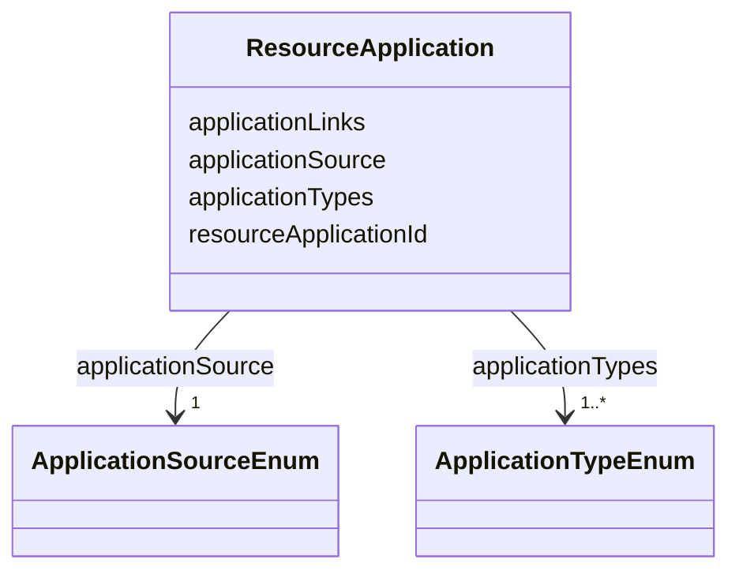

---
search:
  boost: 10.0
---

# Class: ResourceApplication 


_Applications the resource can be used for, such as western blot, immunofluorescence, etc._


<div data-search-exclude markdown="1">


URI: [nftools:ResourceApplication](https://w3id.org/nf-research-tools/ResourceApplication)





<!-- no inheritance hierarchy -->

## Slots

| Name | Cardinality and Range | Description | Inheritance |
| ---  | --- | --- | --- |
| [resourceApplicationId](resourceApplicationId.md) | 1 <br/> [String](String.md) | A unique identifier for the resource application record | direct |
| [applicationSource](applicationSource.md) | 1 <br/> [ApplicationSourceEnum](ApplicationSourceEnum.md) | The source of resource application information | direct |
| [applicationTypes](applicationTypes.md) | 1..* <br/> [ApplicationTypeEnum](ApplicationTypeEnum.md) | One or more uses for the resource (e | direct |
| [applicationLinks](applicationLinks.md) | * <br/> [Uri](Uri.md) | Shareable links related to the resource application | direct |


## Identifier and Mapping Information


### Schema Source


* from schema: https://w3id.org/nf-research-tools


## Mappings

| Mapping Type | Mapped Value |
| ---  | ---  |
| self | nftools:ResourceApplication |
| native | nftools:ResourceApplication |


## LinkML Source

<!-- TODO: investigate https://stackoverflow.com/questions/37606292/how-to-create-tabbed-code-blocks-in-mkdocs-or-sphinx -->

### Direct

<details>
```yaml
name: ResourceApplication
description: Applications the resource can be used for, such as western blot, immunofluorescence,
  etc.
from_schema: https://w3id.org/nf-research-tools
slots:
- resourceApplicationId
- applicationSource
- applicationTypes
- applicationLinks

```
</details>

### Induced

<details>
```yaml
name: ResourceApplication
description: Applications the resource can be used for, such as western blot, immunofluorescence,
  etc.
from_schema: https://w3id.org/nf-research-tools
attributes:
  resourceApplicationId:
    name: resourceApplicationId
    description: A unique identifier for the resource application record.
    from_schema: https://w3id.org/nf-research-tools
    rank: 1000
    identifier: true
    owner: ResourceApplication
    domain_of:
    - ResourceApplication
    range: string
    required: true
  applicationSource:
    name: applicationSource
    description: The source of resource application information.
    from_schema: https://w3id.org/nf-research-tools
    rank: 1000
    owner: ResourceApplication
    domain_of:
    - ResourceApplication
    range: ApplicationSourceEnum
    required: true
  applicationTypes:
    name: applicationTypes
    description: One or more uses for the resource (e.g. western blot, immunofluorescence).
    from_schema: https://w3id.org/nf-research-tools
    rank: 1000
    owner: ResourceApplication
    domain_of:
    - ResourceApplication
    range: ApplicationTypeEnum
    required: true
    multivalued: true
  applicationLinks:
    name: applicationLinks
    description: Shareable links related to the resource application.
    from_schema: https://w3id.org/nf-research-tools
    rank: 1000
    owner: ResourceApplication
    domain_of:
    - ResourceApplication
    range: uri
    multivalued: true

```
</details></div>