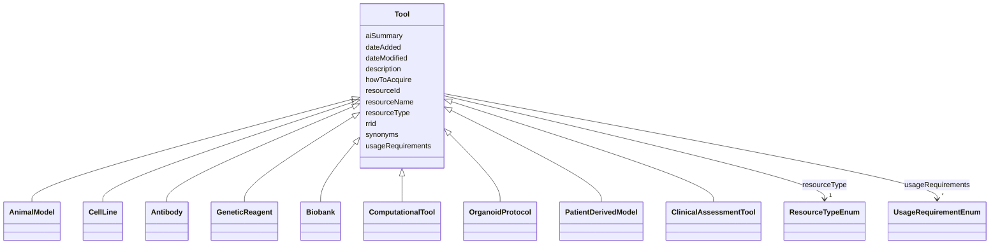

---
search:
  boost: 10.0
---

# Class: Tool 


_A research tool or resource used in the NF research process. Abstract base class for all 9 resource types._


<div data-search-exclude markdown="1">


* __NOTE__: this is an abstract class and should not be instantiated directly


URI: [schema:Thing](http://schema.org/Thing)





## Inheritance
* **Tool**
    * [AnimalModel](AnimalModel.md) [ [HasGeneticDisorder](HasGeneticDisorder.md)]
    * [CellLine](CellLine.md) [ [HasGeneticDisorder](HasGeneticDisorder.md)]
    * [Antibody](Antibody.md)
    * [GeneticReagent](GeneticReagent.md)
    * [Biobank](Biobank.md) [ [HasTumorType](HasTumorType.md) [HasGeneticDisorder](HasGeneticDisorder.md)]
    * [ComputationalTool](ComputationalTool.md)
    * [OrganoidProtocol](OrganoidProtocol.md) [ [HasPassageNumber](HasPassageNumber.md)]
    * [PatientDerivedModel](PatientDerivedModel.md) [ [HasTumorType](HasTumorType.md) [HasPassageNumber](HasPassageNumber.md)]
    * [ClinicalAssessmentTool](ClinicalAssessmentTool.md)


## Class Properties

| Property | Value |
| --- | --- |
| Class URI | [schema:Thing](http://schema.org/Thing) |


## Slots

| Name | Cardinality and Range | Description | Inheritance |
| ---  | --- | --- | --- |
| [resourceId](resourceId.md) | 1 <br/> [String](String.md) | A unique identifier for the resource | direct |
| [rrid](rrid.md) | 0..1 <br/> [String](String.md) | The RRID, a standard resource identifier for interoperability with other data... | direct |
| [resourceName](resourceName.md) | 1 <br/> [String](String.md) | The canonical name of the resource | direct |
| [synonyms](synonyms.md) | * <br/> [String](String.md) | Synonyms of the resource | direct |
| [resourceType](resourceType.md) | 1 <br/> [ResourceTypeEnum](ResourceTypeEnum.md) | Type of resource | direct |
| [description](description.md) | 0..1 <br/> [String](String.md) | Free text description, summary, or purpose of the resource | direct |
| [aiSummary](aiSummary.md) | 0..1 <br/> [String](String.md) | A large language model-generated summary of the resource | direct |
| [usageRequirements](usageRequirements.md) | * <br/> [UsageRequirementEnum](UsageRequirementEnum.md) | Any known restrictions on use of the resource | direct |
| [howToAcquire](howToAcquire.md) | 1 <br/> [String](String.md) | How to acquire a particular resource | direct |
| [dateAdded](dateAdded.md) | 1 <br/> [Date](Date.md) | The date that the resource was originally added | direct |
| [dateModified](dateModified.md) | 1 <br/> [Date](Date.md) | The last update of the resource metadata | direct |


## Comments

* Synapse storage: core Tool slots are denormalized into each tool-type table (e.g. AnimalModel syn26486808 carries resourceName, rrid, description, etc. directly). There is no separate Resource join table. This matches the LinkML inheritance — gen-json-schema materializes all inherited slots into each subclass.


## Identifier and Mapping Information


### Annotations

| property | value |
| --- | --- |
| synapse_table_id | syn26450069 |
| synapse_view_id | syn51730943 |
| synapse_project_id | syn26338068 |


### Schema Source


* from schema: https://w3id.org/nf-research-tools


## Mappings

| Mapping Type | Mapped Value |
| ---  | ---  |
| self | schema:Thing |
| native | nftools:Tool |


## LinkML Source

<!-- TODO: investigate https://stackoverflow.com/questions/37606292/how-to-create-tabbed-code-blocks-in-mkdocs-or-sphinx -->

### Direct

<details>
```yaml
name: Tool
annotations:
  synapse_table_id:
    tag: synapse_table_id
    value: syn26450069
  synapse_view_id:
    tag: synapse_view_id
    value: syn51730943
  synapse_project_id:
    tag: synapse_project_id
    value: syn26338068
description: A research tool or resource used in the NF research process. Abstract
  base class for all 9 resource types.
comments:
- 'Synapse storage: core Tool slots are denormalized into each tool-type table (e.g.
  AnimalModel syn26486808 carries resourceName, rrid, description, etc. directly).
  There is no separate Resource join table. This matches the LinkML inheritance —
  gen-json-schema materializes all inherited slots into each subclass.'
from_schema: https://w3id.org/nf-research-tools
abstract: true
slots:
- resourceId
- rrid
- resourceName
- synonyms
- resourceType
- description
- aiSummary
- usageRequirements
- howToAcquire
- dateAdded
- dateModified
class_uri: schema:Thing

```
</details>

### Induced

<details>
```yaml
name: Tool
annotations:
  synapse_table_id:
    tag: synapse_table_id
    value: syn26450069
  synapse_view_id:
    tag: synapse_view_id
    value: syn51730943
  synapse_project_id:
    tag: synapse_project_id
    value: syn26338068
description: A research tool or resource used in the NF research process. Abstract
  base class for all 9 resource types.
comments:
- 'Synapse storage: core Tool slots are denormalized into each tool-type table (e.g.
  AnimalModel syn26486808 carries resourceName, rrid, description, etc. directly).
  There is no separate Resource join table. This matches the LinkML inheritance —
  gen-json-schema materializes all inherited slots into each subclass.'
from_schema: https://w3id.org/nf-research-tools
abstract: true
attributes:
  resourceId:
    name: resourceId
    description: A unique identifier for the resource.
    from_schema: https://w3id.org/nf-research-tools
    rank: 1000
    slot_uri: schema:identifier
    identifier: true
    owner: Tool
    domain_of:
    - Tool
    - DevelopmentRecord
    - Usage
    range: string
    required: true
  rrid:
    name: rrid
    description: The RRID, a standard resource identifier for interoperability with
      other databases. Must include the lowercase 'rrid:' prefix.
    from_schema: https://w3id.org/nf-research-tools
    rank: 1000
    owner: Tool
    domain_of:
    - Tool
    range: string
    pattern: ^rrid:[a-zA-Z]+.+$
  resourceName:
    name: resourceName
    description: The canonical name of the resource.
    from_schema: https://w3id.org/nf-research-tools
    rank: 1000
    slot_uri: schema:name
    owner: Tool
    domain_of:
    - Tool
    range: string
    required: true
  synonyms:
    name: synonyms
    description: Synonyms of the resource.
    from_schema: https://w3id.org/nf-research-tools
    rank: 1000
    owner: Tool
    domain_of:
    - Tool
    range: string
    multivalued: true
  resourceType:
    name: resourceType
    description: Type of resource.
    from_schema: https://w3id.org/nf-research-tools
    rank: 1000
    owner: Tool
    domain_of:
    - Tool
    range: ResourceTypeEnum
    required: true
  description:
    name: description
    description: Free text description, summary, or purpose of the resource.
    from_schema: https://w3id.org/nf-research-tools
    rank: 1000
    slot_uri: schema:description
    owner: Tool
    domain_of:
    - Tool
    range: string
  aiSummary:
    name: aiSummary
    description: A large language model-generated summary of the resource.
    from_schema: https://w3id.org/nf-research-tools
    rank: 1000
    owner: Tool
    domain_of:
    - Tool
    range: string
  usageRequirements:
    name: usageRequirements
    description: Any known restrictions on use of the resource.
    from_schema: https://w3id.org/nf-research-tools
    rank: 1000
    owner: Tool
    domain_of:
    - Tool
    range: UsageRequirementEnum
    multivalued: true
  howToAcquire:
    name: howToAcquire
    description: How to acquire a particular resource.
    from_schema: https://w3id.org/nf-research-tools
    rank: 1000
    owner: Tool
    domain_of:
    - Tool
    range: string
    required: true
  dateAdded:
    name: dateAdded
    description: The date that the resource was originally added.
    from_schema: https://w3id.org/nf-research-tools
    rank: 1000
    owner: Tool
    domain_of:
    - Tool
    range: date
    required: true
  dateModified:
    name: dateModified
    description: The last update of the resource metadata.
    from_schema: https://w3id.org/nf-research-tools
    rank: 1000
    owner: Tool
    domain_of:
    - Tool
    range: date
    required: true
class_uri: schema:Thing

```
</details></div>