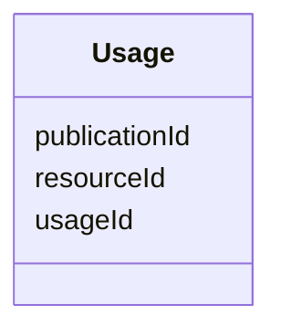

---
search:
  boost: 10.0
---

# Class: Usage 


_Junction table linking a resource to publications that cite or use it._


<div data-search-exclude markdown="1">


URI: [nftools:Usage](https://w3id.org/nf-research-tools/Usage)





<!-- no inheritance hierarchy -->

## Slots

| Name | Cardinality and Range | Description | Inheritance |
| ---  | --- | --- | --- |
| [usageId](usageId.md) | 1 <br/> [String](String.md) | A unique identifier for this usage record | direct |
| [resourceId](resourceId.md) | 1 <br/> [String](String.md) | Foreign key to a tool-type table (resourceId) | direct |
| [publicationId](publicationId.md) | 1 <br/> [String](String.md) | Foreign key to Publication (publicationId) | direct |


## Identifier and Mapping Information


### Annotations

| property | value |
| --- | --- |
| synapse_table_id | syn26486841 |


### Schema Source


* from schema: https://w3id.org/nf-research-tools


## Mappings

| Mapping Type | Mapped Value |
| ---  | ---  |
| self | nftools:Usage |
| native | nftools:Usage |


## LinkML Source

<!-- TODO: investigate https://stackoverflow.com/questions/37606292/how-to-create-tabbed-code-blocks-in-mkdocs-or-sphinx -->

### Direct

<details>
```yaml
name: Usage
annotations:
  synapse_table_id:
    tag: synapse_table_id
    value: syn26486841
description: Junction table linking a resource to publications that cite or use it.
from_schema: https://w3id.org/nf-research-tools
attributes:
  usageId:
    name: usageId
    description: A unique identifier for this usage record.
    from_schema: https://w3id.org/nf-research-tools/tool_base
    rank: 1000
    identifier: true
    domain_of:
    - Usage
    required: true
  resourceId:
    name: resourceId
    description: Foreign key to a tool-type table (resourceId).
    from_schema: https://w3id.org/nf-research-tools/tool_base
    domain_of:
    - Tool
    - DevelopmentRecord
    - Usage
    required: true
  publicationId:
    name: publicationId
    description: Foreign key to Publication (publicationId).
    from_schema: https://w3id.org/nf-research-tools/tool_base
    domain_of:
    - DevelopmentRecord
    - Usage
    - Publication
    required: true

```
</details>

### Induced

<details>
```yaml
name: Usage
annotations:
  synapse_table_id:
    tag: synapse_table_id
    value: syn26486841
description: Junction table linking a resource to publications that cite or use it.
from_schema: https://w3id.org/nf-research-tools
attributes:
  usageId:
    name: usageId
    description: A unique identifier for this usage record.
    from_schema: https://w3id.org/nf-research-tools/tool_base
    rank: 1000
    identifier: true
    owner: Usage
    domain_of:
    - Usage
    range: string
    required: true
  resourceId:
    name: resourceId
    description: Foreign key to a tool-type table (resourceId).
    from_schema: https://w3id.org/nf-research-tools/tool_base
    owner: Usage
    domain_of:
    - Tool
    - DevelopmentRecord
    - Usage
    range: string
    required: true
  publicationId:
    name: publicationId
    description: Foreign key to Publication (publicationId).
    from_schema: https://w3id.org/nf-research-tools/tool_base
    owner: Usage
    domain_of:
    - DevelopmentRecord
    - Usage
    - Publication
    range: string
    required: true

```
</details></div>