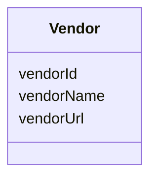

---
search:
  boost: 10.0
---

# Class: Vendor 


_A person or company offering the resource for sale._


<div data-search-exclude markdown="1">


URI: [schema:Organization](http://schema.org/Organization)





<!-- no inheritance hierarchy -->

## Class Properties

| Property | Value |
| --- | --- |
| Class URI | [schema:Organization](http://schema.org/Organization) |


## Slots

| Name | Cardinality and Range | Description | Inheritance |
| ---  | --- | --- | --- |
| [vendorId](vendorId.md) | 1 <br/> [String](String.md) | A unique identifier for the vendor | direct |
| [vendorName](vendorName.md) | 0..1 <br/> [String](String.md) | The name of the vendor | direct |
| [vendorUrl](vendorUrl.md) | 0..1 <br/> [Uri](Uri.md) | The vendor website URL | direct |


## Usages

| used by | used in | type | used |
| ---  | --- | --- | --- |
| [VendorItem](VendorItem.md) | [vendor](vendor.md) | range | [Vendor](Vendor.md) |


## Identifier and Mapping Information


### Annotations

| property | value |
| --- | --- |
| synapse_table_id | syn26486850 |


### Schema Source


* from schema: https://w3id.org/nf-research-tools


## Mappings

| Mapping Type | Mapped Value |
| ---  | ---  |
| self | schema:Organization |
| native | nftools:Vendor |


## LinkML Source

<!-- TODO: investigate https://stackoverflow.com/questions/37606292/how-to-create-tabbed-code-blocks-in-mkdocs-or-sphinx -->

### Direct

<details>
```yaml
name: Vendor
annotations:
  synapse_table_id:
    tag: synapse_table_id
    value: syn26486850
description: A person or company offering the resource for sale.
from_schema: https://w3id.org/nf-research-tools
slots:
- vendorId
- vendorName
- vendorUrl
class_uri: schema:Organization

```
</details>

### Induced

<details>
```yaml
name: Vendor
annotations:
  synapse_table_id:
    tag: synapse_table_id
    value: syn26486850
description: A person or company offering the resource for sale.
from_schema: https://w3id.org/nf-research-tools
attributes:
  vendorId:
    name: vendorId
    description: A unique identifier for the vendor.
    from_schema: https://w3id.org/nf-research-tools
    rank: 1000
    identifier: true
    owner: Vendor
    domain_of:
    - Vendor
    range: string
    required: true
  vendorName:
    name: vendorName
    description: The name of the vendor.
    from_schema: https://w3id.org/nf-research-tools
    rank: 1000
    slot_uri: schema:name
    owner: Vendor
    domain_of:
    - Vendor
    range: string
  vendorUrl:
    name: vendorUrl
    description: The vendor website URL.
    from_schema: https://w3id.org/nf-research-tools
    rank: 1000
    slot_uri: schema:url
    owner: Vendor
    domain_of:
    - Vendor
    range: uri
class_uri: schema:Organization

```
</details></div>