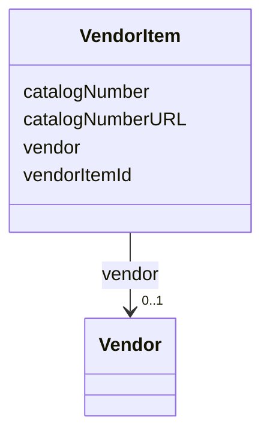

---
search:
  boost: 10.0
---

# Class: VendorItem 


_A resource listing from a specific vendor, including catalog information and purchase URL._


<div data-search-exclude markdown="1">


URI: [nftools:VendorItem](https://w3id.org/nf-research-tools/VendorItem)





<!-- no inheritance hierarchy -->

## Slots

| Name | Cardinality and Range | Description | Inheritance |
| ---  | --- | --- | --- |
| [vendorItemId](vendorItemId.md) | 1 <br/> [String](String.md) | A unique identifier for the vendor item listing | direct |
| [vendor](vendor.md) | 0..1 <br/> [Vendor](Vendor.md) | The vendor offering this item | direct |
| [catalogNumber](catalogNumber.md) | 1 <br/> [String](String.md) | The catalog number associated with the resource pertaining to the vendor | direct |
| [catalogNumberURL](catalogNumberURL.md) | 0..1 <br/> [Uri](Uri.md) | The URL linking to the resource on the vendor's website | direct |


## Identifier and Mapping Information


### Annotations

| property | value |
| --- | --- |
| synapse_table_id | syn26486843 |


### Schema Source


* from schema: https://w3id.org/nf-research-tools


## Mappings

| Mapping Type | Mapped Value |
| ---  | ---  |
| self | nftools:VendorItem |
| native | nftools:VendorItem |


## LinkML Source

<!-- TODO: investigate https://stackoverflow.com/questions/37606292/how-to-create-tabbed-code-blocks-in-mkdocs-or-sphinx -->

### Direct

<details>
```yaml
name: VendorItem
annotations:
  synapse_table_id:
    tag: synapse_table_id
    value: syn26486843
description: A resource listing from a specific vendor, including catalog information
  and purchase URL.
from_schema: https://w3id.org/nf-research-tools
slots:
- vendorItemId
- vendor
- catalogNumber
- catalogNumberURL

```
</details>

### Induced

<details>
```yaml
name: VendorItem
annotations:
  synapse_table_id:
    tag: synapse_table_id
    value: syn26486843
description: A resource listing from a specific vendor, including catalog information
  and purchase URL.
from_schema: https://w3id.org/nf-research-tools
attributes:
  vendorItemId:
    name: vendorItemId
    description: A unique identifier for the vendor item listing.
    from_schema: https://w3id.org/nf-research-tools
    rank: 1000
    identifier: true
    owner: VendorItem
    domain_of:
    - VendorItem
    range: string
    required: true
  vendor:
    name: vendor
    description: The vendor offering this item.
    from_schema: https://w3id.org/nf-research-tools
    rank: 1000
    owner: VendorItem
    domain_of:
    - VendorItem
    range: Vendor
    inlined: true
  catalogNumber:
    name: catalogNumber
    description: The catalog number associated with the resource pertaining to the
      vendor.
    from_schema: https://w3id.org/nf-research-tools
    rank: 1000
    owner: VendorItem
    domain_of:
    - VendorItem
    range: string
    required: true
  catalogNumberURL:
    name: catalogNumberURL
    description: The URL linking to the resource on the vendor's website.
    from_schema: https://w3id.org/nf-research-tools
    rank: 1000
    owner: VendorItem
    domain_of:
    - VendorItem
    range: uri

```
</details></div>